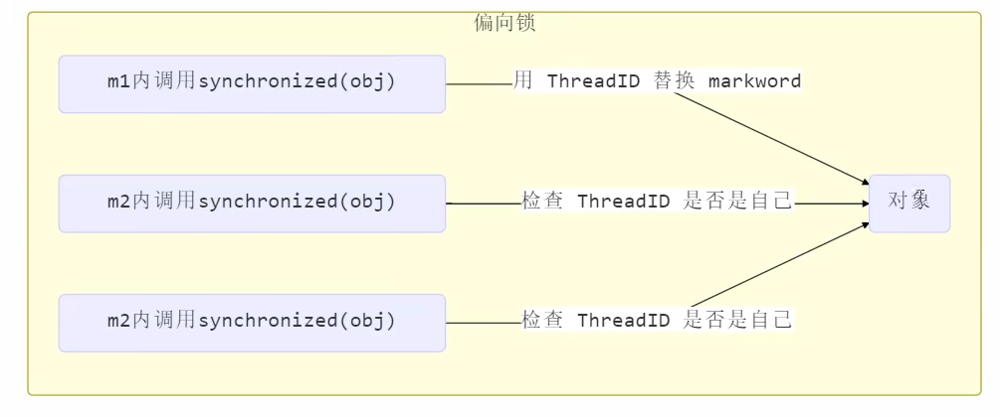

<h1 style="color:green;text-align:center">java并发编程学习笔记</h1>


---


# 进程与线程

## 进程

* 程序由指令和数据组成，但这些指令要运行，数据要读写，就必须将指令加载至 CPU，数据加载至内存。在 指令运行过程中还需要用到磁盘、网络等设备。进程就是用来加载指令、管理内存、管理 IO 的
* 当一个程序被运行，从磁盘加载这个程序的代码至内存，这时就开启了一个进程
* 进程就可以视为程序的一个实例。大部分程序可以同时运行多个实例进程（例如记事本、画图、浏览器 等），也有的程序只能启动一个实例进程（例如网易云音乐、360 安全卫士等）


## 线程

* 一个进程之内可以分为一到多个线程
* 一个线程就是一个指令流，将指令流中的一条条指令以一定的顺序交给 CPU 执行
* Java 中，线程作为最小调度单位，进程作为资源分配的最小单位。 在 windows 中进程是不活动的，只是作为线程的容器


## 二者对比

* 进程基本上相互独立的，而线程存在于进程内，是进程的一个子集
* 进程拥有共享的资源，如内存空间等，供其内部的线程共享
* 进程间通信较为复杂
  * 同一台计算机的进程通信称为 IPC（Inter-process communication）
  * 不同计算机之间的进程通信，需要通过网络，并遵守共同的协议，例如 HTTP
* 线程通信相对简单，因为它们共享进程内的内存，一个例子是多个线程可以访问同一个共享变量
* 线程更轻量，线程上下文切换成本一般上要比进程上下文切换低


# 并行与并发

单核 cpu 下，线程实际还是 串行执行 的。操作系统中有一个组件叫做任务调度器，将 cpu 的时间片（windows 下时间片最小约为 15 毫秒）分给不同的程序使用，只是由于 cpu 在线程间（时间片很短）的切换非常快，人类感 觉是 同时运行的 。总结为一句话就是： 微观串行，宏观并行 

一般会将这种 线程轮流使用 CPU 的做法称为并发

多核 cpu下，每个 核（core） 都可以调度运行线程，这时候线程可以是并行的


* 并发（concurrent）是同一时间应对（dealing with）多件事情的能力
* 并行（parallel）是同一时间动手做（doing）多件事情的能力


# 异步调用

以调用方角度来讲，如果

* 需要等待结果返回，才能继续运行就是同步
* 不需要等待结果返回，就能继续运行就是异步


多线程可以让方法执行变为异步的（即不要巴巴干等着）比如说读取磁盘文件时，假设读取操作花费了 5 秒钟，如 果没有线程调度机制，这 5 秒 cpu 什么都做不了，其它代码都得暂停


同步调用：

```java
package mao;

import java.util.logging.Logger;

/**
 * Project name(项目名称)：java并发编程_异步调用
 * Package(包名): mao
 * Class(类名): Test
 * Author(作者）: mao
 * Author QQ：1296193245
 * GitHub：https://github.com/maomao124/
 * Date(创建日期)： 2022/8/26
 * Time(创建时间)： 19:19
 * Version(版本): 1.0
 * Description(描述)： 同步调用
 */

public class Test
{
    public static void m1()
    {
        System.out.println("开始执行m1方法");
        try
        {
            Thread.sleep(2000);
        }
        catch (InterruptedException e)
        {
            e.printStackTrace();
        }
        System.out.println("m1方法执行完毕");
    }

    public static void main(String[] args)
    {
        m1();
        System.out.println("继续执行main方法");
    }
}
```


异步调用：

```java
package mao;

/**
 * Project name(项目名称)：java并发编程_异步调用
 * Package(包名): mao
 * Class(类名): Test_Async
 * Author(作者）: mao
 * Author QQ：1296193245
 * GitHub：https://github.com/maomao124/
 * Date(创建日期)： 2022/8/26
 * Time(创建时间)： 19:23
 * Version(版本): 1.0
 * Description(描述)： 异步调用
 */

public class Test_Async
{
    public static void m1()
    {
        System.out.println("开始执行m1方法");
        try
        {
            Thread.sleep(2000);
        }
        catch (InterruptedException e)
        {
            e.printStackTrace();
        }
        System.out.println("m1方法执行完毕");
    }

    public static void m1_async()
    {
        Thread thread = new Thread(new Runnable()
        {
            @Override
            public void run()
            {
                m1();
            }
        }, "m1");
        thread.start();
    }

    public static void main(String[] args)
    {
        m1_async();
        System.out.println("继续执行main方法");
    }
}
```


运行结果：

```sh
继续执行main方法
开始执行m1方法
m1方法执行完毕
```


* tomcat 的异步 servlet 也是类似的目的，让用户线程处理耗时较长的操作，避免阻塞 tomcat 的工作线程
* UI 程序中，开线程进行其他操作，避免阻塞 ui 线程


# 提高效率

充分利用多核 cpu 的优势，提高运行效率。想象下面的场景，执行 3 个计算，最后将计算结果汇总


* 计算 1 花费 10 ms
* 计算 2 花费 11 ms
* 计算 3 花费 9 ms
* 汇总需要 1 ms


如果是串行执行，那么总共花费的时间是 10 + 11 + 9 + 1 = 31ms

但如果是四核 cpu，各个核心分别使用线程 1 执行计算 1，线程 2 执行计算 2，线程 3 执行计算 3，那么 3 个 线程是并行的，花费时间只取决于最长的那个线程运行的时间，即 11ms 最后加上汇总时间只会花费 12ms


> 需要在多核 cpu 才能提高效率，单核仍然时是轮流执行


同步计算：

```java
package mao;

/**
 * Project name(项目名称)：java并发编程_异步调用
 * Package(包名): mao
 * Class(类名): Calculate
 * Author(作者）: mao
 * Author QQ：1296193245
 * GitHub：https://github.com/maomao124/
 * Date(创建日期)： 2022/8/26
 * Time(创建时间)： 19:33
 * Version(版本): 1.0
 * Description(描述)： 同步计算
 */

public class Calculate
{
    /**
     * 计算1，模拟计算花费80毫秒
     */
    public static void c1()
    {
        try
        {
            Thread.sleep(80);
        }
        catch (InterruptedException e)
        {
            e.printStackTrace();
        }
    }

    /**
     * 计算2，模拟计算花费120毫秒
     */
    public static void c2()
    {
        try
        {
            Thread.sleep(120);
        }
        catch (InterruptedException e)
        {
            e.printStackTrace();
        }
    }

    /**
     * 计算3，模拟计算花费70毫秒
     */
    public static void c3()
    {
        try
        {
            Thread.sleep(70);
        }
        catch (InterruptedException e)
        {
            e.printStackTrace();
        }
    }

    public static void main(String[] args)
    {
        //------------------------------------------------------
        long startTime = System.currentTimeMillis();    //获取开始时间
        //------------------------------------------------------

        c1();
        c2();
        c3();

        //------------------------------------------------------
        long endTime = System.currentTimeMillis();    //获取结束时间
        System.out.println("程序运行时间：" + (endTime - startTime) + "ms");    //输出程序运行时间
        //------------------------------------------------------
    }

}
```


运行结果：

```sh
程序运行时间：289ms
```


异步计算：

```java
package mao;

/**
 * Project name(项目名称)：java并发编程_异步调用
 * Package(包名): mao
 * Class(类名): Calculate_Async
 * Author(作者）: mao
 * Author QQ：1296193245
 * GitHub：https://github.com/maomao124/
 * Date(创建日期)： 2022/8/26
 * Time(创建时间)： 19:39
 * Version(版本): 1.0
 * Description(描述)： 异步调用
 */

public class Calculate_Async
{
    /**
     * 计算1，模拟计算花费80毫秒
     */
    public static void c1()
    {
        try
        {
            Thread.sleep(80);
        }
        catch (InterruptedException e)
        {
            e.printStackTrace();
        }
    }

    /**
     * 计算2，模拟计算花费120毫秒
     */
    public static void c2()
    {
        try
        {
            Thread.sleep(120);
        }
        catch (InterruptedException e)
        {
            e.printStackTrace();
        }
    }

    /**
     * 计算3，模拟计算花费70毫秒
     */
    public static void c3()
    {
        try
        {
            Thread.sleep(70);
        }
        catch (InterruptedException e)
        {
            e.printStackTrace();
        }
    }

    /**
     * 异步调用
     */
    public static Thread c1_async()
    {
        Thread thread = new Thread(new Runnable()
        {
            @Override
            public void run()
            {
                c1();
            }
        }, "c1");
        thread.start();
        return thread;
    }

    /**
     * 异步调用
     */
    public static Thread c2_async()
    {
        Thread thread = new Thread(new Runnable()
        {
            @Override
            public void run()
            {
                c2();
            }
        }, "c2");
        thread.start();
        return thread;
    }

    /**
     * 异步调用
     */
    public static Thread c3_async()
    {
        Thread thread = new Thread(new Runnable()
        {
            @Override
            public void run()
            {
                c3();
            }
        }, "c3");
        thread.start();
        return thread;
    }

    public static void main(String[] args) throws InterruptedException
    {
        //------------------------------------------------------
        long startTime = System.currentTimeMillis();    //获取开始时间
        //------------------------------------------------------

        Thread t1 = c1_async();
        Thread t2 = c2_async();
        Thread t3 = c3_async();
        t1.join();
        t2.join();
        t3.join();

        //------------------------------------------------------
        long endTime = System.currentTimeMillis();    //获取结束时间
        System.out.println("程序运行时间：" + (endTime - startTime) + "ms");    //输出程序运行时间
        //------------------------------------------------------
    }

}
```


运行结果：

```sh
程序运行时间：123ms
```


* 单核 cpu 下，多线程不能实际提高程序运行效率，只是为了能够在不同的任务之间切换，不同线程轮流使用 cpu ，不至于一个线程总占用 cpu，别的线程没法干活
* 多核 cpu 可以并行跑多个线程，但能否提高程序运行效率还是要分情况的
  * 有些任务，经过精心设计，将任务拆分，并行执行，当然可以提高程序的运行效率。但不是所有计算任 务都能拆分
  * 也不是所有任务都需要拆分，任务的目的如果不同，谈拆分和效率没啥意义
* IO 操作不占用 cpu，只是我们一般拷贝文件使用的是【阻塞 IO】，这时相当于线程虽然不用 cpu，但需要一 直等待 IO 结束，没能充分利用线程


# Java 线程

## 创建和运行线程


方法一，直接使用 Thread：

```java
// 创建线程对象
Thread t = new Thread() {
 public void run() {
 // 要执行的任务
 }
};
// 启动线程
t.start();
```


方法二，使用 Runnable 配合 Thread

```java
Runnable runnable = new Runnable() {
 public void run(){
 // 要执行的任务
 }
};
// 创建线程对象
Thread t = new Thread( runnable );
// 启动线程
t.start(); 
```


方法三，FutureTask 配合 Thread：

```java
// 创建任务对象
FutureTask<Integer> task3 = new FutureTask<>(() -> {
 log.debug("hello");
 return 100;
});
// 参数1 是任务对象; 参数2 是线程名字，推荐
new Thread(task3, "t3").start();
// 主线程阻塞，同步等待 task 执行完毕的结果
Integer result = task3.get();
log.debug("结果是:{}", result);
```


## 栈与栈帧

Java Virtual Machine Stacks （Java 虚拟机栈）

我们都知道 JVM 中由堆、栈、方法区所组成，其中栈内存是给谁用的呢？其实就是线程，每个线程启动后，虚拟 机就会为其分配一块栈内存。

* 每个栈由多个栈帧（Frame）组成，对应着每次方法调用时所占用的内存
* 每个线程只能有一个活动栈帧，对应着当前正在执行的那个方法


比如：main方法调用t方法


当函数开始执行的时候，会先将main方法压入栈中


main方法调用t方法


 **每一个栈帧都包含**

​    **1.局部变量表**

​    **2.操作数栈**

​    **3.返回地址**

​    **4.动态链接（指向运行时常量池的引用）**


## 线程上下文切换

因为以下一些原因导致 cpu 不再执行当前的线程，转而执行另一个线程的代码

* 线程的 cpu 时间片用完
* 垃圾回收
* 有更高优先级的线程需要运行
* 线程自己调用了 sleep、yield、wait、join、park、synchronized、lock 等方法


当 Context Switch 发生时，需要由操作系统保存当前线程的状态，并恢复另一个线程的状态，Java 中对应的概念 就是程序计数器（Program Counter Register），它的作用是记住下一条 jvm 指令的执行地址，是线程私有的

* 状态包括程序计数器、虚拟机栈中每个栈帧的信息，如局部变量、操作数栈、返回地址等
* Context Switch 频繁发生会影响性能


## 常见方法


*  **start()：**启动一个新线 程，在新的线程 运行 run 方法 中的代码。start 方法只是让线程进入就绪，里面代码不一定立刻 运行（CPU 的时间片还没分给它）。每个线程对象的 start方法只能调用一次，如果调用了多次会出现 IllegalThreadStateException
* **run()：**新线程启动后会调用的方法。如果在构造 Thread 对象时传递了 Runnable 参数，则 线程启动后会调用 Runnable 中的 run 方法，否则默 认不执行任何操作。但可以创建 Thread 的子类对象， 来覆盖默认行为
* **join()：**等待线程运行结 束
* **join(long n)：**等待线程运行结 束,最多等待 n 毫秒
* **getId() ：**获取线程长整型 的 id 。id 唯一
* **getName()：**获取线程名
* **setName(String)：**修改线程名
* **getPriority()：**获取线程优先级
* **setPriority(int)：**修改线程优先级。java中规定线程优先级是1~10 的整数，较大的优先级 能提高该线程被 CPU 调度的机率
* **getState() ：**获取线程状态。Java 中线程状态是用 6 个 enum 表示，分别为： NEW, RUNNABLE, BLOCKED, WAITING,  TIMED_WAITING, TERMINATED
* **isInterrupted()：**判断是否被打断。不会清除 打断标记
* **isAlive()：**线程是否存活 （还没有运行完毕）
* **interrupt()：**打断线程。如果被打断线程正在 sleep，wait，join 会导致被打断 的线程抛出 InterruptedException，并清除打断标 记 ；如果打断的正在运行的线程，则会设置打断标 记 ；park 的线程被打断，也会设置打断标记
* **interrupted()：**判断当前线程是否被打断。会清除打断标记。静态方法
* **currentThread()：**获取当前正在执 行的线程。静态方法
* **sleep(long n)：**让当前执行的线 程休眠n毫秒， 休眠时让出 cpu 的时间片给其它线程。静态方法
* **yield() ：**提示线程调度器 让出当前线程对 CPU的使用。主要是为了测试和调试。静态方法


## start 与 run

* 直接调用 run 是在主线程中执行了 run，没有启动新的线程
* 使用 start 是启动新的线程，通过新的线程间接执行 run 中的代码


## sleep 与 yield

### sleep

* 调用 sleep 会让当前线程从 Running 进入 Timed Waiting 状态（阻塞）
* 其它线程可以使用 interrupt 方法打断正在睡眠的线程，这时 sleep 方法会抛出 InterruptedException
* 睡眠结束后的线程未必会立刻得到执行
* 建议用 TimeUnit 的 sleep 代替 Thread 的 sleep 来获得更好的可读性


```java
package mao.sleep;

/**
 * Project name(项目名称)：java并发编程_sleep和yield
 * Package(包名): mao.sleep
 * Class(类名): Test1
 * Author(作者）: mao
 * Author QQ：1296193245
 * GitHub：https://github.com/maomao124/
 * Date(创建日期)： 2022/8/26
 * Time(创建时间)： 20:28
 * Version(版本): 1.0
 * Description(描述)： 调用 sleep 会让当前线程从 Running 进入 Timed Waiting 状态（阻塞）
 */

public class Test1
{
    public static void main(String[] args) throws InterruptedException
    {
        Thread thread = new Thread(new Runnable()
        {
            @Override
            public void run()
            {
                try
                {
                    Thread.sleep(3000);
                }
                catch (InterruptedException e)
                {
                    e.printStackTrace();
                }
            }
        });
        System.out.println(thread.getState());
        thread.start();
        System.out.println(thread.getState());
        Thread.sleep(30);
        System.out.println(thread.getState());
    }
}
```


运行结果：

```sh
NEW
RUNNABLE
TIMED_WAITING
```


```java
package mao.sleep;

/**
 * Project name(项目名称)：java并发编程_sleep和yield
 * Package(包名): mao.sleep
 * Class(类名): Test2
 * Author(作者）: mao
 * Author QQ：1296193245
 * GitHub：https://github.com/maomao124/
 * Date(创建日期)： 2022/8/26
 * Time(创建时间)： 20:31
 * Version(版本): 1.0
 * Description(描述)： 睡眠结束后的线程未必会立刻得到执行
 */

public class Test2
{
    public static void main(String[] args) throws InterruptedException
    {
        //------------------------------------------------------
        long startTime = System.currentTimeMillis();    //获取开始时间
        //------------------------------------------------------

        Thread.sleep(100);
        //时间消耗大于100毫秒

        //------------------------------------------------------
        long endTime = System.currentTimeMillis();    //获取结束时间
        System.out.println("程序运行时间：" + (endTime - startTime) + "ms");    //输出程序运行时间
        //------------------------------------------------------
    }
}
```


运行结果：

```sh
程序运行时间：107ms
```


```java
package mao.sleep;

import java.util.concurrent.TimeUnit;

/**
 * Project name(项目名称)：java并发编程_sleep和yield
 * Package(包名): mao.sleep
 * Class(类名): Test3
 * Author(作者）: mao
 * Author QQ：1296193245
 * GitHub：https://github.com/maomao124/
 * Date(创建日期)： 2022/8/26
 * Time(创建时间)： 20:38
 * Version(版本): 1.0
 * Description(描述)： 建议用 TimeUnit 的 sleep 代替 Thread 的 sleep 来获得更好的可读性
 */

public class Test3
{
    public static void main(String[] args) throws InterruptedException
    {
        //------------------------------------------------------
        long startTime = System.currentTimeMillis();    //获取开始时间
        //------------------------------------------------------

        TimeUnit.SECONDS.sleep(2);
        //两秒
        //TimeUnit.MINUTES.sleep(1);
        //一分钟

        //------------------------------------------------------
        long endTime = System.currentTimeMillis();    //获取结束时间
        System.out.println("程序运行时间：" + (endTime - startTime) + "ms");    //输出程序运行时间
        //------------------------------------------------------
    }
}
```


运行结果：

```sh
程序运行时间：2002ms
```


### yield

* 调用 yield 会让当前线程从 Running 进入 Runnable 就绪状态，然后调度执行其它线程
* 具体的实现依赖于操作系统的任务调度器


```java
public class Thread implements Runnable 
{
/**
 * A hint to the scheduler that the current thread is willing to yield
 * its current use of a processor. The scheduler is free to ignore this
 * hint.
 *
 * <p> Yield is a heuristic attempt to improve relative progression
 * between threads that would otherwise over-utilise a CPU. Its use
 * should be combined with detailed profiling and benchmarking to
 * ensure that it actually has the desired effect.
 *
 * <p> It is rarely appropriate to use this method. It may be useful
 * for debugging or testing purposes, where it may help to reproduce
 * bugs due to race conditions. It may also be useful when designing
 * concurrency control constructs such as the ones in the
 * {@link java.util.concurrent.locks} package.
 */
public static native void yield();
}
```


## 线程优先级

* 线程优先级会提示（hint）调度器优先调度该线程，但它仅仅是一个提示，调度器可以忽略它
* 如果 cpu 比较忙，那么优先级高的线程会获得更多的时间片，但 cpu 闲时，优先级几乎没作用


```java
package mao;

/**
 * Project name(项目名称)：java并发编程_线程优先级
 * Package(包名): mao
 * Class(类名): Test1
 * Author(作者）: mao
 * Author QQ：1296193245
 * GitHub：https://github.com/maomao124/
 * Date(创建日期)： 2022/8/26
 * Time(创建时间)： 20:53
 * Version(版本): 1.0
 * Description(描述)： 无
 */

public class Test1
{
    private static int a = 0;
    private static int b = 0;

    public static void main(String[] args) throws InterruptedException
    {
        Thread thread1 = new Thread(new Runnable()
        {
            @Override
            public void run()
            {
                while (true)
                {
                    a++;
                }
            }
        }, "t1");

        Thread thread2 = new Thread(new Runnable()
        {
            @Override
            public void run()
            {
                while (true)
                {
                    b++;
                }
            }
        }, "t2");

        //启动线程
        thread1.start();
        thread2.start();

        //主线程休眠
        Thread.sleep(2000);

        //强制打断线程
        thread1.stop();
        thread2.stop();

        //查看a和b的值
        System.out.println("a=" + a);
        System.out.println("b=" + b);
        //优先级一样，a和b的值也差不多
    }
}
```


运行结果：

```sh
a=172403497
b=153380774
```

```sh
a=172840004
b=229767254
```

```sh
a=160737324
b=167375710
```


```java
package mao;

/**
 * Project name(项目名称)：java并发编程_线程优先级
 * Package(包名): mao
 * Class(类名): Test2
 * Author(作者）: mao
 * Author QQ：1296193245
 * GitHub：https://github.com/maomao124/
 * Date(创建日期)： 2022/8/26
 * Time(创建时间)： 21:02
 * Version(版本): 1.0
 * Description(描述)： yield方法让出CPU使用权
 */

public class Test2
{
    private static int a = 0;
    private static int b = 0;

    public static void main(String[] args) throws InterruptedException
    {
        Thread thread1 = new Thread(new Runnable()
        {
            @Override
            public void run()
            {
                while (true)
                {
                    a++;
                }
            }
        }, "t1");

        Thread thread2 = new Thread(new Runnable()
        {
            @Override
            public void run()
            {
                while (true)
                {
                    b++;
                    //自增后调用yield方法
                    Thread.yield();
                }
            }
        }, "t2");

        //启动线程
        thread1.start();
        thread2.start();

        //主线程休眠
        Thread.sleep(2000);

        //强制打断线程
        thread1.stop();
        thread2.stop();

        //查看a和b的值
        System.out.println("a=" + a);
        System.out.println("b=" + b);
        //线程2每次自增后调用yield方法，a远大于b
    }
}
```


运行结果：

```sh
a=238488195
b=11278176
```

```sh
a=247029331
b=11722908
```

```sh
a=264029438
b=12110354
```


```java
package mao;

/**
 * Project name(项目名称)：java并发编程_线程优先级
 * Package(包名): mao
 * Class(类名): Test3
 * Author(作者）: mao
 * Author QQ：1296193245
 * GitHub：https://github.com/maomao124/
 * Date(创建日期)： 2022/8/26
 * Time(创建时间)： 21:06
 * Version(版本): 1.0
 * Description(描述)： 更改线程的优先级
 */

public class Test3
{
    private static int a = 0;
    private static int b = 0;

    public static void main(String[] args) throws InterruptedException
    {
        Thread thread1 = new Thread(new Runnable()
        {
            @Override
            public void run()
            {
                while (true)
                {
                    a++;
                }
            }
        }, "t1");

        Thread thread2 = new Thread(new Runnable()
        {
            @Override
            public void run()
            {
                while (true)
                {
                    b++;
                }
            }
        }, "t2");

        //更改优先级
        thread1.setPriority(1);
        thread2.setPriority(10);

        //启动线程
        thread1.start();
        thread2.start();

        //主线程休眠
        Thread.sleep(2000);

        //强制打断线程
        thread1.stop();
        thread2.stop();

        //查看a和b的值
        System.out.println("a=" + a);
        System.out.println("b=" + b);
        
    }
}
```


如果 cpu 比较忙，那么优先级高的线程会获得更多的时间片，但 cpu 闲时，优先级几乎没作用


```java
package mao;

import java.util.ArrayList;
import java.util.List;

/**
 * Project name(项目名称)：java并发编程_线程优先级
 * Package(包名): mao
 * Class(类名): Test3
 * Author(作者）: mao
 * Author QQ：1296193245
 * GitHub：https://github.com/maomao124/
 * Date(创建日期)： 2022/8/26
 * Time(创建时间)： 21:06
 * Version(版本): 1.0
 * Description(描述)： 更改线程的优先级
 */

public class Test3
{
    private static int a = 0;
    private static int b = 0;

    /**
     * 使CPU使用率达到100%
     */
    public static void t()
    {
        int threadCount = 15;
        List<Thread> threads = new ArrayList<>();
        for (int i = 0; i < threadCount; i++)
        {
            Thread thread = new Thread(new Runnable()
            {
                @Override
                public void run()
                {
                    //死循环
                    while (true)
                    {

                    }
                }
            });
            //设置为守护线程
            thread.setDaemon(true);
            threads.add(thread);
        }
        //启动线程
        for (Thread thread : threads)
        {
            thread.start();
        }
    }

    public static void main(String[] args) throws InterruptedException
    {
        Thread thread1 = new Thread(new Runnable()
        {
            @Override
            public void run()
            {
                while (true)
                {
                    a++;
                }
            }
        }, "t1");

        Thread thread2 = new Thread(new Runnable()
        {
            @Override
            public void run()
            {
                while (true)
                {
                    b++;
                }
            }
        }, "t2");

        //更改优先级
        thread1.setPriority(1);
        thread2.setPriority(10);

        //启动线程
        t();
        thread1.start();
        thread2.start();

        //主线程休眠
        Thread.sleep(2000);

        //强制打断线程
        thread1.stop();
        thread2.stop();

        //查看a和b的值
        System.out.println("a=" + a);
        System.out.println("b=" + b);

    }
}
```


运行结果：

```sh
a=120955355
b=487451855
```

```sh
a=117420720
b=542875659
```

```sh
a=194952269
b=272184251
```


## join 方法


```java
static int r = 0;
public static void main(String[] args) throws InterruptedException {
 test1();
}
private static void test1() throws InterruptedException {
 log.debug("开始");
 Thread t1 = new Thread(() -> {
 log.debug("开始");
 Thread.sleep(1000);
 log.debug("结束");
 r = 10;
 });
 t1.start();
 log.debug("结果为:{}", r);
 log.debug("结束");
}
```


* 因为主线程和线程 t1 是并行执行的，t1 线程需要 1 秒之后才能算出 r=10
* 而主线程一开始就要打印 r 的结果，所以只能打印出 r=0


想要在t1线程运行结束后立马打印结果，就需要用到join方法


```java
static int r = 0;
public static void main(String[] args) throws InterruptedException {
 test1();
}
private static void test1() throws InterruptedException {
 log.debug("开始");
 Thread t1 = new Thread(() -> {
 log.debug("开始");
 Thread.sleep(1000);
 log.debug("结束");
 r = 10;
 });
 t1.start();
 t1.join();
 log.debug("结果为:{}", r);
 log.debug("结束");
}
```


```java
static int r1 = 0;
static int r2 = 0;
public static void main(String[] args) throws InterruptedException {
 test2();
}
private static void test2() throws InterruptedException {
 Thread t1 = new Thread(() -> {
 sleep(1000);
 r1 = 10;
 });
 Thread t2 = new Thread(() -> {
 sleep(2000);
 r2 = 20;
 });
 long start = System.currentTimeMillis();
 t1.start();
 t2.start();
 t1.join();
 t2.join();
 long end = System.currentTimeMillis();
 log.debug("r1: {} r2: {} cost: {}", r1, r2, end - start);
}
```


* 第一个 join：等待 t1 时, t2 并没有停止, 而在运行
* 第二个 join：1s 后, 执行到此, t2 也运行了 1s, 因此也只需再等待 1s


所以，时间花费为两秒


## interrupt 方法

**打断 sleep，wait，join 的线程**

这几个方法都会让线程进入阻塞状态

打断 sleep 的线程, 会清空打断状态


```java
package mao;

/**
 * Project name(项目名称)：java并发编程_interrupt
 * Package(包名): mao
 * Class(类名): Test1
 * Author(作者）: mao
 * Author QQ：1296193245
 * GitHub：https://github.com/maomao124/
 * Date(创建日期)： 2022/8/26
 * Time(创建时间)： 22:05
 * Version(版本): 1.0
 * Description(描述)： 无
 */

public class Test1
{
    public static void main(String[] args) throws InterruptedException
    {
        Thread t1 = new Thread(new Runnable()
        {
            @Override
            public void run()
            {
                try
                {
                    Thread.sleep(2000);
                }
                catch (InterruptedException e)
                {
                    e.printStackTrace();
                }
            }
        });
        t1.start();
        Thread.sleep(1000);
        t1.interrupt();
        System.out.println(t1.isInterrupted());
    }
}
```


运行结果：

```sh
false
java.lang.InterruptedException: sleep interrupted
	at java.base/java.lang.Thread.sleep(Native Method)
	at mao.Test1$1.run(Test1.java:27)
	at java.base/java.lang.Thread.run(Thread.java:831)
```


**打断正常运行的线程**

打断正常运行的线程, 不会清空打断状态


```java
package mao;

/**
 * Project name(项目名称)：java并发编程_interrupt
 * Package(包名): mao
 * Class(类名): Test2
 * Author(作者）: mao
 * Author QQ：1296193245
 * GitHub：https://github.com/maomao124/
 * Date(创建日期)： 2022/8/26
 * Time(创建时间)： 22:09
 * Version(版本): 1.0
 * Description(描述)： 无
 */

public class Test2
{
    public static void main(String[] args) throws InterruptedException
    {
        Thread t1 = new Thread(new Runnable()
        {
            @Override
            public void run()
            {
                while (true)
                {
                    Thread thread = Thread.currentThread();
                    boolean interrupted = thread.isInterrupted();
                    if (interrupted)
                    {
                        System.out.println("当前线程已经被打断");
                        break;
                    }
                }
            }
        });
        t1.start();
        Thread.sleep(1000);
        t1.interrupt();
        System.out.println(t1.isInterrupted());
    }
}
```


运行结果：

```sh
true
当前线程已经被打断
```


## 模式之两阶段终止


```java
package mao;

/**
 * Project name(项目名称)：java并发编程_两阶段终止
 * Package(包名): mao
 * Class(类名): Test1
 * Author(作者）: mao
 * Author QQ：1296193245
 * GitHub：https://github.com/maomao124/
 * Date(创建日期)： 2022/8/27
 * Time(创建时间)： 20:02
 * Version(版本): 1.0
 * Description(描述)： 无
 */

public class Test1
{
    public static void service()
    {
        System.out.println("----------------------------------");
        Runtime r = Runtime.getRuntime();
        float memory;
        memory = r.totalMemory();
        memory = memory / 1024 / 1024;
        System.out.printf("JVM总内存：%.3fMB\n", memory);
        memory = r.freeMemory();
        memory = memory / 1024 / 1024;
        System.out.printf(" 空闲内存：%.3fMB\n", memory);
        memory = r.totalMemory() - r.freeMemory();
        memory = memory / 1024 / 1024;
        System.out.printf("已使用的内存：%.4fMB\n", memory);
        System.out.println("----------------------------------");
    }

    public static void release()
    {
        System.out.println("释放资源");
    }

    public static Thread t1()
    {
        Thread thread = new Thread(new Runnable()
        {
            @Override
            public void run()
            {
                while (true)
                {
                    Thread currentThread = Thread.currentThread();
                    if (currentThread.isInterrupted())
                    {
                        //被打断，料理后事，比如释放资源
                        release();
                        //结束循环
                        break;
                    }
                    //没有被打断
                    try
                    {
                        //睡眠
                        Thread.sleep(1000);
                        //无异常，执行业务
                        service();
                    }
                    catch (InterruptedException e)
                    {
                        //有异常，设置打断标记
                        currentThread.interrupt();
                    }

                }
            }
        });
        thread.start();
        return thread;
    }

    public static void main(String[] args) throws InterruptedException
    {
        Thread thread = t1();
        Thread.sleep(3000);
        thread.interrupt();
    }
}
```


运行结果：

```sh
----------------------------------
JVM总内存：256.000MB
 空闲内存：251.118MB
已使用的内存：4.8820MB
----------------------------------
----------------------------------
JVM总内存：256.000MB
 空闲内存：251.118MB
已使用的内存：4.8820MB
----------------------------------
释放资源
```


**封装**


```java
package mao;

/**
 * Project name(项目名称)：java并发编程_两阶段终止
 * Package(包名): mao
 * Interface(接口名): ThreadService
 * Author(作者）: mao
 * Author QQ：1296193245
 * GitHub：https://github.com/maomao124/
 * Date(创建日期)： 2022/8/27
 * Time(创建时间)： 20:20
 * Version(版本): 1.0
 * Description(描述)： 无
 */

public interface ThreadService
{
    /**
     * 主业务
     *
     * @throws Exception 异常
     */
    void service() throws Exception;

    /**
     * 被打断后释放资源的业务
     */
    void release();
}
```


```java
package mao;

/**
 * Project name(项目名称)：java并发编程_两阶段终止
 * Package(包名): mao
 * Class(类名): T
 * Author(作者）: mao
 * Author QQ：1296193245
 * GitHub：https://github.com/maomao124/
 * Date(创建日期)： 2022/8/27
 * Time(创建时间)： 20:20
 * Version(版本): 1.0
 * Description(描述)： 无
 */

public class T
{
    /**
     * 启动一个支持两阶段终止的线程，不需要调用start方法
     *
     * @param threadName    线程的名称
     * @param intervals     调用service方法的间隔时间，单位为毫秒
     * @param threadService 业务
     * @return Thread对象
     */
    public static Thread startThread(String threadName, long intervals, ThreadService threadService)
    {
        Thread thread = new Thread(new Runnable()
        {
            @Override
            public void run()
            {
                while (true)
                {
                    Thread currentThread = Thread.currentThread();
                    if (currentThread.isInterrupted())
                    {
                        //被打断，料理后事，比如释放资源
                        threadService.release();
                        //结束循环
                        break;
                    }
                    //没有被打断
                    try
                    {
                        //睡眠
                        Thread.sleep(intervals);
                        //无异常，执行业务
                        threadService.service();
                    }
                    catch (Exception e)
                    {
                        //有异常，设置打断标记
                        currentThread.interrupt();
                    }
                }
            }
        }, threadName);
        thread.start();
        return thread;
    }

    /**
     * 启动一个支持两阶段终止的线程，不需要调用start方法
     *
     * @param intervals     调用service方法的间隔时间，单位为毫秒
     * @param threadService 业务
     * @return Thread对象
     */
    public static Thread startThread(long intervals, ThreadService threadService)
    {
        Thread thread = new Thread(new Runnable()
        {
            @Override
            public void run()
            {
                while (true)
                {
                    Thread currentThread = Thread.currentThread();
                    if (currentThread.isInterrupted())
                    {
                        //被打断，料理后事，比如释放资源
                        threadService.release();
                        //结束循环
                        break;
                    }
                    //没有被打断
                    try
                    {
                        //睡眠
                        Thread.sleep(intervals);
                        //无异常，执行业务
                        threadService.service();
                    }
                    catch (Exception e)
                    {
                        //有异常，设置打断标记
                        currentThread.interrupt();
                    }
                }
            }
        });
        thread.start();
        return thread;
    }

    /**
     * 启动一个支持两阶段终止的线程，不需要调用start方法。间隔时间默认为1秒
     *
     * @param threadService 业务
     * @return Thread对象
     */
    public static Thread startThread(ThreadService threadService)
    {
        Thread thread = new Thread(new Runnable()
        {
            @Override
            public void run()
            {
                while (true)
                {
                    Thread currentThread = Thread.currentThread();
                    if (currentThread.isInterrupted())
                    {
                        //被打断，料理后事，比如释放资源
                        threadService.release();
                        //结束循环
                        break;
                    }
                    //没有被打断
                    try
                    {
                        //睡眠
                        Thread.sleep(1000);
                        //无异常，执行业务
                        threadService.service();
                    }
                    catch (Exception e)
                    {
                        //有异常，设置打断标记
                        currentThread.interrupt();
                    }
                }
            }
        });
        thread.start();
        return thread;
    }
}
```


```java
package mao;


/**
 * Project name(项目名称)：java并发编程_两阶段终止
 * Package(包名): mao
 * Class(类名): Test2
 * Author(作者）: mao
 * Author QQ：1296193245
 * GitHub：https://github.com/maomao124/
 * Date(创建日期)： 2022/8/27
 * Time(创建时间)： 20:30
 * Version(版本): 1.0
 * Description(描述)： 无
 */

public class Test2
{
    public static int getIntRandom(int min, int max)
    {
        if (min > max)
        {
            min = max;
        }
        return min + (int) (Math.random() * (max - min + 1));
    }


    public static void main(String[] args) throws InterruptedException
    {
        Thread thread = T.startThread(500, new ThreadService()
        {
            @Override
            public void service() throws Exception
            {
                System.out.println("----------------------------------");
                Runtime r = Runtime.getRuntime();
                float memory;
                memory = r.totalMemory();
                memory = memory / 1024 / 1024;
                System.out.printf("JVM总内存：%.3fMB\n", memory);
                memory = r.freeMemory();
                memory = memory / 1024 / 1024;
                System.out.printf(" 空闲内存：%.3fMB\n", memory);
                memory = r.totalMemory() - r.freeMemory();
                memory = memory / 1024 / 1024;
                System.out.printf("已使用的内存：%.4fMB\n", memory);
                System.out.println("----------------------------------");
            }

            @Override
            public void release()
            {
                System.out.println("释放资源");
            }
        });

        Thread.sleep(getIntRandom(2000, 3000));
        thread.interrupt();
    }
}
```


运行结果：

```sh
----------------------------------
JVM总内存：256.000MB
 空闲内存：252.000MB
已使用的内存：4.0000MB
----------------------------------
----------------------------------
JVM总内存：256.000MB
 空闲内存：251.118MB
已使用的内存：4.8821MB
----------------------------------
----------------------------------
JVM总内存：256.000MB
 空闲内存：251.118MB
已使用的内存：4.8821MB
----------------------------------
----------------------------------
JVM总内存：256.000MB
 空闲内存：251.118MB
已使用的内存：4.8821MB
----------------------------------
----------------------------------
JVM总内存：256.000MB
 空闲内存：251.118MB
已使用的内存：4.8821MB
----------------------------------
释放资源
```


## 守护线程

默认情况下，Java 进程需要等待所有线程都运行结束才会结束。有一种特殊的线程叫做守护线程，只要其它非守护线程运行结束了，即使守护线程的代码没有执行完，也会强制结束


如果需要设置成守护线程，则需要调用线程的setDaemon方法，设置成true


## 五种状态


**这是从操作系统层面来描述的**


* 【初始状态】仅是在语言层面创建了线程对象，还未与操作系统线程关联
* 【可运行状态】（就绪状态）指该线程已经被创建（与操作系统线程关联），可以由 CPU 调度执行
* 【运行状态】指获取了 CPU 时间片运行中的状态
  * 当 CPU 时间片用完，会从【运行状态】转换至【可运行状态】，会导致线程的上下文切换
* 【阻塞状态】
  * 如果调用了阻塞 API，如 BIO 读写文件，这时该线程实际不会用到 CPU，会导致线程上下文切换，进入【阻塞状态】
  * 等 BIO 操作完毕，会由操作系统唤醒阻塞的线程，转换至【可运行状态】
  * 与【可运行状态】的区别是，对【阻塞状态】的线程来说只要它们一直不唤醒，调度器就一直不会考虑调度它们
* 【终止状态】表示线程已经执行完毕，生命周期已经结束，不会再转换为其它状态


## 六种状态


**这是从 Java API 层面来描述的**


* NEW： 线程刚被创建，但是还没有调用 start() 方法
* RUNNABLE ：当调用了 start() 方法之后，注意，Java API 层面的 RUNNABLE 状态涵盖了 操作系统 层面的 【可运行状态】、【运行状态】和【阻塞状态】（由于 BIO 导致的线程阻塞，在 Java 里无法区分，仍然认为是可运行）
* BLOCKED ， WAITING ， TIMED_WAITING 都是 Java API 层面对【阻塞状态】的细分
* TERMINATED 当线程代码运行结束


```java
/**
 * A thread state.  A thread can be in one of the following states:
 * <ul>
 * <li>{@link #NEW}<br>
 *     A thread that has not yet started is in this state.
 *     </li>
 * <li>{@link #RUNNABLE}<br>
 *     A thread executing in the Java virtual machine is in this state.
 *     </li>
 * <li>{@link #BLOCKED}<br>
 *     A thread that is blocked waiting for a monitor lock
 *     is in this state.
 *     </li>
 * <li>{@link #WAITING}<br>
 *     A thread that is waiting indefinitely for another thread to
 *     perform a particular action is in this state.
 *     </li>
 * <li>{@link #TIMED_WAITING}<br>
 *     A thread that is waiting for another thread to perform an action
 *     for up to a specified waiting time is in this state.
 *     </li>
 * <li>{@link #TERMINATED}<br>
 *     A thread that has exited is in this state.
 *     </li>
 * </ul>
 *
 * <p>
 * A thread can be in only one state at a given point in time.
 * These states are virtual machine states which do not reflect
 * any operating system thread states.
 *
 * @since   1.5
 * @see #getState
 */
public enum State {
    /**
     * Thread state for a thread which has not yet started.
     */
    NEW,

    /**
     * Thread state for a runnable thread.  A thread in the runnable
     * state is executing in the Java virtual machine but it may
     * be waiting for other resources from the operating system
     * such as processor.
     */
    RUNNABLE,

    /**
     * Thread state for a thread blocked waiting for a monitor lock.
     * A thread in the blocked state is waiting for a monitor lock
     * to enter a synchronized block/method or
     * reenter a synchronized block/method after calling
     * {@link Object#wait() Object.wait}.
     */
    BLOCKED,

    /**
     * Thread state for a waiting thread.
     * A thread is in the waiting state due to calling one of the
     * following methods:
     * <ul>
     *   <li>{@link Object#wait() Object.wait} with no timeout</li>
     *   <li>{@link #join() Thread.join} with no timeout</li>
     *   <li>{@link LockSupport#park() LockSupport.park}</li>
     * </ul>
     *
     * <p>A thread in the waiting state is waiting for another thread to
     * perform a particular action.
     *
     * For example, a thread that has called {@code Object.wait()}
     * on an object is waiting for another thread to call
     * {@code Object.notify()} or {@code Object.notifyAll()} on
     * that object. A thread that has called {@code Thread.join()}
     * is waiting for a specified thread to terminate.
     */
    WAITING,

    /**
     * Thread state for a waiting thread with a specified waiting time.
     * A thread is in the timed waiting state due to calling one of
     * the following methods with a specified positive waiting time:
     * <ul>
     *   <li>{@link #sleep Thread.sleep}</li>
     *   <li>{@link Object#wait(long) Object.wait} with timeout</li>
     *   <li>{@link #join(long) Thread.join} with timeout</li>
     *   <li>{@link LockSupport#parkNanos LockSupport.parkNanos}</li>
     *   <li>{@link LockSupport#parkUntil LockSupport.parkUntil}</li>
     * </ul>
     */
    TIMED_WAITING,

    /**
     * Thread state for a terminated thread.
     * The thread has completed execution.
     */
    TERMINATED;
}
```


# 共享模型之管程

## 共享问题

故事

* 老王（操作系统）有一个功能强大的算盘（CPU），现在想把它租出去，赚一点外快
* 小南、小女（线程）来使用这个算盘来进行一些计算，并按照时间给老王支付费用
* 但小南不能一天24小时使用算盘，他经常要小憩一会（sleep），又或是去吃饭上厕所（阻塞 io 操作），有 时还需要一根烟，没烟时思路全无（wait）这些情况统称为（阻塞）
* 在这些时候，算盘没利用起来（不能收钱了），老王觉得有点不划算
* 另外，小女也想用用算盘，如果总是小南占着算盘，让小女觉得不公平
* 于是，老王灵机一动，想了个办法 [ 让他们每人用一会，轮流使用算盘 ]
* 这样，当小南阻塞的时候，算盘可以分给小女使用，不会浪费，反之亦然
* 最近执行的计算比较复杂，需要存储一些中间结果，而学生们的脑容量（工作内存）不够，所以老王申请了 一个笔记本（主存），把一些中间结果先记在本上
* 计算流程是这样的


*  但是由于分时系统，有一天还是发生了事故
* 小南刚读取了初始值 0 做了个 +1 运算，还没来得及写回结果
* 老王说 [ 小南，你的时间到了，该别人了，记住结果走吧 ]，于是小南念叨着 [ 结果是1，结果是1...] 不甘心地 到一边待着去了（上下文切换）
* 老王说 [ 小女，该你了 ]，小女看到了笔记本上还写着 0 做了一个 -1 运算，将结果 -1 写入笔记本
* 这时小女的时间也用完了，老王又叫醒了小南：[小南，把你上次的题目算完吧]，小南将他脑海中的结果 1 写 入了笔记本


* 小南和小女都觉得自己没做错，但笔记本里的结果是 1 而不是 0


## 共享问题的java实现


```java
/**
 * Project name(项目名称)：java并发编程_共享问题
 * Package(包名): PACKAGE_NAME
 * Class(类名): Test1
 * Author(作者）: mao
 * Author QQ：1296193245
 * GitHub：https://github.com/maomao124/
 * Date(创建日期)： 2022/8/27
 * Time(创建时间)： 21:33
 * Version(版本): 1.0
 * Description(描述)： 无
 */

public class Test1
{
    public static int count = 0;

    public static void main(String[] args) throws InterruptedException
    {
        Thread t1 = new Thread(new Runnable()
        {
            @Override
            public void run()
            {
                for (int i = 0; i < 10000; i++)
                {
                    count++;
                }
            }
        }, "t1");

        Thread t2 = new Thread(new Runnable()
        {
            @Override
            public void run()
            {
                for (int i = 0; i < 10000; i++)
                {
                    count--;
                }
            }
        }, "t2");

        t1.start();
        t2.start();
        t1.join();
        t2.join();
        //输出
        System.out.println(count);
    }
}
```


运行结果：

```sh
-82
```

```sh
-2122
```

```sh
334
```


## 问题分析

以上的结果可能是正数、负数、零。为什么呢？因为 Java 中对静态变量的自增，自减并不是原子操作，要彻底理 解，必须从字节码来进行分析 

例如对于 i++ 而言（i 为静态变量），实际会产生如下的 JVM 字节码指令：


```java
getstatic i   // 获取静态变量i的值
iconst_1      // 准备常量1
iadd           // 自增
putstatic i   // 将修改后的值存入静态变量i
```


而对应 i-- 也是类似

```java
getstatic i    // 获取静态变量i的值
iconst_1       // 准备常量1
isub          // 自减
putstatic i   // 将修改后的值存入静态变量i
```


```java
// class version 60.0 (60)
// access flags 0x20
class Test1$1 implements java/lang/Runnable {

  // compiled from: Test1.java
  NESTHOST Test1
  OUTERCLASS Test1 main ([Ljava/lang/String;)V
  // access flags 0x0
  INNERCLASS Test1$1 null null

  // access flags 0x0
  <init>()V
   L0
    LINENUMBER 21 L0
    ALOAD 0
    INVOKESPECIAL java/lang/Object.<init> ()V
    RETURN
   L1
    LOCALVARIABLE this LTest1$1; L0 L1 0
    MAXSTACK = 1
    MAXLOCALS = 1

  // access flags 0x1
  public run()V
   L0
    LINENUMBER 25 L0
    ICONST_0
    ISTORE 1
   L1
   FRAME APPEND [I]
    ILOAD 1
    SIPUSH 10000
    IF_ICMPGE L2
   L3
    LINENUMBER 27 L3
    GETSTATIC Test1.count : I
    ICONST_1
    IADD
    PUTSTATIC Test1.count : I
   L4
    LINENUMBER 25 L4
    IINC 1 1
    GOTO L1
   L2
    LINENUMBER 29 L2
   FRAME CHOP 1
    RETURN
   L5
    LOCALVARIABLE i I L1 L2 1
    LOCALVARIABLE this LTest1$1; L0 L5 0
    MAXSTACK = 2
    MAXLOCALS = 2
}
```


而 Java 的内存模型如下，完成静态变量的自增，自减需要在主存和工作内存中进行数据交换


如果是单线程，代码是顺序执行，不会交错，没有问题


但多线程下，会出现问题


出现负数的情况：


出现正数的情况：


## 临界区

即Critical Section

* 一个程序运行多个线程本身是没有问题的
* 问题出在多个线程访问共享资源
  * 多个线程读共享资源其实也没有问题
  * 在多个线程对共享资源读写操作时发生指令交错，就会出现问题
* 一段代码块内如果存在对共享资源的多线程读写操作，称这段代码块为临界区


```java
/**
 * Project name(项目名称)：java并发编程_共享问题
 * Package(包名): PACKAGE_NAME
 * Class(类名): Test1
 * Author(作者）: mao
 * Author QQ：1296193245
 * GitHub：https://github.com/maomao124/
 * Date(创建日期)： 2022/8/27
 * Time(创建时间)： 21:33
 * Version(版本): 1.0
 * Description(描述)： 无
 */

public class Test1
{
    public static int count = 0;

    public static void main(String[] args) throws InterruptedException
    {
        Thread t1 = new Thread(new Runnable()
        {
            @Override
            public void run()
            {
                for (int i = 0; i < 10000; i++)
                {
                    //临界区
                    count++;
                    //临界区结束
                }
            }
        }, "t1");

        Thread t2 = new Thread(new Runnable()
        {
            @Override
            public void run()
            {
                for (int i = 0; i < 10000; i++)
                {
                    //临界区
                    count--;
                    //临界区结束
                }
            }
        }, "t2");

        t1.start();
        t2.start();
        t1.join();
        t2.join();
        //输出
        System.out.println(count);
    }
}

```


## 竞态条件

即Race Condition

多个线程在临界区内执行，由于代码的执行序列不同而导致结果无法预测，称之为发生了竞态条件


## 解决

为了避免临界区的竞态条件发生，有多种手段可以达到目的

* 阻塞式的解决方案：synchronized，Lock
* 非阻塞式的解决方案：原子变量


```java
/**
 * Project name(项目名称)：java并发编程_共享问题
 * Package(包名): PACKAGE_NAME
 * Class(类名): Test2
 * Author(作者）: mao
 * Author QQ：1296193245
 * GitHub：https://github.com/maomao124/
 * Date(创建日期)： 2022/8/27
 * Time(创建时间)： 21:55
 * Version(版本): 1.0
 * Description(描述)： 无
 */

public class Test2
{
    public static int count = 0;

    public static void main(String[] args) throws InterruptedException
    {
        Thread t1 = new Thread(new Runnable()
        {
            @Override
            public void run()
            {
                for (int i = 0; i < 10000; i++)
                {
                    synchronized (Test2.class)
                    {
                        //临界区
                        count++;
                        //临界区结束
                    }
                }
            }
        }, "t1");

        Thread t2 = new Thread(new Runnable()
        {
            @Override
            public void run()
            {
                for (int i = 0; i < 10000; i++)
                {
                    synchronized (Test2.class)
                    {
                        //临界区
                        count--;
                        //临界区结束
                    }
                }
            }
        }, "t2");

        t1.start();
        t2.start();
        t1.join();
        t2.join();
        //输出
        System.out.println(count);
    }
}
```


运行结果：

```sh
0
```

```sh
0
```

```sh
0
```


## synchronized

语法：

```java
synchronized(对象)
{
   //临界区
}
```


* synchronized(对象) 中的对象，可以想象为一个房间（room），有唯一入口（门）房间只能一次进入一人 进行计算，线程 t1，t2 想象成两个人
* 当线程 t1 执行到 synchronized(room) 时就好比 t1 进入了这个房间，并锁住了门拿走了钥匙，在门内执行 count++ 代码
* 这时候如果 t2 也运行到了 synchronized(room) 时，它发现门被锁住了，只能在门外等待，发生了上下文切换，阻塞住了
* 这中间即使 t1 的 cpu 时间片不幸用完，被踢出了门外（不要错误理解为锁住了对象就能一直执行下去）， 这时门还是锁住的，t1 仍拿着钥匙，t2 线程还在阻塞状态进不来，只有下次轮到 t1 自己再次获得时间片时才能开门进入
* 当 t1 执行完 synchronized{} 块内的代码，这时候才会从 obj 房间出来并解开门上的锁，唤醒 t2 线程把钥 匙给他。t2 线程这时才可以进入 obj 房间，锁住了门拿上钥匙，执行它的 count-- 代码


synchronized 实际是用对象锁保证了临界区内代码的原子性，临界区内的代码对外是不可分割的，不会被线程切换所打断。


## 改进

把需要保护的共享变量放入一个类


```java
/**
 * Project name(项目名称)：java并发编程_共享问题
 * Package(包名): PACKAGE_NAME
 * Class(类名): Test3
 * Author(作者）: mao
 * Author QQ：1296193245
 * GitHub：https://github.com/maomao124/
 * Date(创建日期)： 2022/8/27
 * Time(创建时间)： 22:09
 * Version(版本): 1.0
 * Description(描述)： 无
 */

public class Test3
{

    public static void main(String[] args) throws InterruptedException
    {
        Room room = new Room();

        Thread t1 = new Thread(new Runnable()
        {
            @Override
            public void run()
            {
                for (int i = 0; i < 20000; i++)
                {
                    room.increment();
                }
            }
        }, "t1");

        Thread t2 = new Thread(new Runnable()
        {
            @Override
            public void run()
            {
                for (int i = 0; i < 20000; i++)
                {
                    room.decrement();
                }
            }
        }, "t2");

        t1.start();
        t2.start();

        t1.join();
        t2.join();
        //打印
        System.out.println(room.get());
    }
}


class Room
{
    private int value = 0;

    /**
     * 加1
     */
    public void increment()
    {
        synchronized (this)
        {
            value++;
        }
    }

    /**
     * 减1
     */
    public void decrement()
    {
        synchronized (this)
        {
            value--;
        }
    }

    /**
     * 取值
     *
     * @return value
     */
    public int get()
    {
        synchronized (this)
        {
            return value;
        }
    }
}
```


运行结果：

```sh
0
```

```sh
0
```

```sh
0
```


## synchronized加在方法上

```java
class Test
{
    public synchronized void test()
    {

    }
}
```

等价于

```java
class Test
{
    public void test()
    {
        synchronized (this)
        {

        }
    }
}
```


```java
class Test
{
    public synchronized static void test()
    {
        
    }
}
```

等价于

```java
class Test
{
    public static void test()
    {
        synchronized (Test.class)
        {

        }
    }
}
```


```java
/**
 * Project name(项目名称)：java并发编程_共享问题
 * Package(包名): PACKAGE_NAME
 * Class(类名): Test4
 * Author(作者）: mao
 * Author QQ：1296193245
 * GitHub：https://github.com/maomao124/
 * Date(创建日期)： 2022/8/27
 * Time(创建时间)： 22:18
 * Version(版本): 1.0
 * Description(描述)： 无
 */

public class Test4
{
    public static void main(String[] args) throws InterruptedException
    {
        Room2 room = new Room2();

        Thread t1 = new Thread(new Runnable()
        {
            @Override
            public void run()
            {
                for (int i = 0; i < 20000; i++)
                {
                    room.increment();
                }
            }
        }, "t1");

        Thread t2 = new Thread(new Runnable()
        {
            @Override
            public void run()
            {
                for (int i = 0; i < 20000; i++)
                {
                    room.decrement();
                }
            }
        }, "t2");

        t1.start();
        t2.start();

        t1.join();
        t2.join();
        //打印
        System.out.println(room.get());
    }
}


class Room2
{
    private int value = 0;

    /**
     * 加1
     */
    public synchronized void increment()
    {
        value++;
    }

    /**
     * 减1
     */
    public synchronized void decrement()
    {
        value--;
    }

    /**
     * 取值
     *
     * @return value
     */
    public synchronized int get()
    {
        return value;
    }
}

```


运行结果：

```sh
0
```

```sh
0
```

```sh
0
```


## 不加 synchronized 的方法

不加 synchronzied 的方法就好比不遵守规则的人，不去老实排队（好比翻窗户进去的）


```java
/**
 * Project name(项目名称)：java并发编程_共享问题
 * Package(包名): PACKAGE_NAME
 * Class(类名): Test5
 * Author(作者）: mao
 * Author QQ：1296193245
 * GitHub：https://github.com/maomao124/
 * Date(创建日期)： 2022/8/27
 * Time(创建时间)： 22:24
 * Version(版本): 1.0
 * Description(描述)： 无
 */

public class Test5
{
    public static void main(String[] args) throws InterruptedException
    {
        Room3 room = new Room3();

        Thread t1 = new Thread(new Runnable()
        {
            @Override
            public void run()
            {
                for (int i = 0; i < 20000; i++)
                {
                    room.increment();
                }
            }
        }, "t1");

        Thread t2 = new Thread(new Runnable()
        {
            @Override
            public void run()
            {
                for (int i = 0; i < 20000; i++)
                {
                    room.decrement();
                }
            }
        }, "t2");

        t1.start();
        t2.start();

        t1.join();
        t2.join();
        //打印
        System.out.println(room.get());
    }
}

class Room3
{
    private int value = 0;

    /**
     * 加1
     */
    public synchronized void increment()
    {
        value++;
    }

    /**
     * 减1，未加同步锁
     */
    public void decrement()
    {
        value--;
    }

    /**
     * 取值
     *
     * @return value
     */
    public synchronized int get()
    {
        return value;
    }
}
```


运行结果：

```sh
436
```

```sh
-7257
```

```sh
-10274
```

```sh
-6992
```


## 线程八锁

考察 synchronized 锁住的是哪个对象


### 情况一

```java
package mao.t1;

import org.slf4j.Logger;
import org.slf4j.LoggerFactory;

/**
 * Project name(项目名称)：java并发编程_线程八锁
 * Package(包名): mao.t1
 * Class(类名): Test
 * Author(作者）: mao
 * Author QQ：1296193245
 * GitHub：https://github.com/maomao124/
 * Date(创建日期)： 2022/8/28
 * Time(创建时间)： 11:41
 * Version(版本): 1.0
 * Description(描述)： 无
 */

public class Test
{
    private static final Logger log = LoggerFactory.getLogger(Test.class);

    public static void main(String[] args)
    {
        Number n = new Number();
        new Thread(new Runnable()
        {
            @Override
            public void run()
            {
                n.a();
            }
        }, "t1").start();

        new Thread(new Runnable()
        {
            @Override
            public void run()
            {
                n.b();
            }
        },"t2").start();

    }

}


class Number
{
    private static final Logger log = LoggerFactory.getLogger(Number.class);

    public synchronized void a()
    {
        log.debug("1");
    }

    public synchronized void b()
    {
        log.debug("2");
    }
}
```


运行结果：

```sh
2022-08-28  12:01:16.732  [t1] DEBUG mao.t1.Number:  1
2022-08-28  12:01:16.734  [t2] DEBUG mao.t1.Number:  2
```


* 1和2几乎同时运行，先1后2，或者先2后1


### 情况二

```java
package mao.t2;

import org.slf4j.Logger;
import org.slf4j.LoggerFactory;

/**
 * Project name(项目名称)：java并发编程_线程八锁
 * Package(包名): mao.t2
 * Class(类名): Test
 * Author(作者）: mao
 * Author QQ：1296193245
 * GitHub：https://github.com/maomao124/
 * Date(创建日期)： 2022/8/28
 * Time(创建时间)： 12:02
 * Version(版本): 1.0
 * Description(描述)： 无
 */

public class Test
{
    private static final Logger log = LoggerFactory.getLogger(Test.class);

    public static void main(String[] args)
    {
        log.info("开始");
        Number n = new Number();
        Thread t1 = new Thread(new Runnable()
        {
            @Override
            public void run()
            {
                n.a();
            }
        }, "t1");

        Thread t2 = new Thread(new Runnable()
        {
            @Override
            public void run()
            {
                n.b();
            }
        }, "t2");

        
        t1.start();
        t2.start();
    }
}

class Number
{
    private static final Logger log = LoggerFactory.getLogger(Number.class);

    public synchronized void a()
    {
        try
        {
            Thread.sleep(1000);
        }
        catch (InterruptedException e)
        {
            e.printStackTrace();
        }
        log.debug("1");
    }

    public synchronized void b()
    {
        log.debug("2");
    }
}
```


运行结果：

```sh
2022-08-28  12:06:08.625  [main] INFO  mao.t2.Test:  开始
2022-08-28  12:06:09.642  [t1] DEBUG mao.t2.Number:  1
2022-08-28  12:06:09.642  [t2] DEBUG mao.t2.Number:  2
```

```sh
2022-08-28  12:08:05.119  [main] INFO  mao.t2.Test:  开始
2022-08-28  12:08:05.123  [t2] DEBUG mao.t2.Number:  2
2022-08-28  12:08:06.130  [t1] DEBUG mao.t2.Number:  1
```


* 1秒后打印1然后再打印2
* 开始立马打印2，1秒后再打印1


### 情况三

```java
package mao.t3;

import org.slf4j.Logger;
import org.slf4j.LoggerFactory;

/**
 * Project name(项目名称)：java并发编程_线程八锁
 * Package(包名): mao.t3
 * Class(类名): Test
 * Author(作者）: mao
 * Author QQ：1296193245
 * GitHub：https://github.com/maomao124/
 * Date(创建日期)： 2022/8/28
 * Time(创建时间)： 12:10
 * Version(版本): 1.0
 * Description(描述)： 无
 */

public class Test
{
    private static final Logger log = LoggerFactory.getLogger(Test.class);

    public static void main(String[] args)
    {
        log.info("开始");
        Number n = new Number();
        Thread t1 = new Thread(new Runnable()
        {
            @Override
            public void run()
            {
                n.a();
            }
        }, "t1");

        Thread t2 = new Thread(new Runnable()
        {
            @Override
            public void run()
            {
                n.b();
            }
        }, "t2");

        Thread t3 = new Thread(new Runnable()
        {
            @Override
            public void run()
            {
                n.c();
            }
        }, "t3");


        t1.start();
        t2.start();
        t3.start();
    }
}

class Number
{
    private static final Logger log = LoggerFactory.getLogger(Number.class);

    public synchronized void a()
    {
        try
        {
            Thread.sleep(1000);
        }
        catch (InterruptedException e)
        {
            e.printStackTrace();
        }
        log.debug("1");
    }

    public synchronized void b()
    {
        log.debug("2");
    }

    public void c()
    {
        log.debug("3");
    }
}
```


运行结果：

````sh
2022-08-28  12:12:31.557  [main] INFO  mao.t3.Test:  开始
2022-08-28  12:12:31.560  [t3] DEBUG mao.t3.Number:  3
2022-08-28  12:12:32.569  [t1] DEBUG mao.t3.Number:  1
2022-08-28  12:12:32.569  [t2] DEBUG mao.t3.Number:  2
````

```sh
2022-08-28  12:14:14.919  [main] INFO  mao.t3.Test:  开始
2022-08-28  12:14:14.923  [t3] DEBUG mao.t3.Number:  3
2022-08-28  12:14:14.923  [t2] DEBUG mao.t3.Number:  2
2022-08-28  12:14:15.938  [t1] DEBUG mao.t3.Number:  1
```

```sh
2022-08-28  12:14:35.940  [main] INFO  mao.t3.Test:  开始
2022-08-28  12:14:35.943  [t2] DEBUG mao.t3.Number:  2
2022-08-28  12:14:35.944  [t3] DEBUG mao.t3.Number:  3
2022-08-28  12:14:36.950  [t1] DEBUG mao.t3.Number:  1
```


* 开始后打印3，1秒后打印1和2
* 开始后打印3，然后打印2,1秒后打印1
* 开始后打印2，然后打印3，1秒后打印1


### 情况四

```java
package mao.t4;

import org.slf4j.Logger;
import org.slf4j.LoggerFactory;

/**
 * Project name(项目名称)：java并发编程_线程八锁
 * Package(包名): mao.t4
 * Class(类名): Test
 * Author(作者）: mao
 * Author QQ：1296193245
 * GitHub：https://github.com/maomao124/
 * Date(创建日期)： 2022/8/28
 * Time(创建时间)： 12:18
 * Version(版本): 1.0
 * Description(描述)： 无
 */

public class Test
{
    private static final Logger log = LoggerFactory.getLogger(mao.t2.Test.class);

    public static void main(String[] args)
    {
        log.info("开始");
        Number n1 = new Number();
        Number n2 = new Number();
        Thread t1 = new Thread(new Runnable()
        {
            @Override
            public void run()
            {
                n1.a();
            }
        }, "t1");

        Thread t2 = new Thread(new Runnable()
        {
            @Override
            public void run()
            {
                n2.b();
            }
        }, "t2");


        t1.start();
        t2.start();
    }
}

class Number
{
    private static final Logger log = LoggerFactory.getLogger(Number.class);

    public synchronized void a()
    {
        try
        {
            Thread.sleep(1000);
        }
        catch (InterruptedException e)
        {
            e.printStackTrace();
        }
        log.debug("1");
    }

    public synchronized void b()
    {
        log.debug("2");
    }
}
```


运行结果：

```sh
2022-08-28  12:20:09.809  [main] INFO  mao.t2.Test:  开始
2022-08-28  12:20:09.812  [t2] DEBUG mao.t4.Number:  2
2022-08-28  12:20:10.816  [t1] DEBUG mao.t4.Number:  1
```


* 开始后打印2，1秒后再打印1


### 情况五

```java
package mao.t5;

import org.slf4j.Logger;
import org.slf4j.LoggerFactory;

/**
 * Project name(项目名称)：java并发编程_线程八锁
 * Package(包名): mao.t5
 * Class(类名): Test
 * Author(作者）: mao
 * Author QQ：1296193245
 * GitHub：https://github.com/maomao124/
 * Date(创建日期)： 2022/8/28
 * Time(创建时间)： 12:29
 * Version(版本): 1.0
 * Description(描述)： 无
 */

public class Test
{
    private static final Logger log = LoggerFactory.getLogger(Test.class);

    public static void main(String[] args)
    {
        log.info("开始");
       Number n = new Number();
        Thread t1 = new Thread(new Runnable()
        {
            @Override
            public void run()
            {
                Number.a();
            }
        }, "t1");

        Thread t2 = new Thread(new Runnable()
        {
            @Override
            public void run()
            {
                n.b();
            }
        }, "t2");


        t1.start();
        t2.start();
    }
}

class Number
{
    private static final Logger log = LoggerFactory.getLogger(Number.class);

    public static synchronized void a()
    {
        try
        {
            Thread.sleep(1000);
        }
        catch (InterruptedException e)
        {
            e.printStackTrace();
        }
        log.debug("1");
    }

    public synchronized void b()
    {
        log.debug("2");
    }
}
```


运行结果：

```sh
2022-08-28  12:31:57.157  [main] INFO  mao.t5.Test:  开始
2022-08-28  12:31:57.161  [t2] DEBUG mao.t5.Number:  2
2022-08-28  12:31:58.163  [t1] DEBUG mao.t5.Number:  1
```


* 开始打印2，1秒后打印1


### 情况六

```java
package mao.t6;

import org.slf4j.Logger;
import org.slf4j.LoggerFactory;

/**
 * Project name(项目名称)：java并发编程_线程八锁
 * Package(包名): mao.t6
 * Class(类名): Test
 * Author(作者）: mao
 * Author QQ：1296193245
 * GitHub：https://github.com/maomao124/
 * Date(创建日期)： 2022/8/28
 * Time(创建时间)： 12:33
 * Version(版本): 1.0
 * Description(描述)： 无
 */

public class Test
{
    private static final Logger log = LoggerFactory.getLogger(Test.class);

    public static void main(String[] args)
    {
        log.info("开始");
        Thread t1 = new Thread(new Runnable()
        {
            @Override
            public void run()
            {
                Number.a();
            }
        }, "t1");

        Thread t2 = new Thread(new Runnable()
        {
            @Override
            public void run()
            {
                Number.b();
            }
        }, "t2");


        t1.start();
        t2.start();
    }
}

class Number
{
    private static final Logger log = LoggerFactory.getLogger(Number.class);

    public static synchronized void a()
    {
        try
        {
            Thread.sleep(1000);
        }
        catch (InterruptedException e)
        {
            e.printStackTrace();
        }
        log.debug("1");
    }

    public static synchronized void b()
    {
        log.debug("2");
    }
}
```


运行结果：

```sh
2022-08-28  12:34:55.050  [main] INFO  mao.t6.Test:  开始
2022-08-28  12:34:56.065  [t1] DEBUG mao.t6.Number:  1
2022-08-28  12:34:56.065  [t2] DEBUG mao.t6.Number:  2
```

```sh
2022-08-28  12:35:31.238  [main] INFO  mao.t6.Test:  开始
2022-08-28  12:35:31.242  [t2] DEBUG mao.t6.Number:  2
2022-08-28  12:35:32.247  [t1] DEBUG mao.t6.Number:  1
```


* 开始后，过1秒，打印1和2
* 开始后先打印2，过1秒再打印1


### 情况七

```java
package mao.t7;

import org.slf4j.Logger;
import org.slf4j.LoggerFactory;

/**
 * Project name(项目名称)：java并发编程_线程八锁
 * Package(包名): mao.t7
 * Class(类名): Test
 * Author(作者）: mao
 * Author QQ：1296193245
 * GitHub：https://github.com/maomao124/
 * Date(创建日期)： 2022/8/28
 * Time(创建时间)： 12:37
 * Version(版本): 1.0
 * Description(描述)： 无
 */

public class Test
{
    private static final Logger log = LoggerFactory.getLogger(Test.class);

    public static void main(String[] args)
    {
        log.info("开始");
        Number n1 = new Number();
        Number n2 = new Number();
        Thread t1 = new Thread(new Runnable()
        {
            @Override
            public void run()
            {
                n1.a();
            }
        }, "t1");

        Thread t2 = new Thread(new Runnable()
        {
            @Override
            public void run()
            {
                n2.b();
            }
        }, "t2");


        t1.start();
        t2.start();
    }
}

class Number
{
    private static final Logger log = LoggerFactory.getLogger(Number.class);

    public static synchronized void a()
    {
        try
        {
            Thread.sleep(1000);
        }
        catch (InterruptedException e)
        {
            e.printStackTrace();
        }
        log.debug("1");
    }

    public synchronized void b()
    {
        log.debug("2");
    }
}
```


运行结果：

```sh
2022-08-28  12:39:07.774  [main] INFO  mao.t7.Test:  开始
2022-08-28  12:39:07.778  [t2] DEBUG mao.t7.Number:  2
2022-08-28  12:39:08.781  [t1] DEBUG mao.t7.Number:  1
```


* 开始后先打印2，1秒后再打印1


### 情况八

```java
package mao.t8;

import org.slf4j.Logger;
import org.slf4j.LoggerFactory;

/**
 * Project name(项目名称)：java并发编程_线程八锁
 * Package(包名): mao.t8
 * Class(类名): Test
 * Author(作者）: mao
 * Author QQ：1296193245
 * GitHub：https://github.com/maomao124/
 * Date(创建日期)： 2022/8/28
 * Time(创建时间)： 12:40
 * Version(版本): 1.0
 * Description(描述)： 无
 */


@SuppressWarnings("all")
public class Test
{
    private static final Logger log = LoggerFactory.getLogger(Test.class);

    public static void main(String[] args)
    {
        log.info("开始");
        Number n1 = new Number();
        Number n2 = new Number();
        Thread t1 = new Thread(new Runnable()
        {
            @Override
            public void run()
            {
                n1.a();
            }
        }, "t1");

        Thread t2 = new Thread(new Runnable()
        {
            @Override
            public void run()
            {
                n2.b();
            }
        }, "t2");


        t1.start();
        t2.start();
    }
}

class Number
{
    private static final Logger log = LoggerFactory.getLogger(Number.class);

    public static synchronized void a()
    {
        try
        {
            Thread.sleep(1000);
        }
        catch (InterruptedException e)
        {
            e.printStackTrace();
        }
        log.debug("1");
    }

    public static synchronized void b()
    {
        log.debug("2");
    }
}
```


运行结果：

```sh
2022-08-28  12:43:04.928  [main] INFO  mao.t8.Test:  开始
2022-08-28  12:43:05.933  [t1] DEBUG mao.t8.Number:  1
2022-08-28  12:43:05.933  [t2] DEBUG mao.t8.Number:  2
```

```sh
2022-08-28  12:43:40.942  [main] INFO  mao.t8.Test:  开始
2022-08-28  12:43:40.946  [t2] DEBUG mao.t8.Number:  2
2022-08-28  12:43:41.952  [t1] DEBUG mao.t8.Number:  1
```


* 1秒后打印1然后再打印2
* 开始立马打印2，1秒后再打印1


## 变量的线程安全


**成员变量和静态变量是否线程安全？**

* 如果它们没有共享，则线程安全
* 如果它们被共享了，根据它们的状态是否能够改变，又分两种情况
  * 如果只有读操作，则线程安全
  * 如果有读写操作，则这段代码是临界区，需要考虑线程安全


**局部变量是否线程安全？**

* 局部变量是线程安全的
* 但局部变量引用的对象则未必
  * 如果该对象没有逃离方法的作用范围，它是线程安全的
  * 如果该对象逃离方法的作用范围，需要考虑线程安全


```java
public static void test1() 
{
    int i = 10;
    i++;
}
```


每个线程调用 test1() 方法时局部变量 i，会在每个线程的栈帧内存中被创建多份，因此不存在共享


**局部变量引用的对象：**

```java
package mao.t1;

import java.util.ArrayList;
import java.util.List;

/**
 * Project name(项目名称)：java并发编程_线程安全
 * Package(包名): mao.t1
 * Class(类名): Test
 * Author(作者）: mao
 * Author QQ：1296193245
 * GitHub：https://github.com/maomao124/
 * Date(创建日期)： 2022/8/28
 * Time(创建时间)： 13:18
 * Version(版本): 1.0
 * Description(描述)： 无
 */

public class Test
{
    private final List<Integer> list = new ArrayList<>();

    public void method1(int loopNumber)
    {
        for (int i = 0; i < loopNumber; i++)
        {
            add();
            sub();
        }
    }

    private void add()
    {
        list.add(1);
    }

    private void sub()
    {
        list.remove(0);
    }

    public static void main(String[] args)
    {
        Test t = new Test();
        Thread t1 = new Thread(new Runnable()
        {
            @Override
            public void run()
            {
                t.method1(500);
            }
        }, "t1");

        Thread t2 = new Thread(new Runnable()
        {
            @Override
            public void run()
            {
                t.method1(500);
            }
        }, "t2");

        t1.start();
        t2.start();
    }
}
```


运行结果：

```sh
Exception in thread "t2" java.lang.IndexOutOfBoundsException: Index 0 out of bounds for length 0
	at java.base/jdk.internal.util.Preconditions.outOfBounds(Preconditions.java:64)
	at java.base/jdk.internal.util.Preconditions.outOfBoundsCheckIndex(Preconditions.java:70)
	at java.base/jdk.internal.util.Preconditions.checkIndex(Preconditions.java:266)
	at java.base/java.util.Objects.checkIndex(Objects.java:359)
	at java.base/java.util.ArrayList.remove(ArrayList.java:504)
	at mao.t1.Test.sub(Test.java:39)
	at mao.t1.Test.method1(Test.java:28)
	at mao.t1.Test$2.run(Test.java:59)
	at java.base/java.lang.Thread.run(Thread.java:831)
```


ThreadUnsafe则为Test类


**将 list 修改为局部变量：**

```java
package mao.t2;

import java.util.ArrayList;
import java.util.List;

/**
 * Project name(项目名称)：java并发编程_线程安全
 * Package(包名): mao.t2
 * Class(类名): Test
 * Author(作者）: mao
 * Author QQ：1296193245
 * GitHub：https://github.com/maomao124/
 * Date(创建日期)： 2022/8/28
 * Time(创建时间)： 13:40
 * Version(版本): 1.0
 * Description(描述)： 无
 */

public class Test
{
    public void method1(int loopNumber)
    {
        List<Integer> list = new ArrayList<>();
        for (int i = 0; i < loopNumber; i++)
        {
            add(list);
            sub(list);
        }
    }

    private void add(List<Integer> list)
    {
        list.add(1);
    }

    private void sub(List<Integer> list)
    {
        list.remove(0);
    }

    public static void main(String[] args)
    {
        Test t = new Test();
        Thread t1 = new Thread(new Runnable()
        {
            @Override
            public void run()
            {
                t.method1(500);
            }
        }, "t1");

        Thread t2 = new Thread(new Runnable()
        {
            @Override
            public void run()
            {
                t.method1(500);
            }
        }, "t2");

        t1.start();
        t2.start();
    }
}
```


* list 是局部变量，每个线程调用时会创建其不同实例，没有共享
* 而 add的参数是从 method1 中传递过来的，与 method1 中引用同一个对象
* sub的参数分析与 method2 相同


如果把 method2 和 method3 的方法修改为 public 会不会代理线程安全问题？

* 情况1：有其它线程调用 add和 sub
* 情况2：在 情况1 的基础上，为 Test类添加子类，子类覆盖 add或 sub方法


```java
package mao.t3;

import java.util.ArrayList;
import java.util.List;

/**
 * Project name(项目名称)：java并发编程_线程安全
 * Package(包名): mao.t3
 * Class(类名): Test
 * Author(作者）: mao
 * Author QQ：1296193245
 * GitHub：https://github.com/maomao124/
 * Date(创建日期)： 2022/8/28
 * Time(创建时间)： 13:46
 * Version(版本): 1.0
 * Description(描述)： 无
 */

public class Test
{
    public void method1(int loopNumber)
    {
        List<Integer> list = new ArrayList<>();
        for (int i = 0; i < loopNumber; i++)
        {
            add(list);
            sub(list);
        }
    }

    public void add(List<Integer> list)
    {
        list.add(1);
    }

    public void sub(List<Integer> list)
    {
        list.remove(0);
    }

    public static void main(String[] args)
    {
        Test t = new Test();
        Thread t1 = new Thread(new Runnable()
        {
            @Override
            public void run()
            {
                t.method1(500);
            }
        }, "t1");

        Thread t2 = new Thread(new Runnable()
        {
            @Override
            public void run()
            {
                t.method1(500);
            }
        }, "t2");

        t1.start();
        t2.start();
    }
}

class Test2 extends Test
{
    @Override
    public void sub(List<Integer> list)
    {
        new Thread(new Runnable()
        {
            @Override
            public void run()
            {
                list.remove(0);
            }
        }).start();
    }

    public static void main(String[] args)
    {
        Test2 t = new Test2();
        Thread t1 = new Thread(new Runnable()
        {
            @Override
            public void run()
            {
                t.method1(500);
            }
        }, "t1");

        Thread t2 = new Thread(new Runnable()
        {
            @Override
            public void run()
            {
                t.method1(500);
            }
        }, "t2");

        t1.start();
        t2.start();
    }
}
```


运行结果：

```sh
Exception in thread "Thread-951" java.lang.IndexOutOfBoundsException: Index 0 out of bounds for length 0
	at java.base/jdk.internal.util.Preconditions.outOfBounds(Preconditions.java:64)
	at java.base/jdk.internal.util.Preconditions.outOfBoundsCheckIndex(Preconditions.java:70)
	at java.base/jdk.internal.util.Preconditions.checkIndex(Preconditions.java:266)
	at java.base/java.util.Objects.checkIndex(Objects.java:359)
	at java.base/java.util.ArrayList.remove(ArrayList.java:504)
	at mao.t3.Test2$1.run(Test.java:77)
	at java.base/java.lang.Thread.run(Thread.java:831)
```


## 常见线程安全类

* String
* Integer
* StringBuffer
* Random
* Vector
* Hashtable
* java.util.concurrent 包下的类


这里说它们是线程安全的是指，多个线程调用它们同一个实例的某个方法时，是线程安全的

* 它们的每个方法是原子的
* 但是它们多个方法的组合不是原子的


```java
package mao.t4;

import java.util.Hashtable;

/**
 * Project name(项目名称)：java并发编程_线程安全
 * Package(包名): mao.t4
 * Class(类名): Test
 * Author(作者）: mao
 * Author QQ：1296193245
 * GitHub：https://github.com/maomao124/
 * Date(创建日期)： 2022/8/29
 * Time(创建时间)： 19:54
 * Version(版本): 1.0
 * Description(描述)： 无
 */

public class Test
{
    private static final Hashtable<String, String> hashtable = new Hashtable<>();

    public static void m(String value)
    {
        if (hashtable.get("key") == null)
        {
            hashtable.put("key", value);
            System.out.println("put "+value);
        }
    }

    public static void main(String[] args)
    {
        new Thread(new Runnable()
        {
            @Override
            public void run()
            {
                m("v1");
            }
        }, "t1").start();

        new Thread(new Runnable()
        {
            @Override
            public void run()
            {
                m("v2");
            }
        }, "t2").start();
    }
}

```


## 不可变类线程安全性

String、Integer 等都是不可变类，因为其内部的状态不可以改变，因此它们的方法都是线程安全的


```java
public final class String
    implements java.io.Serializable, Comparable<String>, CharSequence,
               Constable, ConstantDesc {

    /**
     * The value is used for character storage.
     *
     * @implNote This field is trusted by the VM, and is a subject to
     * constant folding if String instance is constant. Overwriting this
     * field after construction will cause problems.
     *
     * Additionally, it is marked with {@link Stable} to trust the contents
     * of the array. No other facility in JDK provides this functionality (yet).
     * {@link Stable} is safe here, because value is never null.
     */
    @Stable
    private final byte[] value;

    /**
     * The identifier of the encoding used to encode the bytes in
     * {@code value}. The supported values in this implementation are
     *
     * LATIN1
     * UTF16
     *
     * @implNote This field is trusted by the VM, and is a subject to
     * constant folding if String instance is constant. Overwriting this
     * field after construction will cause problems.
     */
    private final byte coder;

    /** Cache the hash code for the string */
    private int hash; // Default to 0

    /**
     * Cache if the hash has been calculated as actually being zero, enabling
     * us to avoid recalculating this.
     */
    private boolean hashIsZero; // Default to false;
                   
...

    /**
     * Returns a string that is a substring of this string. The
     * substring begins at the specified {@code beginIndex} and
     * extends to the character at index {@code endIndex - 1}.
     * Thus the length of the substring is {@code endIndex-beginIndex}.
     * <p>
     * Examples:
     * <blockquote><pre>
     * "hamburger".substring(4, 8) returns "urge"
     * "smiles".substring(1, 5) returns "mile"
     * </pre></blockquote>
     *
     * @param      beginIndex   the beginning index, inclusive.
     * @param      endIndex     the ending index, exclusive.
     * @return     the specified substring.
     * @throws     IndexOutOfBoundsException  if the
     *             {@code beginIndex} is negative, or
     *             {@code endIndex} is larger than the length of
     *             this {@code String} object, or
     *             {@code beginIndex} is larger than
     *             {@code endIndex}.
     */
    public String substring(int beginIndex, int endIndex) {
        int length = length();
        checkBoundsBeginEnd(beginIndex, endIndex, length);
        if (beginIndex == 0 && endIndex == length) {
            return this;
        }
        int subLen = endIndex - beginIndex;
        return isLatin1() ? StringLatin1.newString(value, beginIndex, subLen)
                          : StringUTF16.newString(value, beginIndex, subLen);
    }
}
```


例子：

```java
package mao.t5;

/**
 * Project name(项目名称)：java并发编程_线程安全
 * Package(包名): mao.t5
 * Class(类名): Int
 * Author(作者）: mao
 * Author QQ：1296193245
 * GitHub：https://github.com/maomao124/
 * Date(创建日期)： 2022/8/29
 * Time(创建时间)： 20:11
 * Version(版本): 1.0
 * Description(描述)： 无
 */

public class Int
{
    private int value = 0;

    public Int(int value)
    {
        this.value = value;
    }

    public int getValue()
    {
        return this.value;
    }

    @Override
    public String toString()
    {
        return String.valueOf(value);
    }

    public Int add(int v)
    {
        return new Int(value + v);
    }

    public Int sub(int v)
    {
        return new Int(value - v);
    }
}

```


```java
package mao.t5;

/**
 * Project name(项目名称)：java并发编程_线程安全
 * Package(包名): mao.t5
 * Class(类名): Test
 * Author(作者）: mao
 * Author QQ：1296193245
 * GitHub：https://github.com/maomao124/
 * Date(创建日期)： 2022/8/29
 * Time(创建时间)： 20:14
 * Version(版本): 1.0
 * Description(描述)： 无
 */

public class Test
{
    public static void main(String[] args)
    {
        System.out.println(new Int(2));
        System.out.println(new Int(6).add(5));
    }
}
```


## 卖票问题


```java
package mao.t6;

/**
 * Project name(项目名称)：java并发编程_线程安全
 * Package(包名): mao.t6
 * Class(类名): TicketWindow
 * Author(作者）: mao
 * Author QQ：1296193245
 * GitHub：https://github.com/maomao124/
 * Date(创建日期)： 2022/8/29
 * Time(创建时间)： 20:18
 * Version(版本): 1.0
 * Description(描述)： 无
 */

public class TicketWindow
{
    private int count;

    public TicketWindow(int count)
    {
        this.count = count;
    }

    public int getCount()
    {
        return count;
    }

    public int sell(int amount)
    {
        if (this.count >= amount)
        {
            this.count -= amount;
            return amount;
        }
        else
        {
            return 0;
        }
    }
}
```


```java
package mao.t6;

import java.util.ArrayList;
import java.util.List;
import java.util.Random;
import java.util.Vector;

/**
 * Project name(项目名称)：java并发编程_线程安全
 * Package(包名): mao.t6
 * Class(类名): ExerciseSell
 * Author(作者）: mao
 * Author QQ：1296193245
 * GitHub：https://github.com/maomao124/
 * Date(创建日期)： 2022/8/29
 * Time(创建时间)： 20:19
 * Version(版本): 1.0
 * Description(描述)： 无
 */

public class ExerciseSell
{
    public static void main(String[] args)
    {
        TicketWindow ticketWindow = new TicketWindow(20000);
        List<Thread> list = new ArrayList<>();
        List<Integer> sellCount = new Vector<>();
        for (int i = 0; i < 10000; i++)
        {
            Thread t = new Thread(() ->
            {
                int count = ticketWindow.sell(randomAmount());
                sellCount.add(count);
            });
            list.add(t);
        }

        for (Thread thread : list)
        {
            thread.start();
        }

        list.forEach((t) ->
        {
            try
            {
                t.join();
            }
            catch (InterruptedException e)
            {
                e.printStackTrace();
            }
        });
        System.out.println("卖出去的票总数：" + sellCount.stream().mapToInt(c -> c).sum());
        System.out.println("剩余票数：" + ticketWindow.getCount());
    }

    // Random 为线程安全
    static Random random = new Random();

    // 随机 1~5
    public static int randomAmount()
    {
        return random.nextInt(5) + 1;
    }

}
```


```java
package mao.t6;

/**
 * Project name(项目名称)：java并发编程_线程安全
 * Package(包名): mao.t6
 * Class(类名): Test
 * Author(作者）: mao
 * Author QQ：1296193245
 * GitHub：https://github.com/maomao124/
 * Date(创建日期)： 2022/8/29
 * Time(创建时间)： 20:28
 * Version(版本): 1.0
 * Description(描述)： 无
 */

public class Test
{
    public static void main(String[] args)
    {
        for (int i = 0; i < 10; i++)
        {
            ExerciseSell.main(null);
        }
    }
}
```


运行结果：

```sh
卖出去的票总数：20006
剩余票数：0
```


解决：

加锁

```java
package mao.t6;

/**
 * Project name(项目名称)：java并发编程_线程安全
 * Package(包名): mao.t6
 * Class(类名): TicketWindow
 * Author(作者）: mao
 * Author QQ：1296193245
 * GitHub：https://github.com/maomao124/
 * Date(创建日期)： 2022/8/29
 * Time(创建时间)： 20:18
 * Version(版本): 1.0
 * Description(描述)： 无
 */

public class TicketWindow
{
    private int count;

    public TicketWindow(int count)
    {
        this.count = count;
    }

    public int getCount()
    {
        return count;
    }

    public synchronized int sell(int amount)
    {
        if (this.count >= amount)
        {
            this.count -= amount;
            return amount;
        }
        else
        {
            return 0;
        }
    }
}
```


## 转账问题

```java
package mao.t7;

/**
 * Project name(项目名称)：java并发编程_线程安全
 * Package(包名): mao.t7
 * Class(类名): Account
 * Author(作者）: mao
 * Author QQ：1296193245
 * GitHub：https://github.com/maomao124/
 * Date(创建日期)： 2022/8/29
 * Time(创建时间)： 20:36
 * Version(版本): 1.0
 * Description(描述)： 无
 */

public class Account
{
    private int money;

    public Account(int money)
    {
        this.money = money;
    }

    public int getMoney()
    {
        return money;
    }

    public void setMoney(int money)
    {
        this.money = money;
    }

    /**
     * 转账
     *
     * @param target 对方的账户
     * @param amount 要转账的金额
     */
    public void transfer(Account target, int amount)
    {
        if (this.money > amount)
        {
            this.setMoney(this.getMoney() - amount);
            target.setMoney(target.getMoney() + amount);
        }
    }

}
```


```java
package mao.t7;

import java.util.Random;

/**
 * Project name(项目名称)：java并发编程_线程安全
 * Package(包名): mao.t7
 * Class(类名): ExerciseTransfer
 * Author(作者）: mao
 * Author QQ：1296193245
 * GitHub：https://github.com/maomao124/
 * Date(创建日期)： 2022/8/29
 * Time(创建时间)： 20:37
 * Version(版本): 1.0
 * Description(描述)： 无
 */

public class ExerciseTransfer
{
    public static void main(String[] args) throws InterruptedException
    {
        Account a = new Account(1000);
        Account b = new Account(1000);

        Thread t1 = new Thread(() ->
        {
            for (int i = 0; i < 1000; i++)
            {
                a.transfer(b, randomAmount());
            }
        }, "t1");

        Thread t2 = new Thread(() ->
        {
            for (int i = 0; i < 1000; i++)
            {
                b.transfer(a, randomAmount());
            }
        }, "t2");

        t1.start();
        t2.start();

        t1.join();
        t2.join();

        // 查看转账2000次后的总金额
        System.out.println("转账后双方的总金额:" + (a.getMoney() + b.getMoney()));
    }

    // Random 为线程安全
    static Random random = new Random();

    // 随机 1~100
    public static int randomAmount()
    {
        return random.nextInt(100) + 1;
    }
}
```


```java
package mao.t7;

/**
 * Project name(项目名称)：java并发编程_线程安全
 * Package(包名): mao.t7
 * Class(类名): Test
 * Author(作者）: mao
 * Author QQ：1296193245
 * GitHub：https://github.com/maomao124/
 * Date(创建日期)： 2022/8/29
 * Time(创建时间)： 20:39
 * Version(版本): 1.0
 * Description(描述)： 无
 */

public class Test
{
    public static void main(String[] args) throws InterruptedException
    {
        for (int i = 0; i < 10; i++)
        {
            ExerciseTransfer.main(null);
        }
    }
}
```


运行结果：

```sh
转账后双方的总金额:5271
转账后双方的总金额:4157
转账后双方的总金额:147
转账后双方的总金额:4125
转账后双方的总金额:6143
转账后双方的总金额:1883
转账后双方的总金额:48
转账后双方的总金额:1507
转账后双方的总金额:2000
转账后双方的总金额:2000
```


存在线程安全问题


加上锁住this对象：

```java
package mao.t7;

/**
 * Project name(项目名称)：java并发编程_线程安全
 * Package(包名): mao.t7
 * Class(类名): Account
 * Author(作者）: mao
 * Author QQ：1296193245
 * GitHub：https://github.com/maomao124/
 * Date(创建日期)： 2022/8/29
 * Time(创建时间)： 20:36
 * Version(版本): 1.0
 * Description(描述)： 无
 */

public class Account
{
    private int money;

    public Account(int money)
    {
        this.money = money;
    }

    public int getMoney()
    {
        return money;
    }

    public void setMoney(int money)
    {
        this.money = money;
    }

    /**
     * 转账
     *
     * @param target 对方的账户
     * @param amount 要转账的金额
     */
    public synchronized void transfer(Account target, int amount)
    {
        if (this.money > amount)
        {
            this.setMoney(this.getMoney() - amount);
            target.setMoney(target.getMoney() + amount);
        }
    }

}
```


运行结果：

```sh
转账后双方的总金额:4434
转账后双方的总金额:4963
转账后双方的总金额:2239
转账后双方的总金额:2375
转账后双方的总金额:2350
转账后双方的总金额:771
转账后双方的总金额:1547
转账后双方的总金额:2000
转账后双方的总金额:2000
转账后双方的总金额:2289
```


也有线程安全问题

因为当前方法操作了this和target两个Account类的对象


需要锁住类的字节码


```java
package mao.t7;

/**
 * Project name(项目名称)：java并发编程_线程安全
 * Package(包名): mao.t7
 * Class(类名): Account
 * Author(作者）: mao
 * Author QQ：1296193245
 * GitHub：https://github.com/maomao124/
 * Date(创建日期)： 2022/8/29
 * Time(创建时间)： 20:36
 * Version(版本): 1.0
 * Description(描述)： 无
 */

public class Account
{
    private int money;

    public Account(int money)
    {
        this.money = money;
    }

    public int getMoney()
    {
        return money;
    }

    public void setMoney(int money)
    {
        this.money = money;
    }

    /**
     * 转账
     *
     * @param target 对方的账户
     * @param amount 要转账的金额
     */
    public void transfer(Account target, int amount)
    {
        synchronized (Account.class)
        {
            if (this.money > amount)
            {
                this.setMoney(this.getMoney() - amount);
                target.setMoney(target.getMoney() + amount);
            }
        }
    }

}
```


运行结果：

```sh
转账后双方的总金额:2000
转账后双方的总金额:2000
转账后双方的总金额:2000
转账后双方的总金额:2000
转账后双方的总金额:2000
转账后双方的总金额:2000
转账后双方的总金额:2000
转账后双方的总金额:2000
转账后双方的总金额:2000
转账后双方的总金额:2000
```


## Monitor

Java 对象头


普通对象：

```
|--------------------------------------------------------------|
|                    Object Header (64 bits)                   |
|------------------------------------|-------------------------|
|                Mark Word (32 bits) | Klass Word (32 bits)    |
|------------------------------------|-------------------------|
```


数组对象：

```
|---------------------------------------------------------------------------------|
|                         Object Header (96 bits)                                 |
|--------------------------------|-----------------------|------------------------|
|              Mark Word(32bits) | Klass Word(32bits)    | array length(32bits)   |
|--------------------------------|-----------------------|------------------------|
```


其中 Mark Word 结构为：

```
|-------------------------------------------------------|--------------------|
|                                   Mark Word (32 bits) |              State |
|-------------------------------------------------------|--------------------|
| hashcode:25         | age:4 | biased_lock:0      | 01 |             Normal |
|-------------------------------------------------------|--------------------|
| thread:23 | epoch:2 | age:4 | biased_lock:1      | 01 |             Biased |
|-------------------------------------------------------|--------------------|
| ptr_to_lock_record:30                            | 00 | Lightweight Locked |
|-------------------------------------------------------|--------------------|
| ptr_to_heavyweight_monitor:30                    | 10 | Heavyweight Locked |
|-------------------------------------------------------|--------------------|
|                                                  | 11 |      Marked for GC |
|-------------------------------------------------------|--------------------|
```


## Monitor 原理

Monitor 被翻译为监视器或管程

每个 Java 对象都可以关联一个 Monitor 对象，如果使用 synchronized 给对象上锁（重量级）之后，该对象头的 Mark Word 中就被设置指向 Monitor 对象的指针


Monitor 结构：


* 刚开始 Monitor 中 Owner 为 null
* 当 Thread-2 执行 synchronized(obj) 就会将 Monitor 的所有者 Owner 置为 Thread-2，Monitor中只能有一 个 Owner
* 在 Thread-2 上锁的过程中，如果 Thread-3，Thread-4，Thread-5 也来执行 synchronized(obj)，就会进入 EntryList ， BLOCKED状态
* Thread-2 执行完同步代码块的内容，然后唤醒 EntryList 中等待的线程来竞争锁，竞争的时是非公平的
* WaitSet 中的 Thread-0，Thread-1 是之前获得过锁，但条件不满足进入 WAITING 状态的线程


## synchronized 原理

### 轻量级锁

轻量级锁的使用场景：如果一个对象虽然有多线程要加锁，但加锁的时间是错开的（也就是没有竞争），那么可以 使用轻量级锁来优化。

轻量级锁对使用者是透明的，即语法仍然是 synchronized


假设有两个方法同步块，利用同一个对象加锁：

```java
static final Object obj = new Object();
public static void method1() 
{
 synchronized( obj ) 
 {
 // 同步块 A
 method2();
 }
}
public static void method2() 
{
 synchronized( obj ) 
 {
 // 同步块 B
 }
}
```


创建锁记录（Lock Record）对象，每个线程都的栈帧都会包含一个锁记录的结构，内部可以存储锁定对象的 Mark Word


让锁记录中 Object reference 指向锁对象，并尝试用 cas 替换 Object 的 Mark Word，将 Mark Word 的值存入锁记录


如果 cas 替换成功，对象头中存储了锁记录地址和状态 00 ，表示由该线程给对象加锁


如果 cas 失败，有两种情况

* 如果是其它线程已经持有了该 Object 的轻量级锁，这时表明有竞争，进入锁膨胀过程
* 如果是自己执行了 synchronized 锁重入，那么再添加一条 Lock Record 作为重入的计数


当退出 synchronized 代码块（解锁时）如果有取值为 null 的锁记录，表示有重入，这时重置锁记录，表示重入计数减一


当退出 synchronized 代码块（解锁时）锁记录的值不为 null，这时使用 cas 将 Mark Word 的值恢复给对象头

* 成功，则解锁成功
* 失败，说明轻量级锁进行了锁膨胀或已经升级为重量级锁，进入重量级锁解锁流程


### 锁膨胀

如果在尝试加轻量级锁的过程中，CAS 操作无法成功，这时一种情况就是有其它线程为此对象加上了轻量级锁（有竞争），这时需要进行锁膨胀，将轻量级锁变为重量级锁


当 Thread-1 进行轻量级加锁时，Thread-0 已经对该对象加了轻量级锁


这时 Thread-1 加轻量级锁失败，进入锁膨胀流程

* 即为 Object 对象申请 Monitor 锁，让 Object 指向重量级锁地址
* 然后自己进入 Monitor 的 EntryList BLOCKED


当 Thread-0 退出同步块解锁时，使用 cas 将 Mark Word 的值恢复给对象头，失败。这时会进入重量级解锁流程，即按照 Monitor 地址找到 Monitor 对象，设置 Owner 为 null，唤醒 EntryList 中 BLOCKED 线程


### 自旋优化

重量级锁竞争的时候，还可以使用自旋来进行优化，如果当前线程自旋成功（即这时候持锁线程已经退出了同步块，释放了锁），这时当前线程就可以避免阻塞


* 自旋会占用 CPU 时间，单核 CPU 自旋就是浪费，多核 CPU 自旋才能发挥优势
* 在 Java 6 之后自旋锁是自适应的，比如对象刚刚的一次自旋操作成功过，那么认为这次自旋成功的可能性会 高，就多自旋几次；反之，就少自旋甚至不自旋，总之，比较智能
* Java 7 之后不能控制是否开启自旋功能


### 偏向锁

轻量级锁在没有竞争时（就自己这个线程），每次重入仍然需要执行 CAS 操作

Java 6 中引入了偏向锁来做进一步优化：只有第一次使用 CAS 将线程 ID 设置到对象的 Mark Word 头，之后发现 这个线程 ID 是自己的就表示没有竞争，不用重新 CAS。以后只要不发生竞争，这个对象就归该线程所有


```java
static final Object obj = new Object();
public static void m1() 
{
 synchronized( obj ) 
 {
 // 同步块 A
 m2();
 }
}
public static void m2() 
{
 synchronized( obj ) 
 {
 // 同步块 B
 m3();
 }
}
public static void m3() 
{
 synchronized( obj ) 
 {
    // 同步块 C
 }
}
```





一个对象创建时：

* 如果开启了偏向锁（默认开启），那么对象创建后，markword 值为 0x05 即最后 3 位为 101，这时它的 thread、epoch、age 都为 0
* 偏向锁是默认是延迟的，不会在程序启动时立即生效，如果想避免延迟，可以加 VM 参数 -XX:BiasedLockingStartupDelay=0 来禁用延迟
* 如果没有开启偏向锁，那么对象创建后，markword 值为 0x01 即最后 3 位为 001，这时它的 hashcode、 age 都为 0，第一次用到 hashcode 时才会赋值


添加依赖：

```xml
        <dependency>
            <groupId>org.openjdk.jol</groupId>
            <artifactId>jol-core</artifactId>
            <version>0.16</version>
        </dependency>
```


 测试偏向锁：

```java
package mao.t1;


import org.openjdk.jol.info.ClassLayout;

/**
 * Project name(项目名称)：java并发编程_synchronized原理
 * Package(包名): mao.t1
 * Class(类名): Test
 * Author(作者）: mao
 * Author QQ：1296193245
 * GitHub：https://github.com/maomao124/
 * Date(创建日期)： 2022/8/31
 * Time(创建时间)： 21:27
 * Version(版本): 1.0
 * Description(描述)： 无
 */

public class Test
{

    public static void main(String[] args) throws InterruptedException
    {
        Lock lock = new Lock();
        ClassLayout classLayout = ClassLayout.parseInstance(lock);

        System.out.println(classLayout.toPrintable());

        new Thread(() ->
        {
            System.out.println("synchronized 前");
            System.out.println(classLayout.toPrintable());
            synchronized (lock)
            {
                System.out.println("synchronized 中");
                System.out.println(classLayout.toPrintable());
            }
            System.out.println("synchronized 后");
            System.out.println(classLayout.toPrintable());
        }, "t1").start();
    }

}

class Lock
{

}
```


运行结果：

```sh
mao.t1.Lock object internals:
OFF  SZ   TYPE DESCRIPTION               VALUE
  0   8        (object header: mark)     0x0000000000000001 (non-biasable; age: 0)
  8   4        (object header: class)    0x00180240
 12   4        (object alignment gap)    
Instance size: 16 bytes
Space losses: 0 bytes internal + 4 bytes external = 4 bytes total

synchronized 前
mao.t1.Lock object internals:
OFF  SZ   TYPE DESCRIPTION               VALUE
  0   8        (object header: mark)     0x0000000000000001 (non-biasable; age: 0)
  8   4        (object header: class)    0x00180240
 12   4        (object alignment gap)    
Instance size: 16 bytes
Space losses: 0 bytes internal + 4 bytes external = 4 bytes total

synchronized 中
mao.t1.Lock object internals:
OFF  SZ   TYPE DESCRIPTION               VALUE
  0   8        (object header: mark)     0x000000f734bff150 (thin lock: 0x000000f734bff150)
  8   4        (object header: class)    0x00180240
 12   4        (object alignment gap)    
Instance size: 16 bytes
Space losses: 0 bytes internal + 4 bytes external = 4 bytes total

synchronized 后
mao.t1.Lock object internals:
OFF  SZ   TYPE DESCRIPTION               VALUE
  0   8        (object header: mark)     0x0000000000000001 (non-biasable; age: 0)
  8   4        (object header: class)    0x00180240
 12   4        (object alignment gap)    
Instance size: 16 bytes
Space losses: 0 bytes internal + 4 bytes external = 4 bytes total
```


### 撤销 - 调用对象 hashCode

调用了对象的 hashCode，但偏向锁的对象 MarkWord 中存储的是线程 id，如果调用 hashCode 会导致偏向锁被撤销

* 轻量级锁会在锁记录中记录 hashCode
* 重量级锁会在 Monitor 中记录 hashCode


### 撤销 - 其它线程使用对象

当有其它线程使用偏向锁对象时，会将偏向锁升级为轻量级锁


### 批量重偏向

如果对象虽然被多个线程访问，但没有竞争，这时偏向了线程 T1 的对象仍有机会重新偏向 T2，重偏向会重置对象 的 Thread ID

当撤销偏向锁阈值超过 20 次后，jvm 会这样觉得，我是不是偏向错了呢，于是会在给这些对象加锁时重新偏向至加锁线程


### 批量撤销

当撤销偏向锁阈值超过 40 次后，jvm 会这样觉得，自己确实偏向错了，根本就不该偏向。于是整个类的所有对象 都会变为不可偏向的，新建的对象也是不可偏向的


## wait notify

* 由于条件不满足，小南不能继续进行计算
* 但小南如果一直占用着锁，其它人就得一直阻塞，效率太低
* 于是老王单开了一间休息室（调用 wait 方法），让小南到休息室（WaitSet）等着去了，但这时锁释放开，其它人可以由老王随机安排进屋
* 直到小女进来，调用 notify 方法
* 小南于是可以离开休息室，重新进入竞争锁的队列


### API

* obj.wait() 让进入 object 监视器的线程到 waitSet 等待
* obj.notify() 在 object 上正在 waitSet 等待的线程中挑一个唤醒
* obj.notifyAll() 让 object 上正在 waitSet 等待的线程全部唤醒


```java
public class Object {

    /**
     * Constructs a new object.
     */
    @IntrinsicCandidate
    public Object() {}

    /**
     * Wakes up a single thread that is waiting on this object's
     * monitor. If any threads are waiting on this object, one of them
     * is chosen to be awakened. The choice is arbitrary and occurs at
     * the discretion of the implementation. A thread waits on an object's
     * monitor by calling one of the {@code wait} methods.
     * <p>
     * The awakened thread will not be able to proceed until the current
     * thread relinquishes the lock on this object. The awakened thread will
     * compete in the usual manner with any other threads that might be
     * actively competing to synchronize on this object; for example, the
     * awakened thread enjoys no reliable privilege or disadvantage in being
     * the next thread to lock this object.
     * <p>
     * This method should only be called by a thread that is the owner
     * of this object's monitor. A thread becomes the owner of the
     * object's monitor in one of three ways:
     * <ul>
     * <li>By executing a synchronized instance method of that object.
     * <li>By executing the body of a {@code synchronized} statement
     *     that synchronizes on the object.
     * <li>For objects of type {@code Class,} by executing a
     *     synchronized static method of that class.
     * </ul>
     * <p>
     * Only one thread at a time can own an object's monitor.
     *
     * @throws  IllegalMonitorStateException  if the current thread is not
     *               the owner of this object's monitor.
     * @see        java.lang.Object#notifyAll()
     * @see        java.lang.Object#wait()
     */
    @IntrinsicCandidate
    public final native void notify();

    /**
     * Wakes up all threads that are waiting on this object's monitor. A
     * thread waits on an object's monitor by calling one of the
     * {@code wait} methods.
     * <p>
     * The awakened threads will not be able to proceed until the current
     * thread relinquishes the lock on this object. The awakened threads
     * will compete in the usual manner with any other threads that might
     * be actively competing to synchronize on this object; for example,
     * the awakened threads enjoy no reliable privilege or disadvantage in
     * being the next thread to lock this object.
     * <p>
     * This method should only be called by a thread that is the owner
     * of this object's monitor. See the {@code notify} method for a
     * description of the ways in which a thread can become the owner of
     * a monitor.
     *
     * @throws  IllegalMonitorStateException  if the current thread is not
     *               the owner of this object's monitor.
     * @see        java.lang.Object#notify()
     * @see        java.lang.Object#wait()
     */
    @IntrinsicCandidate
    public final native void notifyAll();

    /**
     * Causes the current thread to wait until it is awakened, typically
     * by being <em>notified</em> or <em>interrupted</em>.
     * <p>
     * In all respects, this method behaves as if {@code wait(0L, 0)}
     * had been called. See the specification of the {@link #wait(long, int)} method
     * for details.
     *
     * @throws IllegalMonitorStateException if the current thread is not
     *         the owner of the object's monitor
     * @throws InterruptedException if any thread interrupted the current thread before or
     *         while the current thread was waiting. The <em>interrupted status</em> of the
     *         current thread is cleared when this exception is thrown.
     * @see    #notify()
     * @see    #notifyAll()
     * @see    #wait(long)
     * @see    #wait(long, int)
     */
    public final void wait() throws InterruptedException {
        wait(0L);
    }

    /**
     * Causes the current thread to wait until it is awakened, typically
     * by being <em>notified</em> or <em>interrupted</em>, or until a
     * certain amount of real time has elapsed.
     * <p>
     * In all respects, this method behaves as if {@code wait(timeoutMillis, 0)}
     * had been called. See the specification of the {@link #wait(long, int)} method
     * for details.
     *
     * @param  timeoutMillis the maximum time to wait, in milliseconds
     * @throws IllegalArgumentException if {@code timeoutMillis} is negative
     * @throws IllegalMonitorStateException if the current thread is not
     *         the owner of the object's monitor
     * @throws InterruptedException if any thread interrupted the current thread before or
     *         while the current thread was waiting. The <em>interrupted status</em> of the
     *         current thread is cleared when this exception is thrown.
     * @see    #notify()
     * @see    #notifyAll()
     * @see    #wait()
     * @see    #wait(long, int)
     */
    public final native void wait(long timeoutMillis) throws InterruptedException;

    /**
     * Causes the current thread to wait until it is awakened, typically
     * by being <em>notified</em> or <em>interrupted</em>, or until a
     * certain amount of real time has elapsed.
     * <p>
     * The current thread must own this object's monitor lock. See the
     * {@link #notify notify} method for a description of the ways in which
     * a thread can become the owner of a monitor lock.
     * <p>
     * This method causes the current thread (referred to here as <var>T</var>) to
     * place itself in the wait set for this object and then to relinquish any
     * and all synchronization claims on this object. Note that only the locks
     * on this object are relinquished; any other objects on which the current
     * thread may be synchronized remain locked while the thread waits.
     * <p>
     * Thread <var>T</var> then becomes disabled for thread scheduling purposes
     * and lies dormant until one of the following occurs:
     * <ul>
     * <li>Some other thread invokes the {@code notify} method for this
     * object and thread <var>T</var> happens to be arbitrarily chosen as
     * the thread to be awakened.
     * <li>Some other thread invokes the {@code notifyAll} method for this
     * object.
     * <li>Some other thread {@linkplain Thread#interrupt() interrupts}
     * thread <var>T</var>.
     * <li>The specified amount of real time has elapsed, more or less.
     * The amount of real time, in nanoseconds, is given by the expression
     * {@code 1000000 * timeoutMillis + nanos}. If {@code timeoutMillis} and {@code nanos}
     * are both zero, then real time is not taken into consideration and the
     * thread waits until awakened by one of the other causes.
     * <li>Thread <var>T</var> is awakened spuriously. (See below.)
     * </ul>
     * <p>
     * The thread <var>T</var> is then removed from the wait set for this
     * object and re-enabled for thread scheduling. It competes in the
     * usual manner with other threads for the right to synchronize on the
     * object; once it has regained control of the object, all its
     * synchronization claims on the object are restored to the status quo
     * ante - that is, to the situation as of the time that the {@code wait}
     * method was invoked. Thread <var>T</var> then returns from the
     * invocation of the {@code wait} method. Thus, on return from the
     * {@code wait} method, the synchronization state of the object and of
     * thread {@code T} is exactly as it was when the {@code wait} method
     * was invoked.
     * <p>
     * A thread can wake up without being notified, interrupted, or timing out, a
     * so-called <em>spurious wakeup</em>.  While this will rarely occur in practice,
     * applications must guard against it by testing for the condition that should
     * have caused the thread to be awakened, and continuing to wait if the condition
     * is not satisfied. See the example below.
     * <p>
     * For more information on this topic, see section 14.2,
     * "Condition Queues," in Brian Goetz and others' <em>Java Concurrency
     * in Practice</em> (Addison-Wesley, 2006) or Item 69 in Joshua
     * Bloch's <em>Effective Java, Second Edition</em> (Addison-Wesley,
     * 2008).
     * <p>
     * If the current thread is {@linkplain java.lang.Thread#interrupt() interrupted}
     * by any thread before or while it is waiting, then an {@code InterruptedException}
     * is thrown.  The <em>interrupted status</em> of the current thread is cleared when
     * this exception is thrown. This exception is not thrown until the lock status of
     * this object has been restored as described above.
     *
     * @apiNote
     * The recommended approach to waiting is to check the condition being awaited in
     * a {@code while} loop around the call to {@code wait}, as shown in the example
     * below. Among other things, this approach avoids problems that can be caused
     * by spurious wakeups.
     *
     * <pre>{@code
     *     synchronized (obj) {
     *         while (<condition does not hold> and <timeout not exceeded>) {
     *             long timeoutMillis = ... ; // recompute timeout values
     *             int nanos = ... ;
     *             obj.wait(timeoutMillis, nanos);
     *         }
     *         ... // Perform action appropriate to condition or timeout
     *     }
     * }</pre>
     *
     * @param  timeoutMillis the maximum time to wait, in milliseconds
     * @param  nanos   additional time, in nanoseconds, in the range 0-999999 inclusive
     * @throws IllegalArgumentException if {@code timeoutMillis} is negative,
     *         or if the value of {@code nanos} is out of range
     * @throws IllegalMonitorStateException if the current thread is not
     *         the owner of the object's monitor
     * @throws InterruptedException if any thread interrupted the current thread before or
     *         while the current thread was waiting. The <em>interrupted status</em> of the
     *         current thread is cleared when this exception is thrown.
     * @see    #notify()
     * @see    #notifyAll()
     * @see    #wait()
     * @see    #wait(long)
     */
    public final void wait(long timeoutMillis, int nanos) throws InterruptedException {
        if (timeoutMillis < 0) {
            throw new IllegalArgumentException("timeoutMillis value is negative");
        }

        if (nanos < 0 || nanos > 999999) {
            throw new IllegalArgumentException(
                                "nanosecond timeout value out of range");
        }

        if (nanos > 0 && timeoutMillis < Long.MAX_VALUE) {
            timeoutMillis++;
        }

        wait(timeoutMillis);
    }
}
```


### sleep和 wait的区别

* sleep 是 Thread 方法，而 wait 是 Object 的方法
* sleep 不需要强制和 synchronized 配合使用，但 wait 需要 和 synchronized 一起用
* sleep 在睡眠的同时，不会释放对象锁，但 wait 在等待的时候会释放对象锁
* 它们的状态为 TIMED_WAITING


### 使用

notify唤醒一个

```java
package mao.t1;

import org.slf4j.Logger;
import org.slf4j.LoggerFactory;

/**
 * Project name(项目名称)：java并发编程_wait_notify
 * Package(包名): mao.t1
 * Class(类名): Test
 * Author(作者）: mao
 * Author QQ：1296193245
 * GitHub：https://github.com/maomao124/
 * Date(创建日期)： 2022/9/1
 * Time(创建时间)： 20:18
 * Version(版本): 1.0
 * Description(描述)： 无
 */

public class Test
{
    /**
     * 锁
     */
    private final static Object lock = new Object();

    /**
     * 日志
     */
    private static final Logger log = LoggerFactory.getLogger(Test.class);
    
    
    public static void main(String[] args) throws InterruptedException
    {
        new Thread(new Runnable()
        {
            @Override
            public void run()
            {
                synchronized (lock)
                {
                    log.debug("执行t1....");
                    try
                    {
                        //等待
                        lock.wait();
                    }
                    catch (InterruptedException e)
                    {
                        e.printStackTrace();
                    }
                    log.debug("t1被唤醒....");
                }
            }
        }, "t1").start();

        new Thread(new Runnable()
        {
            @Override
            public void run()
            {
                synchronized (lock)
                {
                    log.debug("执行t2....");
                    try
                    {
                        lock.wait();
                    }
                    catch (InterruptedException e)
                    {
                        e.printStackTrace();
                    }
                    log.debug("t2被唤醒....");
                }
            }
        }, "t2").start();


        Thread.sleep(300);
        log.debug("唤醒 obj 上其它线程");
        synchronized (lock)
        {
            //唤醒
            lock.notify();
        }
    }
}
```


运行结果：

```sh
2022-09-01  20:26:59.527  [t1] DEBUG mao.t1.Test:  执行t1....
2022-09-01  20:26:59.529  [t2] DEBUG mao.t1.Test:  执行t2....
2022-09-01  20:26:59.837  [main] DEBUG mao.t1.Test:  唤醒 obj 上其它线程
2022-09-01  20:26:59.837  [t1] DEBUG mao.t1.Test:  t1被唤醒....
```


notifyAll唤醒全部：

```java
package mao.t2;

import org.slf4j.Logger;
import org.slf4j.LoggerFactory;

/**
 * Project name(项目名称)：java并发编程_wait_notify
 * Package(包名): mao.t2
 * Class(类名): Test
 * Author(作者）: mao
 * Author QQ：1296193245
 * GitHub：https://github.com/maomao124/
 * Date(创建日期)： 2022/9/1
 * Time(创建时间)： 20:27
 * Version(版本): 1.0
 * Description(描述)： 无
 */

public class Test
{
    /**
     * 锁
     */
    private final static Object lock = new Object();

    /**
     * 日志
     */
    private static final Logger log = LoggerFactory.getLogger(Test.class);


    public static void main(String[] args) throws InterruptedException
    {
        new Thread(new Runnable()
        {
            @Override
            public void run()
            {
                synchronized (lock)
                {
                    log.debug("执行t1....");
                    try
                    {
                        //等待
                        lock.wait();
                    }
                    catch (InterruptedException e)
                    {
                        e.printStackTrace();
                    }
                    log.debug("t1被唤醒....");
                }
            }
        }, "t1").start();

        new Thread(new Runnable()
        {
            @Override
            public void run()
            {
                synchronized (lock)
                {
                    log.debug("执行t2....");
                    try
                    {
                        lock.wait();
                    }
                    catch (InterruptedException e)
                    {
                        e.printStackTrace();
                    }
                    log.debug("t2被唤醒....");
                }
            }
        }, "t2").start();


        Thread.sleep(300);
        log.debug("唤醒 obj 上其它线程");
        synchronized (lock)
        {
            //唤醒全部
            lock.notifyAll();
        }
    }
}
```


运行结果：

```sh
2022-09-01  20:28:32.332  [t1] DEBUG mao.t2.Test:  执行t1....
2022-09-01  20:28:32.334  [t2] DEBUG mao.t2.Test:  执行t2....
2022-09-01  20:28:32.637  [main] DEBUG mao.t2.Test:  唤醒 obj 上其它线程
2022-09-01  20:28:32.637  [t1] DEBUG mao.t2.Test:  t1被唤醒....
2022-09-01  20:28:32.637  [t2] DEBUG mao.t2.Test:  t2被唤醒....
```


wait() 方法会释放对象的锁，进入 WaitSet 等待区，从而让其他线程就机会获取对象的锁。无限制等待，直到 notify 为止

wait(long n) 有时限的等待, 到 n 毫秒后结束等待，或是被 notify


```java
package mao.t3;

import org.slf4j.Logger;
import org.slf4j.LoggerFactory;

/**
 * Project name(项目名称)：java并发编程_wait_notify
 * Package(包名): mao.t3
 * Class(类名): Test
 * Author(作者）: mao
 * Author QQ：1296193245
 * GitHub：https://github.com/maomao124/
 * Date(创建日期)： 2022/9/1
 * Time(创建时间)： 20:30
 * Version(版本): 1.0
 * Description(描述)： 无
 */

public class Test
{
    /**
     * 锁
     */
    private final static Object lock = new Object();

    /**
     * 日志
     */
    private static final Logger log = LoggerFactory.getLogger(Test.class);


    public static void main(String[] args) throws InterruptedException
    {
        new Thread(new Runnable()
        {
            @Override
            public void run()
            {
                synchronized (lock)
                {
                    log.debug("执行t1....");
                    try
                    {
                        //等待
                        lock.wait(500);
                    }
                    catch (InterruptedException e)
                    {
                        e.printStackTrace();
                    }
                    log.debug("t1被唤醒....");
                }
            }
        }, "t1").start();

        new Thread(new Runnable()
        {
            @Override
            public void run()
            {
                synchronized (lock)
                {
                    log.debug("执行t2....");
                    try
                    {
                        lock.wait(200);
                    }
                    catch (InterruptedException e)
                    {
                        e.printStackTrace();
                    }
                    log.debug("t2被唤醒....");
                }
            }
        }, "t2").start();


        new Thread(new Runnable()
        {
            @Override
            public void run()
            {
                synchronized (lock)
                {
                    log.debug("执行t3....");
                    try
                    {
                        lock.wait(2000);
                    }
                    catch (InterruptedException e)
                    {
                        e.printStackTrace();
                    }
                    log.debug("t3被唤醒....");
                }
            }
        }, "t3").start();

        Thread.sleep(1000);
        synchronized (lock)
        {
            lock.notify();
        }
    }
}
```


运行结果：

```sh
2022-09-01  20:33:48.912  [t1] DEBUG mao.t3.Test:  执行t1....
2022-09-01  20:33:48.914  [t3] DEBUG mao.t3.Test:  执行t3....
2022-09-01  20:33:48.914  [t2] DEBUG mao.t3.Test:  执行t2....
2022-09-01  20:33:49.128  [t2] DEBUG mao.t3.Test:  t2被唤醒....
2022-09-01  20:33:49.414  [t1] DEBUG mao.t3.Test:  t1被唤醒....
2022-09-01  20:33:49.911  [t3] DEBUG mao.t3.Test:  t3被唤醒....
```


### 示例

```java
package mao.t4;

import org.slf4j.Logger;
import org.slf4j.LoggerFactory;

/**
 * Project name(项目名称)：java并发编程_wait_notify
 * Package(包名): mao.t4
 * Class(类名): Test
 * Author(作者）: mao
 * Author QQ：1296193245
 * GitHub：https://github.com/maomao124/
 * Date(创建日期)： 2022/9/1
 * Time(创建时间)： 20:36
 * Version(版本): 1.0
 * Description(描述)： 无
 */

public class Test
{
    /**
     * 房间
     */
    private static final Object room = new Object();

    /**
     * 是否有香烟
     */
    private static boolean hasCigarette = false;

    /**
     * 是否有外卖
     */
    private static boolean hasTakeout = false;

    /**
     * 日志
     */
    private static final Logger log = LoggerFactory.getLogger(Test.class);


    public static void main(String[] args) throws InterruptedException
    {
        new Thread(() ->
        {
            synchronized (room)
            {
                log.debug("有烟没？[{}]", hasCigarette);
                if (!hasCigarette)
                {
                    log.debug("没烟，先歇会！");
                    try
                    {
                        Thread.sleep(2000);
                    }
                    catch (InterruptedException e)
                    {
                        e.printStackTrace();
                    }
                }
                log.debug("有烟没？[{}]", hasCigarette);
                if (hasCigarette)
                {
                    log.debug("可以开始干活了");
                }
            }
        }, "小南").start();

        for (int i = 0; i < 5; i++)
        {
            new Thread(() ->
            {
                synchronized (room)
                {
                    log.debug("可以开始干活了");
                }
            }, "其它人").start();
        }

        Thread.sleep(1000);

        new Thread(() ->
        {
            hasCigarette = true;
            log.debug("烟到了噢！");
        }, "送烟的").start();
    }

}
```


运行结果：

```sh
2022-09-01  20:41:29.374  [小南] DEBUG mao.t4.Test:  有烟没？[false]
2022-09-01  20:41:29.376  [小南] DEBUG mao.t4.Test:  没烟，先歇会！
2022-09-01  20:41:30.373  [送烟的] DEBUG mao.t4.Test:  烟到了噢！
2022-09-01  20:41:31.379  [小南] DEBUG mao.t4.Test:  有烟没？[true]
2022-09-01  20:41:31.379  [小南] DEBUG mao.t4.Test:  可以开始干活了
2022-09-01  20:41:31.379  [其它人] DEBUG mao.t4.Test:  可以开始干活了
2022-09-01  20:41:31.380  [其它人] DEBUG mao.t4.Test:  可以开始干活了
2022-09-01  20:41:31.380  [其它人] DEBUG mao.t4.Test:  可以开始干活了
2022-09-01  20:41:31.381  [其它人] DEBUG mao.t4.Test:  可以开始干活了
2022-09-01  20:41:31.381  [其它人] DEBUG mao.t4.Test:  可以开始干活了
```


问题：

*  其它干活的线程，都要一直阻塞，效率太低
* 小南线程必须睡足 2s 后才能醒来，就算烟提前送到，也无法立刻醒来
* 加了 synchronized (room) 后，就好比小南在里面反锁了门睡觉，烟根本没法送进门，main 没加 synchronized 就好像 main 线程是翻窗户进来的
* 解决方法，使用 wait - notify 机制


```java
package mao.t5;

import org.slf4j.Logger;
import org.slf4j.LoggerFactory;

/**
 * Project name(项目名称)：java并发编程_wait_notify
 * Package(包名): mao.t5
 * Class(类名): Test
 * Author(作者）: mao
 * Author QQ：1296193245
 * GitHub：https://github.com/maomao124/
 * Date(创建日期)： 2022/9/1
 * Time(创建时间)： 20:43
 * Version(版本): 1.0
 * Description(描述)： 无
 */

public class Test
{
    /**
     * 房间
     */
    private static final Object room = new Object();

    /**
     * 是否有香烟
     */
    private static boolean hasCigarette = false;

    /**
     * 是否有外卖
     */
    private static boolean hasTakeout = false;

    /**
     * 日志
     */
    private static final Logger log = LoggerFactory.getLogger(Test.class);


    public static void main(String[] args) throws InterruptedException
    {
        new Thread(() ->
        {
            synchronized (room)
            {
                log.debug("有烟没？[{}]", hasCigarette);
                if (!hasCigarette)
                {
                    log.debug("没烟，先歇会！");
                    try
                    {
                        room.wait(2000);
                    }
                    catch (InterruptedException e)
                    {
                        e.printStackTrace();
                    }
                }
                log.debug("有烟没？[{}]", hasCigarette);
                if (hasCigarette)
                {
                    log.debug("可以开始干活了");
                }
            }
        }, "小南").start();

        for (int i = 0; i < 5; i++)
        {
            new Thread(() ->
            {
                synchronized (room)
                {
                    log.debug("可以开始干活了");
                }
            }, "其它人").start();
        }


        Thread.sleep(1000);

        new Thread(() ->
        {
            synchronized (room)
            {
                hasCigarette = true;
                log.debug("烟到了噢！");
                room.notify();
            }
        }, "送烟的").start();

    }
}
```


运行结果：

```sh
2022-09-01  20:45:47.213  [小南] DEBUG mao.t5.Test:  有烟没？[false]
2022-09-01  20:45:47.216  [小南] DEBUG mao.t5.Test:  没烟，先歇会！
2022-09-01  20:45:47.216  [其它人] DEBUG mao.t5.Test:  可以开始干活了
2022-09-01  20:45:47.217  [其它人] DEBUG mao.t5.Test:  可以开始干活了
2022-09-01  20:45:47.217  [其它人] DEBUG mao.t5.Test:  可以开始干活了
2022-09-01  20:45:47.217  [其它人] DEBUG mao.t5.Test:  可以开始干活了
2022-09-01  20:45:47.217  [其它人] DEBUG mao.t5.Test:  可以开始干活了
2022-09-01  20:45:48.210  [送烟的] DEBUG mao.t5.Test:  烟到了噢！
2022-09-01  20:45:48.211  [小南] DEBUG mao.t5.Test:  有烟没？[true]
2022-09-01  20:45:48.211  [小南] DEBUG mao.t5.Test:  可以开始干活了
```


问题：

*  解决了其它干活的线程阻塞的问题
* 但如果有其它线程也在等待条件呢？还需要进一步解决


```java
package mao.t6;

import org.slf4j.Logger;
import org.slf4j.LoggerFactory;

/**
 * Project name(项目名称)：java并发编程_wait_notify
 * Package(包名): mao.t6
 * Class(类名): Test
 * Author(作者）: mao
 * Author QQ：1296193245
 * GitHub：https://github.com/maomao124/
 * Date(创建日期)： 2022/9/1
 * Time(创建时间)： 20:47
 * Version(版本): 1.0
 * Description(描述)： 无
 */

public class Test
{
    /**
     * 房间
     */
    private static final Object room = new Object();

    /**
     * 是否有香烟
     */
    private static boolean hasCigarette = false;

    /**
     * 是否有外卖
     */
    private static boolean hasTakeout = false;

    /**
     * 日志
     */
    private static final Logger log = LoggerFactory.getLogger(Test.class);


    public static void main(String[] args) throws InterruptedException
    {
        new Thread(() ->
        {
            synchronized (room)
            {
                log.debug("有烟没？[{}]", hasCigarette);
                if (!hasCigarette)
                {
                    log.debug("没烟，先歇会！");
                    try
                    {
                        room.wait();
                    }
                    catch (InterruptedException e)
                    {
                        e.printStackTrace();
                    }
                }
                log.debug("有烟没？[{}]", hasCigarette);
                if (hasCigarette)
                {
                    log.debug("可以开始干活了");
                }
                else
                {
                    log.debug("没干成活...");
                }
            }
        }, "小南").start();

        new Thread(() ->
        {
            synchronized (room)
            {
                log.debug("外卖送到没？[{}]", hasTakeout);
                if (!hasTakeout)
                {
                    log.debug("没外卖，先歇会！");
                    try
                    {
                        room.wait();
                    }
                    catch (InterruptedException e)
                    {
                        e.printStackTrace();
                    }
                }
                log.debug("外卖送到没？[{}]", hasTakeout);
                if (hasTakeout)
                {
                    log.debug("可以开始干活了");
                }
                else
                {
                    log.debug("没干成活...");
                }
            }
        }, "小女").start();

        Thread.sleep(1000);

        new Thread(() ->
        {
            synchronized (room)
            {
                hasTakeout = true;
                log.debug("外卖到了噢！");
                room.notify();
            }
        }, "送外卖的").start();
    }
}
```


错误结果：

```sh
2022-09-01  20:50:18.165  [小南] DEBUG mao.t6.Test:  有烟没？[false]
2022-09-01  20:50:18.168  [小南] DEBUG mao.t6.Test:  没烟，先歇会！
2022-09-01  20:50:18.168  [小女] DEBUG mao.t6.Test:  外卖送到没？[false]
2022-09-01  20:50:18.168  [小女] DEBUG mao.t6.Test:  没外卖，先歇会！
2022-09-01  20:50:19.177  [送外卖的] DEBUG mao.t6.Test:  外卖到了噢！
2022-09-01  20:50:19.177  [小南] DEBUG mao.t6.Test:  有烟没？[false]
2022-09-01  20:50:19.177  [小南] DEBUG mao.t6.Test:  没干成活...
```


问题：

* notify 只能随机唤醒一个 WaitSet 中的线程，这时如果有其它线程也在等待，那么就可能唤醒不了正确的线程，称之为【虚假唤醒】
* 解决方法，改为 notifyAll


```java
package mao.t7;

import org.slf4j.Logger;
import org.slf4j.LoggerFactory;

/**
 * Project name(项目名称)：java并发编程_wait_notify
 * Package(包名): mao.t7
 * Class(类名): Test
 * Author(作者）: mao
 * Author QQ：1296193245
 * GitHub：https://github.com/maomao124/
 * Date(创建日期)： 2022/9/1
 * Time(创建时间)： 20:53
 * Version(版本): 1.0
 * Description(描述)： 无
 */

public class Test
{
    /**
     * 房间
     */
    private static final Object room = new Object();

    /**
     * 是否有香烟
     */
    private static boolean hasCigarette = false;

    /**
     * 是否有外卖
     */
    private static boolean hasTakeout = false;

    /**
     * 日志
     */
    private static final Logger log = LoggerFactory.getLogger(Test.class);


    public static void main(String[] args) throws InterruptedException
    {
        new Thread(() ->
        {
            synchronized (room)
            {
                log.debug("有烟没？[{}]", hasCigarette);
                if (!hasCigarette)
                {
                    log.debug("没烟，先歇会！");
                    try
                    {
                        room.wait();
                    }
                    catch (InterruptedException e)
                    {
                        e.printStackTrace();
                    }
                }
                log.debug("有烟没？[{}]", hasCigarette);
                if (hasCigarette)
                {
                    log.debug("可以开始干活了");
                }
                else
                {
                    log.debug("没干成活...");
                }
            }
        }, "小南").start();

        new Thread(() ->
        {
            synchronized (room)
            {
                log.debug("外卖送到没？[{}]", hasTakeout);
                if (!hasTakeout)
                {
                    log.debug("没外卖，先歇会！");
                    try
                    {
                        room.wait();
                    }
                    catch (InterruptedException e)
                    {
                        e.printStackTrace();
                    }
                }
                log.debug("外卖送到没？[{}]", hasTakeout);
                if (hasTakeout)
                {
                    log.debug("可以开始干活了");
                }
                else
                {
                    log.debug("没干成活...");
                }
            }
        }, "小女").start();

        Thread.sleep(1000);

        new Thread(() ->
        {
            synchronized (room)
            {
                hasTakeout = true;
                log.debug("外卖到了噢！");
                room.notifyAll();
            }
        }, "送外卖的").start();
    }
}
```


运行结果：

```sh
2022-09-01  20:55:15.165  [小南] DEBUG mao.t7.Test:  有烟没？[false]
2022-09-01  20:55:15.167  [小南] DEBUG mao.t7.Test:  没烟，先歇会！
2022-09-01  20:55:15.167  [小女] DEBUG mao.t7.Test:  外卖送到没？[false]
2022-09-01  20:55:15.168  [小女] DEBUG mao.t7.Test:  没外卖，先歇会！
2022-09-01  20:55:16.164  [送外卖的] DEBUG mao.t7.Test:  外卖到了噢！
2022-09-01  20:55:16.165  [小南] DEBUG mao.t7.Test:  有烟没？[false]
2022-09-01  20:55:16.165  [小南] DEBUG mao.t7.Test:  没干成活...
2022-09-01  20:55:16.165  [小女] DEBUG mao.t7.Test:  外卖送到没？[true]
2022-09-01  20:55:16.165  [小女] DEBUG mao.t7.Test:  可以开始干活了
```


问题：

* 用 notifyAll 仅解决某个线程的唤醒问题，但使用 if + wait 判断仅有一次机会，一旦条件不成立，就没有重新 判断的机会了
* 解决方法，用 while + wait，当条件不成立，再次 wait


```java
package mao.t8;

import org.slf4j.Logger;
import org.slf4j.LoggerFactory;

/**
 * Project name(项目名称)：java并发编程_wait_notify
 * Package(包名): mao.t8
 * Class(类名): Test
 * Author(作者）: mao
 * Author QQ：1296193245
 * GitHub：https://github.com/maomao124/
 * Date(创建日期)： 2022/9/1
 * Time(创建时间)： 20:56
 * Version(版本): 1.0
 * Description(描述)： 无
 */

public class Test
{
    /**
     * 房间
     */
    private static final Object room = new Object();

    /**
     * 是否有香烟
     */
    private static boolean hasCigarette = false;

    /**
     * 是否有外卖
     */
    private static boolean hasTakeout = false;

    /**
     * 日志
     */
    private static final Logger log = LoggerFactory.getLogger(Test.class);


    public static void main(String[] args) throws InterruptedException
    {
        new Thread(() ->
        {
            synchronized (room)
            {
                log.debug("有烟没？[{}]", hasCigarette);
                while (!hasCigarette)
                {
                    log.debug("没烟，先歇会！");
                    try
                    {
                        room.wait();
                    }
                    catch (InterruptedException e)
                    {
                        e.printStackTrace();
                    }
                    log.debug("有烟没？[{}]", hasCigarette);
                }
                if (hasCigarette)
                {
                    log.debug("可以开始干活了");
                }
                else
                {
                    log.debug("没干成活...");
                }
            }
        }, "小南").start();

        new Thread(() ->
        {
            synchronized (room)
            {
                log.debug("外卖送到没？[{}]", hasTakeout);
                while (!hasTakeout)
                {
                    log.debug("没外卖，先歇会！");
                    try
                    {
                        room.wait();
                    }
                    catch (InterruptedException e)
                    {
                        e.printStackTrace();
                    }
                    log.debug("外卖送到没？[{}]", hasTakeout);
                }
                if (hasTakeout)
                {
                    log.debug("可以开始干活了");
                }
                else
                {
                    log.debug("没干成活...");
                }
            }
        }, "小女").start();

        Thread.sleep(1000);

        new Thread(() ->
        {
            synchronized (room)
            {
                hasTakeout = true;
                log.debug("外卖到了噢！");
                room.notifyAll();
            }
        }, "送外卖的").start();

        Thread.sleep(2000);

        new Thread(() ->
        {
            synchronized (room)
            {
                hasCigarette = true;
                log.debug("烟到了噢！");
                room.notifyAll();
            }
        }, "送烟的").start();
    }
}
```


运行结果：

```sh
2022-09-01  21:00:25.420  [小南] DEBUG mao.t8.Test:  有烟没？[false]
2022-09-01  21:00:25.423  [小南] DEBUG mao.t8.Test:  没烟，先歇会！
2022-09-01  21:00:25.423  [小女] DEBUG mao.t8.Test:  外卖送到没？[false]
2022-09-01  21:00:25.423  [小女] DEBUG mao.t8.Test:  没外卖，先歇会！
2022-09-01  21:00:26.429  [送外卖的] DEBUG mao.t8.Test:  外卖到了噢！
2022-09-01  21:00:26.429  [小南] DEBUG mao.t8.Test:  有烟没？[false]
2022-09-01  21:00:26.429  [小南] DEBUG mao.t8.Test:  没烟，先歇会！
2022-09-01  21:00:26.429  [小女] DEBUG mao.t8.Test:  外卖送到没？[true]
2022-09-01  21:00:26.429  [小女] DEBUG mao.t8.Test:  可以开始干活了
2022-09-01  21:00:28.440  [送烟的] DEBUG mao.t8.Test:  烟到了噢！
2022-09-01  21:00:28.440  [小南] DEBUG mao.t8.Test:  有烟没？[true]
2022-09-01  21:00:28.441  [小南] DEBUG mao.t8.Test:  可以开始干活了
```


## 模式之保护性暂停

### 定义

即 Guarded Suspension，用在一个线程等待另一个线程的执行结果

* 有一个结果需要从一个线程传递到另一个线程，让他们关联同一个 GuardedObject
* 如果有结果不断从一个线程到另一个线程那么可以使用消息队列
* JDK 中，join 的实现、Future 的实现，采用的就是此模式
* 因为要等待另一方的结果，因此归类到同步模式


### 实现

```java
package mao.t1;

/**
 * Project name(项目名称)：java并发编程_保护性暂停
 * Package(包名): mao.t1
 * Class(类名): GuardedObject
 * Author(作者）: mao
 * Author QQ：1296193245
 * GitHub：https://github.com/maomao124/
 * Date(创建日期)： 2022/9/1
 * Time(创建时间)： 21:39
 * Version(版本): 1.0
 * Description(描述)： 无
 */

public class GuardedObject
{
    /**
     * 响应
     */
    private Object response;
    /**
     * 锁
     */

    private final Object lock = new Object();

    /**
     * 得到响应
     *
     * @return {@link Object}
     */
    public Object getResponse()
    {
        synchronized (lock)
        {
            while (response == null)
            {
                try
                {
                    lock.wait();
                }
                catch (InterruptedException e)
                {
                    e.printStackTrace();
                }
            }
            return response;
        }
    }

    /**
     * 完成
     *
     * @param response 响应
     */
    public void complete(Object response)
    {
        synchronized (lock)
        {
            this.response = response;
            lock.notifyAll();
        }
    }
}
```


```java
package mao.t1;

import java.util.Date;

/**
 * Project name(项目名称)：java并发编程_保护性暂停
 * Package(包名): mao.t1
 * Class(类名): Test
 * Author(作者）: mao
 * Author QQ：1296193245
 * GitHub：https://github.com/maomao124/
 * Date(创建日期)： 2022/9/1
 * Time(创建时间)： 21:42
 * Version(版本): 1.0
 * Description(描述)： 无
 */

public class Test
{
    public static void main(String[] args)
    {
        GuardedObject guardedObject = new GuardedObject();

        new Thread(new Runnable()
        {
            @Override
            public void run()
            {
                //休眠2秒
                try
                {
                    Thread.sleep(2000);
                }
                catch (InterruptedException e)
                {
                    e.printStackTrace();
                }
                //返回结果
                guardedObject.complete(Math.random());

            }
        }, "t1").start();

        //主线程等待
        System.out.println("主线程开始获取t1线程的运行结果");
        System.out.println(new Date());
        Object response = guardedObject.getResponse();
        System.out.println("结果为" + response);
        System.out.println(new Date());
    }
}
```


运行结果：

```sh
主线程开始获取t1线程的运行结果
Thu Sep 01 21:52:28 CST 2022
结果为0.8617855786578636
Thu Sep 01 21:52:30 CST 2022
```


### 支持超时时间


```java
package mao.t2;

/**
 * Project name(项目名称)：java并发编程_保护性暂停
 * Package(包名): mao.t2
 * Class(类名): GuardedObject
 * Author(作者）: mao
 * Author QQ：1296193245
 * GitHub：https://github.com/maomao124/
 * Date(创建日期)： 2022/9/2
 * Time(创建时间)： 22:48
 * Version(版本): 1.0
 * Description(描述)： 无
 */

public class GuardedObject
{
    /**
     * 响应
     */
    private Object response;

    /**
     * 锁
     */
    private final Object lock = new Object();


    /**
     * 得到响应
     *
     * @param millis 毫秒值
     * @return {@link Object}
     */
    public Object getResponse(long millis)
    {
        synchronized (lock)
        {
            //记录最初时间
            long begin = System.currentTimeMillis();
            //已经经历的时间
            long timePassed = 0;
            while (response == null)
            {
                long waitTime = millis - timePassed;
                if (waitTime <= 0)
                {
                    break;
                }
                try
                {
                    lock.wait(waitTime);
                }
                catch (InterruptedException e)
                {
                    e.printStackTrace();
                }
                timePassed = System.currentTimeMillis() - begin;
            }
            return response;
        }

    }

    /**
     * 完成
     *
     * @param response 响应
     */
    public void complete(Object response)
    {
        synchronized (lock)
        {
            this.response = response;
            System.out.println("notify...");
            lock.notifyAll();
        }
    }

}
```


```java
package mao.t2;

import java.util.Date;

/**
 * Project name(项目名称)：java并发编程_保护性暂停
 * Package(包名): mao.t2
 * Class(类名): Test
 * Author(作者）: mao
 * Author QQ：1296193245
 * GitHub：https://github.com/maomao124/
 * Date(创建日期)： 2022/9/2
 * Time(创建时间)： 22:53
 * Version(版本): 1.0
 * Description(描述)： 无
 */

public class Test
{
    public static void main(String[] args)
    {
        GuardedObject guardedObject = new GuardedObject();

        new Thread(new Runnable()
        {
            @Override
            public void run()
            {
                //休眠2秒
                try
                {
                    Thread.sleep(2000);
                }
                catch (InterruptedException e)
                {
                    e.printStackTrace();
                }
                //返回结果
                guardedObject.complete(Math.random());

            }
        }, "t1").start();

        //主线程等待
        System.out.println("主线程开始获取t1线程的运行结果");
        System.out.println(new Date());
        Object response = guardedObject.getResponse(1000);
        System.out.println("结果为" + response);
        System.out.println(new Date());
    }
}
```


运行结果：

```sh
主线程开始获取t1线程的运行结果
Fri Sep 02 22:54:41 CST 2022
结果为null
Fri Sep 02 22:54:42 CST 2022
notify...
```


线程的join方法采用此模式

```java
public class Thread implements Runnable 
{
    /**
     * Waits at most {@code millis} milliseconds for this thread to
     * die. A timeout of {@code 0} means to wait forever.
     *
     * <p> This implementation uses a loop of {@code this.wait} calls
     * conditioned on {@code this.isAlive}. As a thread terminates the
     * {@code this.notifyAll} method is invoked. It is recommended that
     * applications not use {@code wait}, {@code notify}, or
     * {@code notifyAll} on {@code Thread} instances.
     *
     * @param  millis
     *         the time to wait in milliseconds
     *
     * @throws  IllegalArgumentException
     *          if the value of {@code millis} is negative
     *
     * @throws  InterruptedException
     *          if any thread has interrupted the current thread. The
     *          <i>interrupted status</i> of the current thread is
     *          cleared when this exception is thrown.
     */
    public final synchronized void join(final long millis)
    throws InterruptedException {
        if (millis > 0) {
            if (isAlive()) {
                final long startTime = System.nanoTime();
                long delay = millis;
                do {
                    wait(delay);
                } while (isAlive() && (delay = millis -
                        TimeUnit.NANOSECONDS.toMillis(System.nanoTime() - startTime)) > 0);
            }
        } else if (millis == 0) {
            while (isAlive()) {
                wait(0);
            }
        } else {
            throw new IllegalArgumentException("timeout value is negative");
        }
    }

    /**
     * Waits at most {@code millis} milliseconds plus
     * {@code nanos} nanoseconds for this thread to die.
     * If both arguments are {@code 0}, it means to wait forever.
     *
     * <p> This implementation uses a loop of {@code this.wait} calls
     * conditioned on {@code this.isAlive}. As a thread terminates the
     * {@code this.notifyAll} method is invoked. It is recommended that
     * applications not use {@code wait}, {@code notify}, or
     * {@code notifyAll} on {@code Thread} instances.
     *
     * @param  millis
     *         the time to wait in milliseconds
     *
     * @param  nanos
     *         {@code 0-999999} additional nanoseconds to wait
     *
     * @throws  IllegalArgumentException
     *          if the value of {@code millis} is negative, or the value
     *          of {@code nanos} is not in the range {@code 0-999999}
     *
     * @throws  InterruptedException
     *          if any thread has interrupted the current thread. The
     *          <i>interrupted status</i> of the current thread is
     *          cleared when this exception is thrown.
     */
    public final synchronized void join(long millis, int nanos)
    throws InterruptedException {

        if (millis < 0) {
            throw new IllegalArgumentException("timeout value is negative");
        }

        if (nanos < 0 || nanos > 999999) {
            throw new IllegalArgumentException(
                                "nanosecond timeout value out of range");
        }

        if (nanos > 0 && millis < Long.MAX_VALUE) {
            millis++;
        }

        join(millis);
    }

    /**
     * Waits for this thread to die.
     *
     * <p> An invocation of this method behaves in exactly the same
     * way as the invocation
     *
     * <blockquote>
     * {@linkplain #join(long) join}{@code (0)}
     * </blockquote>
     *
     * @throws  InterruptedException
     *          if any thread has interrupted the current thread. The
     *          <i>interrupted status</i> of the current thread is
     *          cleared when this exception is thrown.
     */
    public final void join() throws InterruptedException {
        join(0);
    }
}
```


### 多任务

```java
package mao.t3;

/**
 * Project name(项目名称)：java并发编程_保护性暂停
 * Package(包名): mao.t3
 * Class(类名): GuardedObject
 * Author(作者）: mao
 * Author QQ：1296193245
 * GitHub：https://github.com/maomao124/
 * Date(创建日期)： 2022/9/2
 * Time(创建时间)： 23:12
 * Version(版本): 1.0
 * Description(描述)： 无
 */

public class GuardedObject
{
    // 标识 Guarded Object
    private int id;

    /**
     * 响应
     */
    private Object response;

    /**
     * 保护对象
     *
     * @param id id
     */
    public GuardedObject(int id)
    {
        this.id = id;
    }

    /**
     * 得到id
     *
     * @return int
     */
    public int getId()
    {
        return id;
    }

    /**
     * 得到响应
     *
     * @param timeout 超时时间
     * @return {@link Object}
     */
    public Object getResponse(long timeout)
    {
        synchronized (this)
        {
            long begin = System.currentTimeMillis();
            long passedTime = 0;
            while (response == null)
            {
                long waitTime = timeout - passedTime;
                if (timeout - passedTime <= 0)
                {
                    break;
                }
                try
                {
                    this.wait(waitTime);
                }
                catch (InterruptedException e)
                {
                    e.printStackTrace();
                }
                passedTime = System.currentTimeMillis() - begin;
            }
            return response;
        }
    }

    /**
     * 完成
     *
     * @param response 响应
     */
    public void complete(Object response)
    {
        synchronized (this)
        {
            // 给结果成员变量赋值
            this.response = response;
            this.notifyAll();
        }
    }


}
```


```java
package mao.t3;

import java.util.Hashtable;
import java.util.Map;
import java.util.Set;

/**
 * Project name(项目名称)：java并发编程_保护性暂停
 * Package(包名): mao.t3
 * Class(类名): Mailboxes
 * Author(作者）: mao
 * Author QQ：1296193245
 * GitHub：https://github.com/maomao124/
 * Date(创建日期)： 2022/9/2
 * Time(创建时间)： 23:15
 * Version(版本): 1.0
 * Description(描述)： 无
 */

public class Mailboxes
{
    /**
     * 盒子
     */
    private static final Map<Integer, GuardedObject> boxes = new Hashtable<>();

    private static int id = 1;

    /**
     * 生成id
     *
     * @return int
     */
    private static synchronized int generateId()
    {
        return id++;
    }

    /**
     * 获得保护对象
     *
     * @param id id
     * @return {@link GuardedObject}
     */
    public static GuardedObject getGuardedObject(int id)
    {
        return boxes.remove(id);
    }

    /**
     * 创建对象
     *
     * @return {@link GuardedObject}
     */
    public static GuardedObject createGuardedObject()
    {
        GuardedObject guardedObject = new GuardedObject(generateId());
        boxes.put(guardedObject.getId(), guardedObject);
        return guardedObject;
    }

    /**
     * 得到id
     *
     * @return {@link Set}<{@link Integer}>
     */
    public static Set<Integer> getIds()
    {
        return boxes.keySet();
    }
}
```


```java
package mao.t3;

/**
 * Project name(项目名称)：java并发编程_保护性暂停
 * Package(包名): mao.t3
 * Class(类名): Consumer
 * Author(作者）: mao
 * Author QQ：1296193245
 * GitHub：https://github.com/maomao124/
 * Date(创建日期)： 2022/9/2
 * Time(创建时间)： 23:18
 * Version(版本): 1.0
 * Description(描述)： 无
 */

public class Consumer extends Thread
{
    @Override
    public void run()
    {
        GuardedObject guardedObject = Mailboxes.createGuardedObject();
        System.out.println("开始收信 id:" + guardedObject.getId());
        Object mail = guardedObject.getResponse(5000);
        System.out.println("收到信 id:" + guardedObject.getId() + ", 内容:" + mail);
    }
}
```


```java
package mao.t3;

/**
 * Project name(项目名称)：java并发编程_保护性暂停
 * Package(包名): mao.t3
 * Class(类名): Producer
 * Author(作者）: mao
 * Author QQ：1296193245
 * GitHub：https://github.com/maomao124/
 * Date(创建日期)： 2022/9/2
 * Time(创建时间)： 23:21
 * Version(版本): 1.0
 * Description(描述)： 无
 */

public class Producer extends Thread
{
    /**
     * id
     */
    private final int id;

    /**
     * 邮件
     */
    private final String mail;

    /**
     * 生产商
     *
     * @param id   id
     * @param mail 邮件
     */
    public Producer(int id, String mail)
    {
        this.id = id;
        this.mail = mail;
    }

    /**
     * 运行
     */
    @Override
    public void run()
    {
        GuardedObject guardedObject = Mailboxes.getGuardedObject(id);
        System.out.println("送信 id:" + id + ", 内容:" + mail);
        guardedObject.complete(mail);
    }
}
```


```java
package mao.t3;

/**
 * Project name(项目名称)：java并发编程_保护性暂停
 * Package(包名): mao.t3
 * Class(类名): Test
 * Author(作者）: mao
 * Author QQ：1296193245
 * GitHub：https://github.com/maomao124/
 * Date(创建日期)： 2022/9/2
 * Time(创建时间)： 23:23
 * Version(版本): 1.0
 * Description(描述)： 无
 */

public class Test
{
    public static void main(String[] args) throws InterruptedException
    {
        for (int i = 0; i < 3; i++)
        {
            new Consumer().start();
        }

        Thread.sleep(2000);

        for (Integer id : Mailboxes.getIds())
        {
            new Producer(id, "内容" + id).start();
        }

    }
}
```


运行结果：

```sh
开始收信 id:2
开始收信 id:3
开始收信 id:1
送信 id:3, 内容:内容3
送信 id:1, 内容:内容1
收到信 id:3, 内容:内容3
送信 id:2, 内容:内容2
收到信 id:1, 内容:内容1
收到信 id:2, 内容:内容2
```


## Park和Unpark


### API

它们是 LockSupport 类中的方法


* LockSupport.park() ：暂停当前线程
* LockSupport.unpark(暂停线程对象) ：恢复某个线程的运行


```java
public class LockSupport {
    private LockSupport() {} // Cannot be instantiated.

    private static void setBlocker(Thread t, Object arg) {
        U.putReferenceOpaque(t, PARKBLOCKER, arg);
    }

    /**
     * Sets the object to be returned by invocations of {@link
     * #getBlocker getBlocker} for the current thread. This method may
     * be used before invoking the no-argument version of {@link
     * LockSupport#park() park()} from non-public objects, allowing
     * more helpful diagnostics, or retaining compatibility with
     * previous implementations of blocking methods.  Previous values
     * of the blocker are not automatically restored after blocking.
     * To obtain the effects of {@code park(b}}, use {@code
     * setCurrentBlocker(b); park(); setCurrentBlocker(null);}
     *
     * @param blocker the blocker object
     * @since 14
     */
    public static void setCurrentBlocker(Object blocker) {
        U.putReferenceOpaque(Thread.currentThread(), PARKBLOCKER, blocker);
    }

    /**
     * Makes available the permit for the given thread, if it
     * was not already available.  If the thread was blocked on
     * {@code park} then it will unblock.  Otherwise, its next call
     * to {@code park} is guaranteed not to block. This operation
     * is not guaranteed to have any effect at all if the given
     * thread has not been started.
     *
     * @param thread the thread to unpark, or {@code null}, in which case
     *        this operation has no effect
     */
    public static void unpark(Thread thread) {
        if (thread != null)
            U.unpark(thread);
    }

    /**
     * Disables the current thread for thread scheduling purposes unless the
     * permit is available.
     *
     * <p>If the permit is available then it is consumed and the call returns
     * immediately; otherwise
     * the current thread becomes disabled for thread scheduling
     * purposes and lies dormant until one of three things happens:
     *
     * <ul>
     * <li>Some other thread invokes {@link #unpark unpark} with the
     * current thread as the target; or
     *
     * <li>Some other thread {@linkplain Thread#interrupt interrupts}
     * the current thread; or
     *
     * <li>The call spuriously (that is, for no reason) returns.
     * </ul>
     *
     * <p>This method does <em>not</em> report which of these caused the
     * method to return. Callers should re-check the conditions which caused
     * the thread to park in the first place. Callers may also determine,
     * for example, the interrupt status of the thread upon return.
     *
     * @param blocker the synchronization object responsible for this
     *        thread parking
     * @since 1.6
     */
    public static void park(Object blocker) {
        Thread t = Thread.currentThread();
        setBlocker(t, blocker);
        U.park(false, 0L);
        setBlocker(t, null);
    }

    /**
     * Disables the current thread for thread scheduling purposes, for up to
     * the specified waiting time, unless the permit is available.
     *
     * <p>If the specified waiting time is zero or negative, the
     * method does nothing. Otherwise, if the permit is available then
     * it is consumed and the call returns immediately; otherwise the
     * current thread becomes disabled for thread scheduling purposes
     * and lies dormant until one of four things happens:
     *
     * <ul>
     * <li>Some other thread invokes {@link #unpark unpark} with the
     * current thread as the target; or
     *
     * <li>Some other thread {@linkplain Thread#interrupt interrupts}
     * the current thread; or
     *
     * <li>The specified waiting time elapses; or
     *
     * <li>The call spuriously (that is, for no reason) returns.
     * </ul>
     *
     * <p>This method does <em>not</em> report which of these caused the
     * method to return. Callers should re-check the conditions which caused
     * the thread to park in the first place. Callers may also determine,
     * for example, the interrupt status of the thread, or the elapsed time
     * upon return.
     *
     * @param blocker the synchronization object responsible for this
     *        thread parking
     * @param nanos the maximum number of nanoseconds to wait
     * @since 1.6
     */
    public static void parkNanos(Object blocker, long nanos) {
        if (nanos > 0) {
            Thread t = Thread.currentThread();
            setBlocker(t, blocker);
            U.park(false, nanos);
            setBlocker(t, null);
        }
    }

    /**
     * Disables the current thread for thread scheduling purposes, until
     * the specified deadline, unless the permit is available.
     *
     * <p>If the permit is available then it is consumed and the call
     * returns immediately; otherwise the current thread becomes disabled
     * for thread scheduling purposes and lies dormant until one of four
     * things happens:
     *
     * <ul>
     * <li>Some other thread invokes {@link #unpark unpark} with the
     * current thread as the target; or
     *
     * <li>Some other thread {@linkplain Thread#interrupt interrupts} the
     * current thread; or
     *
     * <li>The specified deadline passes; or
     *
     * <li>The call spuriously (that is, for no reason) returns.
     * </ul>
     *
     * <p>This method does <em>not</em> report which of these caused the
     * method to return. Callers should re-check the conditions which caused
     * the thread to park in the first place. Callers may also determine,
     * for example, the interrupt status of the thread, or the current time
     * upon return.
     *
     * @param blocker the synchronization object responsible for this
     *        thread parking
     * @param deadline the absolute time, in milliseconds from the Epoch,
     *        to wait until
     * @since 1.6
     */
    public static void parkUntil(Object blocker, long deadline) {
        Thread t = Thread.currentThread();
        setBlocker(t, blocker);
        U.park(true, deadline);
        setBlocker(t, null);
    }

    /**
     * Returns the blocker object supplied to the most recent
     * invocation of a park method that has not yet unblocked, or null
     * if not blocked.  The value returned is just a momentary
     * snapshot -- the thread may have since unblocked or blocked on a
     * different blocker object.
     *
     * @param t the thread
     * @return the blocker
     * @throws NullPointerException if argument is null
     * @since 1.6
     */
    public static Object getBlocker(Thread t) {
        if (t == null)
            throw new NullPointerException();
        return U.getReferenceOpaque(t, PARKBLOCKER);
    }

    /**
     * Disables the current thread for thread scheduling purposes unless the
     * permit is available.
     *
     * <p>If the permit is available then it is consumed and the call
     * returns immediately; otherwise the current thread becomes disabled
     * for thread scheduling purposes and lies dormant until one of three
     * things happens:
     *
     * <ul>
     *
     * <li>Some other thread invokes {@link #unpark unpark} with the
     * current thread as the target; or
     *
     * <li>Some other thread {@linkplain Thread#interrupt interrupts}
     * the current thread; or
     *
     * <li>The call spuriously (that is, for no reason) returns.
     * </ul>
     *
     * <p>This method does <em>not</em> report which of these caused the
     * method to return. Callers should re-check the conditions which caused
     * the thread to park in the first place. Callers may also determine,
     * for example, the interrupt status of the thread upon return.
     */
    public static void park() {
        U.park(false, 0L);
    }

    /**
     * Disables the current thread for thread scheduling purposes, for up to
     * the specified waiting time, unless the permit is available.
     *
     * <p>If the specified waiting time is zero or negative, the
     * method does nothing. Otherwise, if the permit is available then
     * it is consumed and the call returns immediately; otherwise the
     * current thread becomes disabled for thread scheduling purposes
     * and lies dormant until one of four things happens:
     *
     * <ul>
     * <li>Some other thread invokes {@link #unpark unpark} with the
     * current thread as the target; or
     *
     * <li>Some other thread {@linkplain Thread#interrupt interrupts}
     * the current thread; or
     *
     * <li>The specified waiting time elapses; or
     *
     * <li>The call spuriously (that is, for no reason) returns.
     * </ul>
     *
     * <p>This method does <em>not</em> report which of these caused the
     * method to return. Callers should re-check the conditions which caused
     * the thread to park in the first place. Callers may also determine,
     * for example, the interrupt status of the thread, or the elapsed time
     * upon return.
     *
     * @param nanos the maximum number of nanoseconds to wait
     */
    public static void parkNanos(long nanos) {
        if (nanos > 0)
            U.park(false, nanos);
    }

    /**
     * Disables the current thread for thread scheduling purposes, until
     * the specified deadline, unless the permit is available.
     *
     * <p>If the permit is available then it is consumed and the call
     * returns immediately; otherwise the current thread becomes disabled
     * for thread scheduling purposes and lies dormant until one of four
     * things happens:
     *
     * <ul>
     * <li>Some other thread invokes {@link #unpark unpark} with the
     * current thread as the target; or
     *
     * <li>Some other thread {@linkplain Thread#interrupt interrupts}
     * the current thread; or
     *
     * <li>The specified deadline passes; or
     *
     * <li>The call spuriously (that is, for no reason) returns.
     * </ul>
     *
     * <p>This method does <em>not</em> report which of these caused the
     * method to return. Callers should re-check the conditions which caused
     * the thread to park in the first place. Callers may also determine,
     * for example, the interrupt status of the thread, or the current time
     * upon return.
     *
     * @param deadline the absolute time, in milliseconds from the Epoch,
     *        to wait until
     */
    public static void parkUntil(long deadline) {
        U.park(true, deadline);
    }

    /**
     * Returns the thread id for the given thread.  We must access
     * this directly rather than via method Thread.getId() because
     * getId() has been known to be overridden in ways that do not
     * preserve unique mappings.
     */
    static final long getThreadId(Thread thread) {
        return U.getLong(thread, TID);
    }

    // Hotspot implementation via intrinsics API
    private static final Unsafe U = Unsafe.getUnsafe();
    private static final long PARKBLOCKER
        = U.objectFieldOffset(Thread.class, "parkBlocker");
    private static final long TID
        = U.objectFieldOffset(Thread.class, "tid");

}
```


### 使用

先 park 再 unpark：

```java
package mao.t1;

import org.slf4j.Logger;
import org.slf4j.LoggerFactory;

import java.util.concurrent.locks.LockSupport;

/**
 * Project name(项目名称)：java并发编程_Park和Unpark
 * Package(包名): mao.t1
 * Class(类名): Test
 * Author(作者）: mao
 * Author QQ：1296193245
 * GitHub：https://github.com/maomao124/
 * Date(创建日期)： 2022/9/3
 * Time(创建时间)： 18:37
 * Version(版本): 1.0
 * Description(描述)： 无
 */

public class Test
{
    /**
     * 日志
     */
    private static final Logger log = LoggerFactory.getLogger(Test.class);

    public static void main(String[] args) throws InterruptedException
    {
        Thread thread = new Thread(new Runnable()
        {
            @Override
            public void run()
            {
                log.debug("开始");
                try
                {
                    Thread.sleep(1000);
                }
                catch (InterruptedException e)
                {
                    e.printStackTrace();
                }
                log.debug("park");
                LockSupport.park();
                log.debug("释放");
            }
        }, "t1");

        thread.start();

        Thread.sleep(2000);
        log.debug("开始释放");
        LockSupport.unpark(thread);

    }
}
```


运行结果：

```sh
2022-09-03  18:52:05.080  [t1] DEBUG mao.t1.Test:  开始
2022-09-03  18:52:06.086  [t1] DEBUG mao.t1.Test:  park
2022-09-03  18:52:07.086  [main] DEBUG mao.t1.Test:  开始释放
2022-09-03  18:52:07.086  [t1] DEBUG mao.t1.Test:  释放
```


先 unpark 再 park：

```java
package mao.t2;

import org.slf4j.Logger;
import org.slf4j.LoggerFactory;

import java.util.concurrent.locks.LockSupport;

/**
 * Project name(项目名称)：java并发编程_Park和Unpark
 * Package(包名): mao.t2
 * Class(类名): Test
 * Author(作者）: mao
 * Author QQ：1296193245
 * GitHub：https://github.com/maomao124/
 * Date(创建日期)： 2022/9/3
 * Time(创建时间)： 18:53
 * Version(版本): 1.0
 * Description(描述)： 无
 */

public class Test
{
    /**
     * 日志
     */
    private static final Logger log = LoggerFactory.getLogger(Test.class);

    public static void main(String[] args) throws InterruptedException
    {
        Thread thread = new Thread(new Runnable()
        {
            @Override
            public void run()
            {
                log.debug("开始");
                try
                {
                    Thread.sleep(2000);
                }
                catch (InterruptedException e)
                {
                    e.printStackTrace();
                }
                log.debug("park");
                LockSupport.park();
                log.debug("释放");
            }
        }, "t1");

        thread.start();

        Thread.sleep(1000);
        log.debug("开始释放");
        LockSupport.unpark(thread);

    }
}
```


运行结果：

```sh
2022-09-03  18:54:26.733  [t1] DEBUG mao.t2.Test:  开始
2022-09-03  18:54:27.741  [main] DEBUG mao.t2.Test:  开始释放
2022-09-03  18:54:28.745  [t1] DEBUG mao.t2.Test:  park
2022-09-03  18:54:28.745  [t1] DEBUG mao.t2.Test:  释放
```


###  wait和notify

* wait，notify 和 notifyAll 必须配合 Object Monitor 一起使用，而 park，unpark 不必
* park & unpark 是以线程为单位来【阻塞】和【唤醒】线程，而 notify 只能随机唤醒一个等待线程，notifyAll  是唤醒所有等待线程，就不那么【精确】
* park & unpark 可以先 unpark，而 wait & notify 不能先 notify


### park unpark 原理

每个线程都有自己的一个 Parker 对象，由三部分组成 _counter ， _cond 和 _mutex

* 线程就像一个旅人，Parker 就像他随身携带的背包，条件变量就好比背包中的帐篷。_counter 就好比背包中 的备用干粮（0 为耗尽，1 为充足）
* 调用 park 就是要看需不需要停下来歇息
  * 如果备用干粮耗尽，那么钻进帐篷歇息
  * 如果备用干粮充足，那么不需停留，继续前进
* 调用 unpark，就好比令干粮充足
  * 如果这时线程还在帐篷，就唤醒让他继续前进
  * 如果这时线程还在运行，那么下次他调用 park 时，仅是消耗掉备用干粮，不需停留继续前进。因为背包空间有限，多次调用 unpark 仅会补充一份备用干粮


### 线程状态转换


### 情况1 NEW --> RUNNABLE

* 当调用 t.start() 方法时，由 NEW --> RUNNABLE


### 情况2 RUNNABLE <--> WAITING

t 线程用 synchronized(obj) 获取了对象锁后

* 调用 obj.wait() 方法时，t 线程从 RUNNABLE --> WAITING
* 其它线程调用 obj.notify() ， obj.notifyAll() ， t.interrupt() 时
  * 竞争锁成功，t 线程从 WAITING --> RUNNABLE
  * 竞争锁失败，t 线程从 WAITING --> BLOCKED


### 情况 3 RUNNABLE <--> WAITING

* 当前线程调用 t.join() 方法时，当前线程从 RUNNABLE --> WAITING。注意是当前线程在t 线程对象的监视器上等待
* t 线程运行结束，或调用了当前线程的 interrupt() 时，当前线程从 WAITING --> RUNNABLE


### 情况4 RUNNABLE <--> WAITING

* 当前线程调用 LockSupport.park() 方法会让当前线程从 RUNNABLE --> WAITING
* 调用 LockSupport.unpark(目标线程) 或调用了线程 的 interrupt() ，会让目标线程从 WAITING -->  RUNNABLE


### 情况5 RUNNABLE <--> TIMED_WAITING

t 线程用 synchronized(obj) 获取了对象锁后

* 调用 obj.wait(long n) 方法时，t 线程从 RUNNABLE --> TIMED_WAITING
* t 线程等待时间超过了 n 毫秒，或调用 obj.notify() ， obj.notifyAll() ， t.interrupt() 时
  * 竞争锁成功，t 线程从 TIMED_WAITING --> RUNNABLE
  * 竞争锁失败，t 线程从 TIMED_WAITING --> BLOCKED


### 情况6 RUNNABLE <--> TIMED_WAITING

* 当前线程调用 t.join(long n) 方法时，当前线程从 RUNNABLE --> TIMED_WAITING。注意是当前线程在t 线程对象的监视器上等待
* 当前线程等待时间超过了 n 毫秒，或t 线程运行结束，或调用了当前线程的 interrupt() 时，当前线程从 TIMED_WAITING --> RUNNABLE


### 情况7 RUNNABLE <--> TIMED_WAITING

* 当前线程调用 Thread.sleep(long n) ，当前线程从 RUNNABLE --> TIMED_WAITING
* 当前线程等待时间超过了 n 毫秒，当前线程从 TIMED_WAITING --> RUNNABLE


### 情况8 RUNNABLE <--> TIMED_WAITING

* 当前线程调用 LockSupport.parkNanos(long nanos) 或 LockSupport.parkUntil(long millis) 时，当前线 程从 RUNNABLE --> TIMED_WAITING
* 调用 LockSupport.unpark(目标线程) 或调用了线程 的 interrupt() ，或是等待超时，会让目标线程从 TIMED_WAITING--> RUNNABLE


### 情况 9 RUNNABLE <--> BLOCKED

* t 线程用 synchronized(obj) 获取了对象锁时如果竞争失败，从 RUNNABLE --> BLOCKED
* 持 obj 锁线程的同步代码块执行完毕，会唤醒该对象上所有 BLOCKED 的线程重新竞争，如果其中 t 线程竞争 成功，从 BLOCKED --> RUNNABLE ，其它失败的线程仍然 BLOCKED


### 情况10 RUNNABLE <--> TERMINATED

当前线程所有代码运行完毕，进入 TERMINATED


## 多把锁

一间大屋子有两个功能：睡觉、学习，互不相干

现在小南要学习，小女要睡觉，但如果只用一间屋子（一个对象锁）的话，那么并发度很低 解决方法是准备多个房间（多个对象锁）


```java
package mao.t1;

import org.slf4j.Logger;
import org.slf4j.LoggerFactory;

/**
 * Project name(项目名称)：java并发编程_多把锁
 * Package(包名): mao.t1
 * Class(类名): Test
 * Author(作者）: mao
 * Author QQ：1296193245
 * GitHub：https://github.com/maomao124/
 * Date(创建日期)： 2022/9/5
 * Time(创建时间)： 10:58
 * Version(版本): 1.0
 * Description(描述)： 无
 */

public class Test
{
    /**
     * 锁
     */
    private static final Object lock = new Object();

    private static final Logger log = LoggerFactory.getLogger(Test.class);


    public static void main(String[] args)
    {
        new Thread(new Runnable()
        {
            @Override
            public void run()
            {
                synchronized (lock)
                {
                    log.debug("线程t1获取到锁");
                    log.debug("t1休眠3秒");
                    try
                    {
                        Thread.sleep(3000);
                    }
                    catch (InterruptedException e)
                    {
                        e.printStackTrace();
                    }
                    log.debug("t1运行");
                    log.debug("t1释放锁");
                }
            }
        }, "t1").start();

        new Thread(new Runnable()
        {
            @Override
            public void run()
            {
                synchronized (lock)
                {
                    log.debug("线程t2获取到锁");
                    log.debug("t2休眠2秒");
                    try
                    {
                        Thread.sleep(2000);
                    }
                    catch (InterruptedException e)
                    {
                        e.printStackTrace();
                    }
                    log.debug("t2运行");
                    log.debug("t2释放锁");
                }
            }
        }, "t2").start();
    }
}
```


运行结果：

```sh
2022-09-05  11:05:20.793  [t1] DEBUG mao.t1.Test:  线程t1获取到锁
2022-09-05  11:05:20.795  [t1] DEBUG mao.t1.Test:  t1休眠3秒
2022-09-05  11:05:23.796  [t1] DEBUG mao.t1.Test:  t1运行
2022-09-05  11:05:23.796  [t1] DEBUG mao.t1.Test:  t1释放锁
2022-09-05  11:05:23.796  [t2] DEBUG mao.t1.Test:  线程t2获取到锁
2022-09-05  11:05:23.796  [t2] DEBUG mao.t1.Test:  t2休眠2秒
2022-09-05  11:05:25.809  [t2] DEBUG mao.t1.Test:  t2运行
2022-09-05  11:05:25.809  [t2] DEBUG mao.t1.Test:  t2释放锁
```


改进：

```java
package mao.t2;

import org.slf4j.Logger;
import org.slf4j.LoggerFactory;

/**
 * Project name(项目名称)：java并发编程_多把锁
 * Package(包名): mao.t2
 * Class(类名): Test
 * Author(作者）: mao
 * Author QQ：1296193245
 * GitHub：https://github.com/maomao124/
 * Date(创建日期)： 2022/9/5
 * Time(创建时间)： 11:06
 * Version(版本): 1.0
 * Description(描述)： 无
 */

public class Test
{

    /**
     * lock1
     */
    private static final Object lock1 = new Object();

    /**
     * lock2
     */
    private static final Object lock2 = new Object();

    /**
     * 日志
     */
    private static final Logger log = LoggerFactory.getLogger(Test.class);


    public static void main(String[] args)
    {
        new Thread(new Runnable()
        {
            @Override
            public void run()
            {
                synchronized (lock1)
                {
                    log.debug("线程t1获取到锁1");
                    log.debug("t1休眠3秒");
                    try
                    {
                        Thread.sleep(3000);
                    }
                    catch (InterruptedException e)
                    {
                        e.printStackTrace();
                    }
                    log.debug("t1运行");
                    log.debug("t1释放锁1");
                }
            }
        }, "t1").start();

        new Thread(new Runnable()
        {
            @Override
            public void run()
            {
                synchronized (lock2)
                {
                    log.debug("线程t2获取到锁2");
                    log.debug("t2休眠2秒");
                    try
                    {
                        Thread.sleep(2000);
                    }
                    catch (InterruptedException e)
                    {
                        e.printStackTrace();
                    }
                    log.debug("t2运行");
                    log.debug("t2释放锁2");
                }
            }
        }, "t2").start();
    }
}
```


运行结果：

```sh
2022-09-05  11:07:45.315  [t1] DEBUG mao.t2.Test:  线程t1获取到锁1
2022-09-05  11:07:45.315  [t2] DEBUG mao.t2.Test:  线程t2获取到锁2
2022-09-05  11:07:45.318  [t1] DEBUG mao.t2.Test:  t1休眠3秒
2022-09-05  11:07:45.318  [t2] DEBUG mao.t2.Test:  t2休眠2秒
2022-09-05  11:07:47.320  [t2] DEBUG mao.t2.Test:  t2运行
2022-09-05  11:07:47.320  [t2] DEBUG mao.t2.Test:  t2释放锁2
2022-09-05  11:07:48.333  [t1] DEBUG mao.t2.Test:  t1运行
2022-09-05  11:07:48.333  [t1] DEBUG mao.t2.Test:  t1释放锁1
```


将锁的粒度细分

* 好处，是可以增强并发度
* 坏处，如果一个线程需要同时获得多把锁，就容易发生死锁


## 活跃性

### 死锁

有这样的情况：一个线程需要同时获取多把锁，这时就容易发生死锁


```java
package mao.t1;

import org.slf4j.Logger;
import org.slf4j.LoggerFactory;

/**
 * Project name(项目名称)：java并发编程_活跃性
 * Package(包名): mao.t1
 * Class(类名): Test
 * Author(作者）: mao
 * Author QQ：1296193245
 * GitHub：https://github.com/maomao124/
 * Date(创建日期)： 2022/9/5
 * Time(创建时间)： 11:22
 * Version(版本): 1.0
 * Description(描述)： 死锁
 */

public class Test
{
    /**
     * lock1
     */
    private static final Object lock1 = new Object();

    /**
     * lock2
     */
    private static final Object lock2 = new Object();

    /**
     * 日志
     */
    private static final Logger log = LoggerFactory.getLogger(Test.class);


    public static void main(String[] args)
    {
        new Thread(new Runnable()
        {
            @Override
            public void run()
            {
                synchronized (lock1)
                {
                    log.debug("t1获得锁1");
                    log.debug("t1尝试获取锁2");
                    synchronized (lock2)
                    {
                        log.debug("t1获得锁2");
                        log.debug("todo...");
                    }
                }
            }
        }, "t1").start();

        new Thread(new Runnable()
        {
            @Override
            public void run()
            {
                synchronized (lock2)
                {
                    log.debug("t2获得锁2");
                    log.debug("t2尝试获取锁1");
                    synchronized (lock1)
                    {
                        log.debug("t2获得锁1");
                        log.debug("todo...");
                    }
                }
            }
        }, "t2").start();


        Runtime.getRuntime().addShutdownHook(new Thread(new Runnable()
        {
            @Override
            public void run()
            {
                log.info("程序退出");
            }
        },"ShutdownHook"));
    }

}

```


运行结果：

```sh
2022-09-05  11:34:05.530  [t2] DEBUG mao.t1.Test:  t2获得锁2
2022-09-05  11:34:05.530  [t1] DEBUG mao.t1.Test:  t1获得锁1
2022-09-05  11:34:05.532  [t2] DEBUG mao.t1.Test:  t2尝试获取锁1
2022-09-05  11:34:05.533  [t1] DEBUG mao.t1.Test:  t1尝试获取锁2
2022-09-05  11:34:17.715  [ShutdownHook] INFO  mao.t1.Test:  程序退出
```


已经产生死锁


### 定位死锁

检测死锁可以使用 jconsole工具，或者使用 jps 定位进程 id，再用 jstack 定位死锁


**jps+jstack**


```sh
PS C:\Users\mao\Desktop> jps
10712 Test
17512 Launcher
11644 RemoteMavenServer36
12812 RemoteMavenServer36
2844
2892 Jps
PS C:\Users\mao\Desktop>
```


```sh
PS C:\Users\mao\Desktop> jstack 10712
2022-09-05 11:35:59
Full thread dump OpenJDK 64-Bit Server VM (16.0.2+7-67 mixed mode, sharing):

Threads class SMR info:
_java_thread_list=0x00000207e648f3d0, length=15, elements={
0x00000207e5115710, 0x00000207e51165d0, 0x00000207e512c7c0, 0x00000207e512f5f0,
0x00000207e512fff0, 0x00000207e51309f0, 0x00000207e5136c30, 0x00000207e5149070,
0x00000207e5c08070, 0x00000207e5cede20, 0x00000207e5e48520, 0x00000207e5e4d110,
0x00000207e664bf80, 0x00000207e664c920, 0x00000207c19cf9d0
}

"Reference Handler" #2 daemon prio=10 os_prio=2 cpu=0.00ms elapsed=91.73s tid=0x00000207e5115710 nid=0x458 waiting on condition  [0x00000071f3bfe000]
   java.lang.Thread.State: RUNNABLE
        at java.lang.ref.Reference.waitForReferencePendingList(java.base@16.0.2/Native Method)
        at java.lang.ref.Reference.processPendingReferences(java.base@16.0.2/Reference.java:243)
        at java.lang.ref.Reference$ReferenceHandler.run(java.base@16.0.2/Reference.java:215)

"Finalizer" #3 daemon prio=8 os_prio=1 cpu=0.00ms elapsed=91.73s tid=0x00000207e51165d0 nid=0x2e70 in Object.wait()  [0x00000071f3cfe000]
   java.lang.Thread.State: WAITING (on object monitor)
        at java.lang.Object.wait(java.base@16.0.2/Native Method)
        - waiting on <0x000000070f602c18> (a java.lang.ref.ReferenceQueue$Lock)
        at java.lang.ref.ReferenceQueue.remove(java.base@16.0.2/ReferenceQueue.java:155)
        - locked <0x000000070f602c18> (a java.lang.ref.ReferenceQueue$Lock)
        at java.lang.ref.ReferenceQueue.remove(java.base@16.0.2/ReferenceQueue.java:176)
        at java.lang.ref.Finalizer$FinalizerThread.run(java.base@16.0.2/Finalizer.java:171)

"Signal Dispatcher" #4 daemon prio=9 os_prio=2 cpu=0.00ms elapsed=91.72s tid=0x00000207e512c7c0 nid=0xbd8 runnable  [0x0000000000000000]
   java.lang.Thread.State: RUNNABLE

"Attach Listener" #5 daemon prio=5 os_prio=2 cpu=15.62ms elapsed=91.72s tid=0x00000207e512f5f0 nid=0x37a0 waiting on condition  [0x0000000000000000]
   java.lang.Thread.State: RUNNABLE

"Service Thread" #6 daemon prio=9 os_prio=0 cpu=0.00ms elapsed=91.72s tid=0x00000207e512fff0 nid=0x98c runnable  [0x0000000000000000]
   java.lang.Thread.State: RUNNABLE

"Monitor Deflation Thread" #7 daemon prio=9 os_prio=0 cpu=0.00ms elapsed=91.72s tid=0x00000207e51309f0 nid=0x930 runnable  [0x0000000000000000]
   java.lang.Thread.State: RUNNABLE

"C2 CompilerThread0" #8 daemon prio=9 os_prio=2 cpu=187.50ms elapsed=91.72s tid=0x00000207e5136c30 nid=0x2344 waiting on condition  [0x0000000000000000]
   java.lang.Thread.State: RUNNABLE
   No compile task

"C1 CompilerThread0" #16 daemon prio=9 os_prio=2 cpu=78.12ms elapsed=91.72s tid=0x00000207e5149070 nid=0x4058 waiting on condition  [0x0000000000000000]
   java.lang.Thread.State: RUNNABLE
   No compile task

"Sweeper thread" #20 daemon prio=9 os_prio=2 cpu=0.00ms elapsed=91.72s tid=0x00000207e5c08070 nid=0x2bd4 runnable  [0x0000000000000000]
   java.lang.Thread.State: RUNNABLE

"Common-Cleaner" #21 daemon prio=8 os_prio=1 cpu=0.00ms elapsed=91.70s tid=0x00000207e5cede20 nid=0x7c0 in Object.wait()  [0x00000071f44fe000]
   java.lang.Thread.State: TIMED_WAITING (on object monitor)
        at java.lang.Object.wait(java.base@16.0.2/Native Method)
        - waiting on <0x000000070f6041c0> (a java.lang.ref.ReferenceQueue$Lock)
        at java.lang.ref.ReferenceQueue.remove(java.base@16.0.2/ReferenceQueue.java:155)
        - locked <0x000000070f6041c0> (a java.lang.ref.ReferenceQueue$Lock)
        at jdk.internal.ref.CleanerImpl.run(java.base@16.0.2/CleanerImpl.java:140)
        at java.lang.Thread.run(java.base@16.0.2/Thread.java:831)
        at jdk.internal.misc.InnocuousThread.run(java.base@16.0.2/InnocuousThread.java:134)

"Monitor Ctrl-Break" #22 daemon prio=5 os_prio=0 cpu=15.62ms elapsed=91.66s tid=0x00000207e5e48520 nid=0x213c runnable  [0x00000071f46fe000]
   java.lang.Thread.State: RUNNABLE
        at sun.nio.ch.SocketDispatcher.read0(java.base@16.0.2/Native Method)
        at sun.nio.ch.SocketDispatcher.read(java.base@16.0.2/SocketDispatcher.java:46)
        at sun.nio.ch.NioSocketImpl.tryRead(java.base@16.0.2/NioSocketImpl.java:261)
        at sun.nio.ch.NioSocketImpl.implRead(java.base@16.0.2/NioSocketImpl.java:312)
        at sun.nio.ch.NioSocketImpl.read(java.base@16.0.2/NioSocketImpl.java:350)
        at sun.nio.ch.NioSocketImpl$1.read(java.base@16.0.2/NioSocketImpl.java:803)
        at java.net.Socket$SocketInputStream.read(java.base@16.0.2/Socket.java:976)
        at sun.nio.cs.StreamDecoder.readBytes(java.base@16.0.2/StreamDecoder.java:297)
        at sun.nio.cs.StreamDecoder.implRead(java.base@16.0.2/StreamDecoder.java:339)
        at sun.nio.cs.StreamDecoder.read(java.base@16.0.2/StreamDecoder.java:188)
        - locked <0x000000070f601ec8> (a java.io.InputStreamReader)
        at java.io.InputStreamReader.read(java.base@16.0.2/InputStreamReader.java:178)
        at java.io.BufferedReader.fill(java.base@16.0.2/BufferedReader.java:161)
        at java.io.BufferedReader.readLine(java.base@16.0.2/BufferedReader.java:329)
        - locked <0x000000070f601ec8> (a java.io.InputStreamReader)
        at java.io.BufferedReader.readLine(java.base@16.0.2/BufferedReader.java:396)
        at com.intellij.rt.execution.application.AppMainV2$1.run(AppMainV2.java:49)

"Notification Thread" #23 daemon prio=9 os_prio=0 cpu=0.00ms elapsed=91.66s tid=0x00000207e5e4d110 nid=0x3348 runnable  [0x0000000000000000]
   java.lang.Thread.State: RUNNABLE

"t1" #27 prio=5 os_prio=0 cpu=0.00ms elapsed=91.17s tid=0x00000207e664bf80 nid=0x2a54 waiting for monitor entry  [0x00000071f51ff000]
   java.lang.Thread.State: BLOCKED (on object monitor)
        at mao.t1.Test$1.run(Test.java:50)
        - waiting to lock <0x000000070f711788> (a java.lang.Object)
        - locked <0x000000070f711798> (a java.lang.Object)
        at java.lang.Thread.run(java.base@16.0.2/Thread.java:831)

"t2" #28 prio=5 os_prio=0 cpu=0.00ms elapsed=91.17s tid=0x00000207e664c920 nid=0xad4 waiting for monitor entry  [0x00000071f52fe000]
   java.lang.Thread.State: BLOCKED (on object monitor)
        at mao.t1.Test$2.run(Test.java:68)
        - waiting to lock <0x000000070f711798> (a java.lang.Object)
        - locked <0x000000070f711788> (a java.lang.Object)
        at java.lang.Thread.run(java.base@16.0.2/Thread.java:831)

"DestroyJavaVM" #30 prio=5 os_prio=0 cpu=546.88ms elapsed=91.17s tid=0x00000207c19cf9d0 nid=0x2084 waiting on condition  [0x0000000000000000]
   java.lang.Thread.State: RUNNABLE

"VM Thread" os_prio=2 cpu=0.00ms elapsed=91.74s tid=0x00000207e51106c0 nid=0x2924 runnable

"GC Thread#0" os_prio=2 cpu=15.62ms elapsed=91.74s tid=0x00000207c1a228a0 nid=0x37ec runnable

"GC Thread#1" os_prio=2 cpu=15.62ms elapsed=91.43s tid=0x00000207e6416f10 nid=0xde8 runnable

"GC Thread#2" os_prio=2 cpu=15.62ms elapsed=91.43s tid=0x00000207e60f2000 nid=0x226c runnable

"GC Thread#3" os_prio=2 cpu=15.62ms elapsed=91.43s tid=0x00000207e60f2310 nid=0x3ebc runnable

"GC Thread#4" os_prio=2 cpu=15.62ms elapsed=91.43s tid=0x00000207e60f2620 nid=0x19c8 runnable

"GC Thread#5" os_prio=2 cpu=15.62ms elapsed=91.43s tid=0x00000207e60f31c0 nid=0x2808 runnable

"G1 Main Marker" os_prio=2 cpu=0.00ms elapsed=91.74s tid=0x00000207c1a337f0 nid=0x3994 runnable

"G1 Conc#0" os_prio=2 cpu=0.00ms elapsed=91.74s tid=0x00000207c1a34a00 nid=0x2f44 runnable

"G1 Refine#0" os_prio=2 cpu=0.00ms elapsed=91.74s tid=0x00000207e4fd44e0 nid=0x2a94 runnable

"G1 Service" os_prio=2 cpu=0.00ms elapsed=91.74s tid=0x00000207c1a9f080 nid=0x3e30 runnable

"VM Periodic Task Thread" os_prio=2 cpu=0.00ms elapsed=91.66s tid=0x00000207e5e4e2c0 nid=0x1268 waiting on condition

JNI global refs: 23, weak refs: 0


Found one Java-level deadlock:
=============================
"t1":
  waiting to lock monitor 0x00000207e66a1340 (object 0x000000070f711788, a java.lang.Object),
  which is held by "t2"

"t2":
  waiting to lock monitor 0x00000207e66a2bc0 (object 0x000000070f711798, a java.lang.Object),
  which is held by "t1"

Java stack information for the threads listed above:
===================================================
"t1":
        at mao.t1.Test$1.run(Test.java:50)
        - waiting to lock <0x000000070f711788> (a java.lang.Object)
        - locked <0x000000070f711798> (a java.lang.Object)
        at java.lang.Thread.run(java.base@16.0.2/Thread.java:831)
"t2":
        at mao.t1.Test$2.run(Test.java:68)
        - waiting to lock <0x000000070f711798> (a java.lang.Object)
        - locked <0x000000070f711788> (a java.lang.Object)
        at java.lang.Thread.run(java.base@16.0.2/Thread.java:831)

Found 1 deadlock.

PS C:\Users\mao\Desktop>
```


**jconsole**


点击线程选项卡


点击检测死锁


### 哲学家就餐问题

有五位哲学家，围坐在圆桌旁

* 他们只做两件事，思考和吃饭，思考一会吃口饭，吃完饭后接着思考
* 吃饭时要用两根筷子吃，桌上共有 5 根筷子，每位哲学家左右手边各有一根筷子
* 如果筷子被身边的人拿着，自己就得等待


```java
package mao.t2;

/**
 * Project name(项目名称)：java并发编程_活跃性
 * Package(包名): mao.t2
 * Class(类名): Chopstick
 * Author(作者）: mao
 * Author QQ：1296193245
 * GitHub：https://github.com/maomao124/
 * Date(创建日期)： 2022/9/5
 * Time(创建时间)： 11:42
 * Version(版本): 1.0
 * Description(描述)： 筷子类
 */

public class Chopstick
{
    /**
     * 筷子名字
     */
    String name;

    /**
     * 筷子
     *
     * @param name 名字
     */
    public Chopstick(String name)
    {
        this.name = name;
    }

    /**
     * 字符串
     *
     * @return {@link String}
     */
    @Override
    public String toString()
    {
        return "筷子" + name;
    }
}
```


```java
package mao.t2;

import org.slf4j.Logger;
import org.slf4j.LoggerFactory;

/**
 * Project name(项目名称)：java并发编程_活跃性
 * Package(包名): mao.t2
 * Class(类名): Philosopher
 * Author(作者）: mao
 * Author QQ：1296193245
 * GitHub：https://github.com/maomao124/
 * Date(创建日期)： 2022/9/5
 * Time(创建时间)： 11:44
 * Version(版本): 1.0
 * Description(描述)：哲学家
 */

public class Philosopher extends Thread
{
    private static final Logger log = LoggerFactory.getLogger(Philosopher.class);

    /**
     * 左边筷子
     */
    final Chopstick leftChopstick;

    /**
     * 右边筷子
     */
    final Chopstick rightChopstick;

    /**
     * 哲学家
     *
     * @param name           线程名字，也就是哲学家名字
     * @param leftChopstick  左边筷子
     * @param rightChopstick 右边筷子
     */
    public Philosopher(String name, Chopstick leftChopstick, Chopstick rightChopstick)
    {
        super(name);
        this.leftChopstick = leftChopstick;
        this.rightChopstick = rightChopstick;
    }

    /**
     * 吃饭
     */
    private void eat()
    {
        log.debug("eating...");
        try
        {
            Thread.sleep(1000);
        }
        catch (InterruptedException e)
        {
            e.printStackTrace();
        }
    }

    @Override
    public void run()
    {
        while (true)
        {
            // 获得左手筷子
            synchronized (leftChopstick)
            {
                // 获得右手筷子
                synchronized (rightChopstick)
                {
                    // 吃饭
                    eat();
                }
                // 放下右手筷子
            }
            // 放下左手筷子
        }
    }
}
```


```java
package mao.t2;

import org.slf4j.Logger;
import org.slf4j.LoggerFactory;

/**
 * Project name(项目名称)：java并发编程_活跃性
 * Package(包名): mao.t2
 * Class(类名): Test
 * Author(作者）: mao
 * Author QQ：1296193245
 * GitHub：https://github.com/maomao124/
 * Date(创建日期)： 2022/9/5
 * Time(创建时间)： 11:42
 * Version(版本): 1.0
 * Description(描述)： 无
 */

public class Test
{
    /**
     * 日志
     */
    private static final Logger log = LoggerFactory.getLogger(Test.class);

    public static void main(String[] args)
    {
        Chopstick c1 = new Chopstick("1");
        Chopstick c2 = new Chopstick("2");
        Chopstick c3 = new Chopstick("3");
        Chopstick c4 = new Chopstick("4");
        Chopstick c5 = new Chopstick("5");
        new Philosopher("苏格拉底", c1, c2).start();
        new Philosopher("柏拉图", c2, c3).start();
        new Philosopher("亚里士多德", c3, c4).start();
        new Philosopher("赫拉克利特", c4, c5).start();
        new Philosopher("阿基米德", c5, c1).start();

        Runtime.getRuntime().addShutdownHook(new Thread(new Runnable()
        {
            @Override
            public void run()
            {
                log.info("程序退出");
            }
        }, "ShutdownHook"));
    }
}
```


运行结果：

```sh
2022-09-05  11:55:37.333  [亚里士多德] DEBUG mao.t2.Philosopher:  eating...
2022-09-05  11:55:37.333  [苏格拉底] DEBUG mao.t2.Philosopher:  eating...
2022-09-05  11:55:38.337  [苏格拉底] DEBUG mao.t2.Philosopher:  eating...
2022-09-05  11:55:38.337  [亚里士多德] DEBUG mao.t2.Philosopher:  eating...
2022-09-05  11:55:39.339  [苏格拉底] DEBUG mao.t2.Philosopher:  eating...
2022-09-05  11:55:39.339  [亚里士多德] DEBUG mao.t2.Philosopher:  eating...
2022-09-05  11:55:40.341  [苏格拉底] DEBUG mao.t2.Philosopher:  eating...
2022-09-05  11:55:40.341  [亚里士多德] DEBUG mao.t2.Philosopher:  eating...
2022-09-05  11:55:41.349  [亚里士多德] DEBUG mao.t2.Philosopher:  eating...
2022-09-05  11:55:42.350  [亚里士多德] DEBUG mao.t2.Philosopher:  eating...
2022-09-05  11:55:43.359  [亚里士多德] DEBUG mao.t2.Philosopher:  eating...
2022-09-05  11:55:44.372  [亚里士多德] DEBUG mao.t2.Philosopher:  eating...
2022-09-05  11:55:45.374  [亚里士多德] DEBUG mao.t2.Philosopher:  eating...
2022-09-05  11:55:46.384  [亚里士多德] DEBUG mao.t2.Philosopher:  eating...
2022-09-05  11:55:47.399  [亚里士多德] DEBUG mao.t2.Philosopher:  eating...
2022-09-05  11:55:48.400  [亚里士多德] DEBUG mao.t2.Philosopher:  eating...
2022-09-05  11:55:49.413  [亚里士多德] DEBUG mao.t2.Philosopher:  eating...
2022-09-05  11:55:50.427  [亚里士多德] DEBUG mao.t2.Philosopher:  eating...
```


没有向下运行了


检测死锁


```sh
PS C:\Users\mao\Desktop> jps
14704 Launcher
4116 Jps
12812 RemoteMavenServer36
2844
3132 Test
PS C:\Users\mao\Desktop> jstack.exe 3132
2022-09-05 11:57:54
Full thread dump OpenJDK 64-Bit Server VM (16.0.2+7-67 mixed mode, sharing):

Threads class SMR info:
_java_thread_list=0x0000023eb9e5aca0, length=18, elements={
0x0000023eb88f4c40, 0x0000023eb88f5b00, 0x0000023eb890cc50, 0x0000023eb8911980,
0x0000023eb8912290, 0x0000023eb8912ba0, 0x0000023eb8918e90, 0x0000023eb8919980,
0x0000023eb9410060, 0x0000023eb88d5090, 0x0000023eb965a8e0, 0x0000023eb965ae00,
0x0000023eb9ddab50, 0x0000023eb9ddb070, 0x0000023eb9ded010, 0x0000023eb9ded530,
0x0000023eb9df1a60, 0x0000023e931ac200
}

"Reference Handler" #2 daemon prio=10 os_prio=2 cpu=0.00ms elapsed=138.10s tid=0x0000023eb88f4c40 nid=0x3514 waiting on condition  [0x000000d9f41ff000]
   java.lang.Thread.State: RUNNABLE
        at java.lang.ref.Reference.waitForReferencePendingList(java.base@16.0.2/Native Method)
        at java.lang.ref.Reference.processPendingReferences(java.base@16.0.2/Reference.java:243)
        at java.lang.ref.Reference$ReferenceHandler.run(java.base@16.0.2/Reference.java:215)

"Finalizer" #3 daemon prio=8 os_prio=1 cpu=0.00ms elapsed=138.10s tid=0x0000023eb88f5b00 nid=0xc10 in Object.wait()  [0x000000d9f42ff000]
   java.lang.Thread.State: WAITING (on object monitor)
        at java.lang.Object.wait(java.base@16.0.2/Native Method)
        - waiting on <0x000000070f602c18> (a java.lang.ref.ReferenceQueue$Lock)
        at java.lang.ref.ReferenceQueue.remove(java.base@16.0.2/ReferenceQueue.java:155)
        - locked <0x000000070f602c18> (a java.lang.ref.ReferenceQueue$Lock)
        at java.lang.ref.ReferenceQueue.remove(java.base@16.0.2/ReferenceQueue.java:176)
        at java.lang.ref.Finalizer$FinalizerThread.run(java.base@16.0.2/Finalizer.java:171)

"Signal Dispatcher" #4 daemon prio=9 os_prio=2 cpu=0.00ms elapsed=138.09s tid=0x0000023eb890cc50 nid=0x4290 runnable  [0x0000000000000000]
   java.lang.Thread.State: RUNNABLE

"Attach Listener" #5 daemon prio=5 os_prio=2 cpu=15.62ms elapsed=138.09s tid=0x0000023eb8911980 nid=0x4398 waiting on condition  [0x0000000000000000]
   java.lang.Thread.State: RUNNABLE

"Service Thread" #6 daemon prio=9 os_prio=0 cpu=0.00ms elapsed=138.09s tid=0x0000023eb8912290 nid=0x2aec runnable  [0x0000000000000000]
   java.lang.Thread.State: RUNNABLE

"Monitor Deflation Thread" #7 daemon prio=9 os_prio=0 cpu=0.00ms elapsed=138.09s tid=0x0000023eb8912ba0 nid=0x37d0 runnable  [0x0000000000000000]
   java.lang.Thread.State: RUNNABLE

"C2 CompilerThread0" #8 daemon prio=9 os_prio=2 cpu=296.88ms elapsed=138.09s tid=0x0000023eb8918e90 nid=0x1350 waiting on condition  [0x0000000000000000]
   java.lang.Thread.State: RUNNABLE
   No compile task

"C1 CompilerThread0" #16 daemon prio=9 os_prio=2 cpu=109.38ms elapsed=138.09s tid=0x0000023eb8919980 nid=0x3f68 waiting on condition  [0x0000000000000000]
   java.lang.Thread.State: RUNNABLE
   No compile task

"Sweeper thread" #20 daemon prio=9 os_prio=2 cpu=0.00ms elapsed=138.09s tid=0x0000023eb9410060 nid=0x2758 runnable  [0x0000000000000000]
   java.lang.Thread.State: RUNNABLE

"Common-Cleaner" #21 daemon prio=8 os_prio=1 cpu=0.00ms elapsed=138.07s tid=0x0000023eb88d5090 nid=0x2a30 in Object.wait()  [0x000000d9f4afe000]
   java.lang.Thread.State: TIMED_WAITING (on object monitor)
        at java.lang.Object.wait(java.base@16.0.2/Native Method)
        - waiting on <0x000000070f6041c0> (a java.lang.ref.ReferenceQueue$Lock)
        at java.lang.ref.ReferenceQueue.remove(java.base@16.0.2/ReferenceQueue.java:155)
        - locked <0x000000070f6041c0> (a java.lang.ref.ReferenceQueue$Lock)
        at jdk.internal.ref.CleanerImpl.run(java.base@16.0.2/CleanerImpl.java:140)
        at java.lang.Thread.run(java.base@16.0.2/Thread.java:831)
        at jdk.internal.misc.InnocuousThread.run(java.base@16.0.2/InnocuousThread.java:134)

"Monitor Ctrl-Break" #22 daemon prio=5 os_prio=0 cpu=15.62ms elapsed=138.03s tid=0x0000023eb965a8e0 nid=0x3c3c runnable  [0x000000d9f4efe000]
   java.lang.Thread.State: RUNNABLE
        at sun.nio.ch.SocketDispatcher.read0(java.base@16.0.2/Native Method)
        at sun.nio.ch.SocketDispatcher.read(java.base@16.0.2/SocketDispatcher.java:46)
        at sun.nio.ch.NioSocketImpl.tryRead(java.base@16.0.2/NioSocketImpl.java:261)
        at sun.nio.ch.NioSocketImpl.implRead(java.base@16.0.2/NioSocketImpl.java:312)
        at sun.nio.ch.NioSocketImpl.read(java.base@16.0.2/NioSocketImpl.java:350)
        at sun.nio.ch.NioSocketImpl$1.read(java.base@16.0.2/NioSocketImpl.java:803)
        at java.net.Socket$SocketInputStream.read(java.base@16.0.2/Socket.java:976)
        at sun.nio.cs.StreamDecoder.readBytes(java.base@16.0.2/StreamDecoder.java:297)
        at sun.nio.cs.StreamDecoder.implRead(java.base@16.0.2/StreamDecoder.java:339)
        at sun.nio.cs.StreamDecoder.read(java.base@16.0.2/StreamDecoder.java:188)
        - locked <0x000000070f601d08> (a java.io.InputStreamReader)
        at java.io.InputStreamReader.read(java.base@16.0.2/InputStreamReader.java:178)
        at java.io.BufferedReader.fill(java.base@16.0.2/BufferedReader.java:161)
        at java.io.BufferedReader.readLine(java.base@16.0.2/BufferedReader.java:329)
        - locked <0x000000070f601d08> (a java.io.InputStreamReader)
        at java.io.BufferedReader.readLine(java.base@16.0.2/BufferedReader.java:396)
        at com.intellij.rt.execution.application.AppMainV2$1.run(AppMainV2.java:49)

"Notification Thread" #23 daemon prio=9 os_prio=0 cpu=0.00ms elapsed=138.03s tid=0x0000023eb965ae00 nid=0x2740 runnable  [0x0000000000000000]
   java.lang.Thread.State: RUNNABLE

"苏格拉底" #27 prio=5 os_prio=0 cpu=15.62ms elapsed=137.56s tid=0x0000023eb9ddab50 nid=0x1024 waiting for monitor entry  [0x000000d9f57ff000]
   java.lang.Thread.State: BLOCKED (on object monitor)
        at mao.t2.Philosopher.run(Philosopher.java:75)
        - waiting to lock <0x0000000710249a28> (a mao.t2.Chopstick)
        - locked <0x0000000710249a18> (a mao.t2.Chopstick)

"柏拉图" #28 prio=5 os_prio=0 cpu=0.00ms elapsed=137.56s tid=0x0000023eb9ddb070 nid=0x47c8 waiting for monitor entry  [0x000000d9f58ff000]
   java.lang.Thread.State: BLOCKED (on object monitor)
        at mao.t2.Philosopher.run(Philosopher.java:75)
        - waiting to lock <0x0000000710249a38> (a mao.t2.Chopstick)
        - locked <0x0000000710249a28> (a mao.t2.Chopstick)

"亚里士多德" #29 prio=5 os_prio=0 cpu=0.00ms elapsed=137.56s tid=0x0000023eb9ded010 nid=0x310c waiting for monitor entry  [0x000000d9f59ff000]
   java.lang.Thread.State: BLOCKED (on object monitor)
        at mao.t2.Philosopher.run(Philosopher.java:75)
        - waiting to lock <0x0000000710249a48> (a mao.t2.Chopstick)
        - locked <0x0000000710249a38> (a mao.t2.Chopstick)

"赫拉克利特" #30 prio=5 os_prio=0 cpu=0.00ms elapsed=137.56s tid=0x0000023eb9ded530 nid=0x1078 waiting for monitor entry  [0x000000d9f5aff000]
   java.lang.Thread.State: BLOCKED (on object monitor)
        at mao.t2.Philosopher.run(Philosopher.java:75)
        - waiting to lock <0x0000000710249a58> (a mao.t2.Chopstick)
        - locked <0x0000000710249a48> (a mao.t2.Chopstick)

"阿基米德" #31 prio=5 os_prio=0 cpu=0.00ms elapsed=137.56s tid=0x0000023eb9df1a60 nid=0xfdc waiting for monitor entry  [0x000000d9f5bfe000]
   java.lang.Thread.State: BLOCKED (on object monitor)
        at mao.t2.Philosopher.run(Philosopher.java:75)
        - waiting to lock <0x0000000710249a18> (a mao.t2.Chopstick)
        - locked <0x0000000710249a58> (a mao.t2.Chopstick)

"DestroyJavaVM" #33 prio=5 os_prio=0 cpu=515.62ms elapsed=137.56s tid=0x0000023e931ac200 nid=0x50c waiting on condition  [0x0000000000000000]
   java.lang.Thread.State: RUNNABLE

"VM Thread" os_prio=2 cpu=0.00ms elapsed=138.10s tid=0x0000023eb88efff0 nid=0x294c runnable

"GC Thread#0" os_prio=2 cpu=0.00ms elapsed=138.11s tid=0x0000023e931ff040 nid=0xfe4 runnable

"GC Thread#1" os_prio=2 cpu=0.00ms elapsed=137.80s tid=0x0000023eb9c958e0 nid=0xc4 runnable

"GC Thread#2" os_prio=2 cpu=0.00ms elapsed=137.80s tid=0x0000023eb9c95bf0 nid=0x30e8 runnable

"GC Thread#3" os_prio=2 cpu=0.00ms elapsed=137.80s tid=0x0000023eb9c95f00 nid=0x2500 runnable

"GC Thread#4" os_prio=2 cpu=0.00ms elapsed=137.80s tid=0x0000023eb9c96620 nid=0x46d0 runnable

"GC Thread#5" os_prio=2 cpu=0.00ms elapsed=137.80s tid=0x0000023eb9c975c0 nid=0x470 runnable

"G1 Main Marker" os_prio=2 cpu=0.00ms elapsed=138.11s tid=0x0000023e9320ff90 nid=0x22e4 runnable

"G1 Conc#0" os_prio=2 cpu=0.00ms elapsed=138.11s tid=0x0000023e932111a0 nid=0x24d8 runnable

"G1 Refine#0" os_prio=2 cpu=0.00ms elapsed=138.10s tid=0x0000023e9327c5d0 nid=0x4d8 runnable

"G1 Service" os_prio=2 cpu=0.00ms elapsed=138.10s tid=0x0000023e9327d050 nid=0x3760 runnable

"VM Periodic Task Thread" os_prio=2 cpu=0.00ms elapsed=138.03s tid=0x0000023eb965b7a0 nid=0x3190 waiting on condition

JNI global refs: 23, weak refs: 0


Found one Java-level deadlock:
=============================
"苏格拉底":
  waiting to lock monitor 0x0000023eb9dc11b0 (object 0x0000000710249a28, a mao.t2.Chopstick),
  which is held by "柏拉图"

"柏拉图":
  waiting to lock monitor 0x0000023eb9dc10d0 (object 0x0000000710249a38, a mao.t2.Chopstick),
  which is held by "亚里士多德"

"亚里士多德":
  waiting to lock monitor 0x0000023eb9dc2a30 (object 0x0000000710249a48, a mao.t2.Chopstick),
  which is held by "赫拉克利特"

"赫拉克利特":
  waiting to lock monitor 0x0000023eb9dc1a70 (object 0x0000000710249a58, a mao.t2.Chopstick),
  which is held by "阿基米德"

"阿基米德":
  waiting to lock monitor 0x0000023eb9dc16f0 (object 0x0000000710249a18, a mao.t2.Chopstick),
  which is held by "苏格拉底"

Java stack information for the threads listed above:
===================================================
"苏格拉底":
        at mao.t2.Philosopher.run(Philosopher.java:75)
        - waiting to lock <0x0000000710249a28> (a mao.t2.Chopstick)
        - locked <0x0000000710249a18> (a mao.t2.Chopstick)
"柏拉图":
        at mao.t2.Philosopher.run(Philosopher.java:75)
        - waiting to lock <0x0000000710249a38> (a mao.t2.Chopstick)
        - locked <0x0000000710249a28> (a mao.t2.Chopstick)
"亚里士多德":
        at mao.t2.Philosopher.run(Philosopher.java:75)
        - waiting to lock <0x0000000710249a48> (a mao.t2.Chopstick)
        - locked <0x0000000710249a38> (a mao.t2.Chopstick)
"赫拉克利特":
        at mao.t2.Philosopher.run(Philosopher.java:75)
        - waiting to lock <0x0000000710249a58> (a mao.t2.Chopstick)
        - locked <0x0000000710249a48> (a mao.t2.Chopstick)
"阿基米德":
        at mao.t2.Philosopher.run(Philosopher.java:75)
        - waiting to lock <0x0000000710249a18> (a mao.t2.Chopstick)
        - locked <0x0000000710249a58> (a mao.t2.Chopstick)

Found 1 deadlock.

PS C:\Users\mao\Desktop>
```


全部都产生了死锁


### 活锁

活锁出现在两个线程互相改变对方的结束条件，最后谁也无法结束


```java
package mao.t3;

import org.slf4j.Logger;
import org.slf4j.LoggerFactory;

/**
 * Project name(项目名称)：java并发编程_活跃性
 * Package(包名): mao.t3
 * Class(类名): Test
 * Author(作者）: mao
 * Author QQ：1296193245
 * GitHub：https://github.com/maomao124/
 * Date(创建日期)： 2022/9/5
 * Time(创建时间)： 12:00
 * Version(版本): 1.0
 * Description(描述)： 活锁
 */

public class Test
{
    private static final Logger log = LoggerFactory.getLogger(Test.class);

    /**
     * volatile保证可见性，保证获取的是最新的数据，但不能保证原子性
     */
    static volatile int count = 100;

    public static void main(String[] args)
    {
        new Thread(new Runnable()
        {
            @Override
            public void run()
            {
                while (count > 0)
                {
                    try
                    {
                        Thread.sleep(30);
                    }
                    catch (InterruptedException e)
                    {
                        e.printStackTrace();
                    }
                    count--;
                    log.debug("t1 count:" + count);
                }
            }
        }, "t1").start();

        new Thread(new Runnable()
        {
            @Override
            public void run()
            {
                while (count < 200)
                {
                    try
                    {
                        Thread.sleep(30);
                    }
                    catch (InterruptedException e)
                    {
                        e.printStackTrace();
                    }
                    count++;
                    log.debug("t2 count:" + count);
                }
            }
        }, "t2").start();
    }
}

```


运行结果：

```sh
2022-09-05  12:35:08.357  [t2] DEBUG mao.t3.Test:  t2 count:100
2022-09-05  12:35:08.357  [t1] DEBUG mao.t3.Test:  t1 count:100
2022-09-05  12:35:08.401  [t1] DEBUG mao.t3.Test:  t1 count:99
2022-09-05  12:35:08.401  [t2] DEBUG mao.t3.Test:  t2 count:100
2022-09-05  12:35:08.432  [t1] DEBUG mao.t3.Test:  t1 count:99
2022-09-05  12:35:08.432  [t2] DEBUG mao.t3.Test:  t2 count:101
2022-09-05  12:35:08.463  [t2] DEBUG mao.t3.Test:  t2 count:102
2022-09-05  12:35:08.463  [t1] DEBUG mao.t3.Test:  t1 count:101
2022-09-05  12:35:08.495  [t1] DEBUG mao.t3.Test:  t1 count:101
2022-09-05  12:35:08.495  [t2] DEBUG mao.t3.Test:  t2 count:102
2022-09-05  12:35:08.527  [t2] DEBUG mao.t3.Test:  t2 count:101
2022-09-05  12:35:08.527  [t1] DEBUG mao.t3.Test:  t1 count:100
2022-09-05  12:35:08.558  [t2] DEBUG mao.t3.Test:  t2 count:102
2022-09-05  12:35:08.558  [t1] DEBUG mao.t3.Test:  t1 count:102
2022-09-05  12:35:08.589  [t1] DEBUG mao.t3.Test:  t1 count:101
2022-09-05  12:35:08.589  [t2] DEBUG mao.t3.Test:  t2 count:102
2022-09-05  12:35:08.621  [t1] DEBUG mao.t3.Test:  t1 count:101
2022-09-05  12:35:08.621  [t2] DEBUG mao.t3.Test:  t2 count:101
2022-09-05  12:35:08.653  [t1] DEBUG mao.t3.Test:  t1 count:101
2022-09-05  12:35:08.653  [t2] DEBUG mao.t3.Test:  t2 count:102
2022-09-05  12:35:08.698  [t1] DEBUG mao.t3.Test:  t1 count:102
2022-09-05  12:35:08.698  [t2] DEBUG mao.t3.Test:  t2 count:102
2022-09-05  12:35:08.729  [t1] DEBUG mao.t3.Test:  t1 count:102
2022-09-05  12:35:08.729  [t2] DEBUG mao.t3.Test:  t2 count:102
2022-09-05  12:35:08.761  [t2] DEBUG mao.t3.Test:  t2 count:102
2022-09-05  12:35:08.761  [t1] DEBUG mao.t3.Test:  t1 count:102
2022-09-05  12:35:08.793  [t2] DEBUG mao.t3.Test:  t2 count:101
2022-09-05  12:35:08.793  [t1] DEBUG mao.t3.Test:  t1 count:101
2022-09-05  12:35:08.825  [t2] DEBUG mao.t3.Test:  t2 count:101
2022-09-05  12:35:08.825  [t1] DEBUG mao.t3.Test:  t1 count:100
2022-09-05  12:35:08.856  [t2] DEBUG mao.t3.Test:  t2 count:102
2022-09-05  12:35:08.857  [t1] DEBUG mao.t3.Test:  t1 count:101
2022-09-05  12:35:08.889  [t2] DEBUG mao.t3.Test:  t2 count:101
2022-09-05  12:35:08.889  [t1] DEBUG mao.t3.Test:  t1 count:100
2022-09-05  12:35:08.921  [t2] DEBUG mao.t3.Test:  t2 count:102
2022-09-05  12:35:08.921  [t1] DEBUG mao.t3.Test:  t1 count:100
2022-09-05  12:35:08.952  [t2] DEBUG mao.t3.Test:  t2 count:102
2022-09-05  12:35:08.952  [t1] DEBUG mao.t3.Test:  t1 count:101
2022-09-05  12:35:08.983  [t2] DEBUG mao.t3.Test:  t2 count:102
2022-09-05  12:35:08.983  [t1] DEBUG mao.t3.Test:  t1 count:101
2022-09-05  12:35:09.014  [t1] DEBUG mao.t3.Test:  t1 count:101
2022-09-05  12:35:09.014  [t2] DEBUG mao.t3.Test:  t2 count:102
2022-09-05  12:35:09.046  [t2] DEBUG mao.t3.Test:  t2 count:103
2022-09-05  12:35:09.046  [t1] DEBUG mao.t3.Test:  t1 count:102
2022-09-05  12:35:09.078  [t1] DEBUG mao.t3.Test:  t1 count:101
2022-09-05  12:35:09.078  [t2] DEBUG mao.t3.Test:  t2 count:101
2022-09-05  12:35:09.109  [t2] DEBUG mao.t3.Test:  t2 count:101
2022-09-05  12:35:09.109  [t1] DEBUG mao.t3.Test:  t1 count:100
2022-09-05  12:35:09.140  [t2] DEBUG mao.t3.Test:  t2 count:101
...
```


### 饥饿

一个线程由于优先级太低，始终得不到 CPU 调度执行，也不能够结束


顺序加锁


## ReentrantLock

相对于 synchronized 它具备如下特点

* 可中断
* 可以设置超时时间
* 可以设置为公平锁
* 支持多个条件变量


与 synchronized 一样，都支持可重入


### 语法

```java
		//获取锁
        log.debug("尝试获取锁");
        reentrantLock.lock();
        try
        {
            log.debug("获得到锁");
            //临界区
        }
        finally
        {
            //释放锁
            reentrantLock.unlock();
            log.debug("释放锁");
        }
```


### 可重入

可重入是指同一个线程如果首次获得了这把锁，那么因为它是这把锁的拥有者，因此有权利再次获取这把锁 

如果是不可重入锁，那么第二次获得锁时，自己也会被锁挡住


```java
package mao.t2;

import org.slf4j.Logger;
import org.slf4j.LoggerFactory;

import java.util.concurrent.locks.ReentrantLock;

/**
 * Project name(项目名称)：java并发编程_ReentrantLock
 * Package(包名): mao.t2
 * Class(类名): Test
 * Author(作者）: mao
 * Author QQ：1296193245
 * GitHub：https://github.com/maomao124/
 * Date(创建日期)： 2022/9/5
 * Time(创建时间)： 16:05
 * Version(版本): 1.0
 * Description(描述)： 无
 */

public class Test
{
    /**
     * 可重入锁
     */
    private static final ReentrantLock REENTRANT_LOCK = new ReentrantLock();

    /**
     * 日志
     */
    private static final Logger log = LoggerFactory.getLogger(Test.class);

    /**
     * method1
     */
    public static void method1()
    {
        REENTRANT_LOCK.lock();
        try
        {
            log.debug("execute method1");
            method2();
        }
        finally
        {
            REENTRANT_LOCK.unlock();
        }
    }

    /**
     * method2
     */
    public static void method2()
    {
        REENTRANT_LOCK.lock();
        try
        {
            log.debug("execute method2");
            method3();
        }
        finally
        {
            REENTRANT_LOCK.unlock();
        }
    }

    /**
     * method3
     */
    public static void method3()
    {
        REENTRANT_LOCK.lock();
        try
        {
            log.debug("execute method3");
        }
        finally
        {
            REENTRANT_LOCK.unlock();
        }

    }

    public static void main(String[] args)
    {
        method1();
    }
}
```


运行结果：

```sh
2022-09-05  16:09:45.185  [main] DEBUG mao.t2.Test:  execute method1
2022-09-05  16:09:45.187  [main] DEBUG mao.t2.Test:  execute method2
2022-09-05  16:09:45.187  [main] DEBUG mao.t2.Test:  execute method3
```


### 可打断


```java
package mao.t3;

import org.slf4j.Logger;
import org.slf4j.LoggerFactory;

import java.util.concurrent.locks.ReentrantLock;

/**
 * Project name(项目名称)：java并发编程_ReentrantLock
 * Package(包名): mao.t3
 * Class(类名): Test
 * Author(作者）: mao
 * Author QQ：1296193245
 * GitHub：https://github.com/maomao124/
 * Date(创建日期)： 2022/9/5
 * Time(创建时间)： 16:11
 * Version(版本): 1.0
 * Description(描述)： 可打断
 */

public class Test
{
    /**
     * 可重入锁
     */
    private static final ReentrantLock REENTRANT_LOCK = new ReentrantLock();

    /**
     * 日志
     */
    private static final Logger log = LoggerFactory.getLogger(Test.class);


    public static void main(String[] args)
    {
        Thread thread = new Thread(new Runnable()
        {
            @Override
            public void run()
            {
                log.debug("启动...");
                try
                {
                    REENTRANT_LOCK.lockInterruptibly();
                }
                catch (InterruptedException e)
                {
                    e.printStackTrace();
                    log.debug("等锁的过程中被打断");
                    return;
                }
                try
                {
                    log.debug("获得了锁");
                }
                finally
                {
                    log.debug("释放锁");
                    REENTRANT_LOCK.unlock();
                }
            }
        }, "t1");

        //主线程获取锁
        REENTRANT_LOCK.lock();
        log.debug("main线程获得了锁");
        thread.start();
        try
        {
            Thread.sleep(1000);
            //打断
            log.debug("执行打断");
            thread.interrupt();
        }
        catch (InterruptedException e)
        {
            e.printStackTrace();
        }
        finally
        {
            REENTRANT_LOCK.unlock();
        }
    }
}
```


运行结果：

```sh
2022-09-05  16:18:42.110  [main] DEBUG mao.t3.Test:  main线程获得了锁
2022-09-05  16:18:42.112  [t1] DEBUG mao.t3.Test:  启动...
2022-09-05  16:18:43.113  [main] DEBUG mao.t3.Test:  执行打断
2022-09-05  16:18:43.114  [t1] DEBUG mao.t3.Test:  等锁的过程中被打断
java.lang.InterruptedException
	at java.base/java.util.concurrent.locks.AbstractQueuedSynchronizer.acquireInterruptibly(AbstractQueuedSynchronizer.java:958)
	at java.base/java.util.concurrent.locks.ReentrantLock$Sync.lockInterruptibly(ReentrantLock.java:161)
	at java.base/java.util.concurrent.locks.ReentrantLock.lockInterruptibly(ReentrantLock.java:372)
	at mao.t3.Test$1.run(Test.java:44)
	at java.base/java.lang.Thread.run(Thread.java:831)
```


如果是不可中断模式，那么即使使用了 interrupt 也不会让等待中断


```java
package mao.t4;

import org.slf4j.Logger;
import org.slf4j.LoggerFactory;

import java.util.concurrent.locks.ReentrantLock;

/**
 * Project name(项目名称)：java并发编程_ReentrantLock
 * Package(包名): mao.t4
 * Class(类名): Test
 * Author(作者）: mao
 * Author QQ：1296193245
 * GitHub：https://github.com/maomao124/
 * Date(创建日期)： 2022/9/5
 * Time(创建时间)： 16:19
 * Version(版本): 1.0
 * Description(描述)： 如果是不可中断模式，那么即使使用了 interrupt 也不会让等待中断
 */

public class Test
{
    /**
     * 可重入锁
     */
    private static final ReentrantLock REENTRANT_LOCK = new ReentrantLock();

    /**
     * 日志
     */
    private static final Logger log = LoggerFactory.getLogger(Test.class);


    public static void main(String[] args)
    {
        Thread thread = new Thread(new Runnable()
        {
            @Override
            public void run()
            {
                log.debug("启动...");
                REENTRANT_LOCK.lock();
                try
                {
                    log.debug("获得了锁");
                }
                finally
                {
                    log.debug("释放锁");
                    REENTRANT_LOCK.unlock();
                }
            }
        }, "t1");

        //主线程获取锁
        REENTRANT_LOCK.lock();
        log.debug("main线程获得了锁");
        thread.start();
        try
        {
            Thread.sleep(1000);
            //打断
            log.debug("执行打断");
            thread.interrupt();
            Thread.sleep(2000);
        }
        catch (InterruptedException e)
        {
            e.printStackTrace();
        }
        finally
        {
            log.debug("释放锁");
            REENTRANT_LOCK.unlock();
        }
    }
}
```


运行结果：

```sh
2022-09-05  16:24:00.274  [main] DEBUG mao.t4.Test:  main线程获得了锁
2022-09-05  16:24:00.276  [t1] DEBUG mao.t4.Test:  启动...
2022-09-05  16:24:01.277  [main] DEBUG mao.t4.Test:  执行打断
2022-09-05  16:24:03.289  [main] DEBUG mao.t4.Test:  释放锁
2022-09-05  16:24:03.289  [t1] DEBUG mao.t4.Test:  获得了锁
2022-09-05  16:24:03.289  [t1] DEBUG mao.t4.Test:  释放锁
```


### 锁超时


**立刻失败：**


```java
package mao.t5;

import org.slf4j.Logger;
import org.slf4j.LoggerFactory;

import java.util.concurrent.locks.ReentrantLock;

/**
 * Project name(项目名称)：java并发编程_ReentrantLock
 * Package(包名): mao.t5
 * Class(类名): Test
 * Author(作者）: mao
 * Author QQ：1296193245
 * GitHub：https://github.com/maomao124/
 * Date(创建日期)： 2022/9/5
 * Time(创建时间)： 16:25
 * Version(版本): 1.0
 * Description(描述)： 锁超时 , 立刻失败
 */

public class Test
{
    /**
     * 可重入锁
     */
    private static final ReentrantLock REENTRANT_LOCK = new ReentrantLock();

    /**
     * 日志
     */
    private static final Logger log = LoggerFactory.getLogger(Test.class);

    public static void main(String[] args)
    {
        Thread thread = new Thread(new Runnable()
        {
            @Override
            public void run()
            {
                try
                {
                    Thread.sleep(500);
                }
                catch (InterruptedException e)
                {
                    e.printStackTrace();
                }
                boolean lock = REENTRANT_LOCK.tryLock();
                if (!lock)
                {
                    log.debug("获取锁失败，直接返回");
                    return;
                }
                try
                {
                    log.debug("获取锁成功");
                }
                finally
                {
                    log.debug("释放锁");
                    REENTRANT_LOCK.unlock();
                }
            }
        }, "t1");

        REENTRANT_LOCK.lock();
        log.debug("获得锁");
        thread.start();
        try
        {
            Thread.sleep(2000);
        }
        catch (InterruptedException e)
        {
            e.printStackTrace();
        }
        finally
        {
            log.debug("释放锁");
            REENTRANT_LOCK.unlock();
        }
    }
}
```


运行结果：

```sh
2022-09-05  16:31:22.420  [main] DEBUG mao.t5.Test:  获得锁
2022-09-05  16:31:22.930  [t1] DEBUG mao.t5.Test:  获取锁失败，直接返回
2022-09-05  16:31:24.437  [main] DEBUG mao.t5.Test:  释放锁
```


**超时失败：**


```java
package mao.t6;

import org.slf4j.Logger;
import org.slf4j.LoggerFactory;

import java.util.concurrent.TimeUnit;
import java.util.concurrent.locks.ReentrantLock;

/**
 * Project name(项目名称)：java并发编程_ReentrantLock
 * Package(包名): mao.t6
 * Class(类名): Test
 * Author(作者）: mao
 * Author QQ：1296193245
 * GitHub：https://github.com/maomao124/
 * Date(创建日期)： 2022/9/5
 * Time(创建时间)： 16:35
 * Version(版本): 1.0
 * Description(描述)： 无
 */

public class Test
{
    /**
     * 可重入锁
     */
    private static final ReentrantLock REENTRANT_LOCK = new ReentrantLock();

    /**
     * 日志
     */
    private static final Logger log = LoggerFactory.getLogger(Test.class);

    public static void main(String[] args)
    {
        Thread thread = new Thread(new Runnable()
        {
            @Override
            public void run()
            {
                try
                {
                    Thread.sleep(500);
                }
                catch (InterruptedException e)
                {
                    e.printStackTrace();
                }
                boolean lock = false;
                try
                {
                    log.debug("开始尝试获取锁，超时时间为500毫秒");
                    lock = REENTRANT_LOCK.tryLock(500, TimeUnit.MILLISECONDS);
                }
                catch (InterruptedException e)
                {
                    e.printStackTrace();
                }
                if (!lock)
                {
                    log.debug("获取锁失败，直接返回");
                    return;
                }
                try
                {
                    log.debug("获取锁成功");
                }
                finally
                {
                    log.debug("释放锁");
                    REENTRANT_LOCK.unlock();
                }
            }
        }, "t1");

        REENTRANT_LOCK.lock();
        log.debug("获得锁");
        thread.start();
        try
        {
            Thread.sleep(2000);
        }
        catch (InterruptedException e)
        {
            e.printStackTrace();
        }
        finally
        {
            log.debug("释放锁");
            REENTRANT_LOCK.unlock();
        }
    }
}
```


运行结果：

```sh
2022-09-05  16:40:38.206  [main] DEBUG mao.t6.Test:  获得锁
2022-09-05  16:40:38.709  [t1] DEBUG mao.t6.Test:  开始尝试获取锁，超时时间为500毫秒
2022-09-05  16:40:39.210  [t1] DEBUG mao.t6.Test:  获取锁失败，直接返回
2022-09-05  16:40:40.222  [main] DEBUG mao.t6.Test:  释放锁
```


### 哲学家就餐问题

可以用ReentrantLock的tryLock方法解决死锁问题


```java
package mao.t7;

import java.util.concurrent.locks.ReentrantLock;

/**
 * Project name(项目名称)：java并发编程_ReentrantLock
 * Package(包名): mao.t7
 * Class(类名): Chopstick
 * Author(作者）: mao
 * Author QQ：1296193245
 * GitHub：https://github.com/maomao124/
 * Date(创建日期)： 2022/9/5
 * Time(创建时间)： 16:42
 * Version(版本): 1.0
 * Description(描述)： 无
 */

public class Chopstick extends ReentrantLock
{
    /**
     * 筷子名字
     */
    String name;

    /**
     * 筷子
     *
     * @param name 名字
     */
    public Chopstick(String name)
    {
        this.name = name;
    }

    /**
     * 字符串
     *
     * @return {@link String}
     */
    @Override
    public String toString()
    {
        return "筷子" + name;
    }
}
```


```java
package mao.t7;

import org.slf4j.Logger;
import org.slf4j.LoggerFactory;

/**
 * Project name(项目名称)：java并发编程_ReentrantLock
 * Package(包名): mao.t7
 * Class(类名): Philosopher
 * Author(作者）: mao
 * Author QQ：1296193245
 * GitHub：https://github.com/maomao124/
 * Date(创建日期)： 2022/9/5
 * Time(创建时间)： 16:42
 * Version(版本): 1.0
 * Description(描述)： 无
 */

public class Philosopher extends Thread
{
    private static final Logger log = LoggerFactory.getLogger(Philosopher.class);

    /**
     * 左边筷子
     */
    final Chopstick leftChopstick;

    /**
     * 右边筷子
     */
    final Chopstick rightChopstick;

    /**
     * 哲学家
     *
     * @param name           线程名字，也就是哲学家名字
     * @param leftChopstick  左边筷子
     * @param rightChopstick 右边筷子
     */
    public Philosopher(String name, Chopstick leftChopstick, Chopstick rightChopstick)
    {
        super(name);
        this.leftChopstick = leftChopstick;
        this.rightChopstick = rightChopstick;
    }

    /**
     * 吃饭
     */
    private void eat()
    {
        log.debug("eating...");
        try
        {
            Thread.sleep(200);
        }
        catch (InterruptedException e)
        {
            e.printStackTrace();
        }
    }

    @Override
    public void run()
    {
        while (true)
        {
            //尝试获得左手筷子
            if (leftChopstick.tryLock())
            {
                try
                {
                    //尝试获得右手筷子
                    if (rightChopstick.tryLock())
                    {
                        try
                        {
                            eat();
                        }
                        finally
                        {
                            //放下右手筷子
                            rightChopstick.unlock();
                        }
                    }
                }
                finally
                {
                    //放下左手筷子
                    leftChopstick.unlock();
                }
            }
        }
    }
}
```


```java
package mao.t7;

import org.slf4j.Logger;
import org.slf4j.LoggerFactory;

/**
 * Project name(项目名称)：java并发编程_ReentrantLock
 * Package(包名): mao.t7
 * Class(类名): Test
 * Author(作者）: mao
 * Author QQ：1296193245
 * GitHub：https://github.com/maomao124/
 * Date(创建日期)： 2022/9/5
 * Time(创建时间)： 16:42
 * Version(版本): 1.0
 * Description(描述)： 无
 */

public class Test
{
    /**
     * 日志
     */
    private static final Logger log = LoggerFactory.getLogger(Test.class);

    public static void main(String[] args)
    {
        Chopstick c1 = new Chopstick("1");
        Chopstick c2 = new Chopstick("2");
        Chopstick c3 = new Chopstick("3");
        Chopstick c4 = new Chopstick("4");
        Chopstick c5 = new Chopstick("5");
        new Philosopher("苏格拉底", c1, c2).start();
        new Philosopher("柏拉图", c2, c3).start();
        new Philosopher("亚里士多德", c3, c4).start();
        new Philosopher("赫拉克利特", c4, c5).start();
        new Philosopher("阿基米德", c5, c1).start();

        Runtime.getRuntime().addShutdownHook(new Thread(new Runnable()
        {
            @Override
            public void run()
            {
                log.info("程序退出");
            }
        }, "ShutdownHook"));
    }
}
```


运行结果：

```sh
2022-09-05  16:50:10.430  [亚里士多德] DEBUG mao.t7.Philosopher:  eating...
2022-09-05  16:50:10.430  [苏格拉底] DEBUG mao.t7.Philosopher:  eating...
2022-09-05  16:50:10.637  [柏拉图] DEBUG mao.t7.Philosopher:  eating...
2022-09-05  16:50:10.637  [阿基米德] DEBUG mao.t7.Philosopher:  eating...
2022-09-05  16:50:10.841  [苏格拉底] DEBUG mao.t7.Philosopher:  eating...
2022-09-05  16:50:10.841  [赫拉克利特] DEBUG mao.t7.Philosopher:  eating...
2022-09-05  16:50:11.047  [阿基米德] DEBUG mao.t7.Philosopher:  eating...
2022-09-05  16:50:11.047  [亚里士多德] DEBUG mao.t7.Philosopher:  eating...
2022-09-05  16:50:11.255  [赫拉克利特] DEBUG mao.t7.Philosopher:  eating...
2022-09-05  16:50:11.255  [苏格拉底] DEBUG mao.t7.Philosopher:  eating...
2022-09-05  16:50:11.461  [赫拉克利特] DEBUG mao.t7.Philosopher:  eating...
2022-09-05  16:50:11.461  [柏拉图] DEBUG mao.t7.Philosopher:  eating...
2022-09-05  16:50:11.667  [苏格拉底] DEBUG mao.t7.Philosopher:  eating...
2022-09-05  16:50:11.667  [亚里士多德] DEBUG mao.t7.Philosopher:  eating...
2022-09-05  16:50:11.874  [苏格拉底] DEBUG mao.t7.Philosopher:  eating...
2022-09-05  16:50:11.874  [赫拉克利特] DEBUG mao.t7.Philosopher:  eating...
2022-09-05  16:50:12.077  [亚里士多德] DEBUG mao.t7.Philosopher:  eating...
2022-09-05  16:50:12.077  [阿基米德] DEBUG mao.t7.Philosopher:  eating...
2022-09-05  16:50:12.283  [柏拉图] DEBUG mao.t7.Philosopher:  eating...
2022-09-05  16:50:12.283  [赫拉克利特] DEBUG mao.t7.Philosopher:  eating...
2022-09-05  16:50:12.489  [阿基米德] DEBUG mao.t7.Philosopher:  eating...
2022-09-05  16:50:12.489  [柏拉图] DEBUG mao.t7.Philosopher:  eating...
2022-09-05  16:50:12.697  [苏格拉底] DEBUG mao.t7.Philosopher:  eating...
2022-09-05  16:50:12.697  [赫拉克利特] DEBUG mao.t7.Philosopher:  eating...
2022-09-05  16:50:12.903  [柏拉图] DEBUG mao.t7.Philosopher:  eating...
2022-09-05  16:50:12.903  [赫拉克利特] DEBUG mao.t7.Philosopher:  eating...
2022-09-05  16:50:13.107  [亚里士多德] DEBUG mao.t7.Philosopher:  eating...
2022-09-05  16:50:13.107  [苏格拉底] DEBUG mao.t7.Philosopher:  eating...
2022-09-05  16:50:13.312  [柏拉图] DEBUG mao.t7.Philosopher:  eating...
2022-09-05  16:50:13.312  [阿基米德] DEBUG mao.t7.Philosopher:  eating...
2022-09-05  16:50:13.519  [阿基米德] DEBUG mao.t7.Philosopher:  eating...
2022-09-05  16:50:13.519  [亚里士多德] DEBUG mao.t7.Philosopher:  eating...
2022-09-05  16:50:13.725  [赫拉克利特] DEBUG mao.t7.Philosopher:  eating...
2022-09-05  16:50:13.725  [柏拉图] DEBUG mao.t7.Philosopher:  eating...
2022-09-05  16:50:13.930  [阿基米德] DEBUG mao.t7.Philosopher:  eating...
...
```


### 公平锁

ReentrantLock 默认是不公平的


```java
public ReentrantLock() {
    sync = new NonfairSync();
}

/**
 * Creates an instance of {@code ReentrantLock} with the
 * given fairness policy.
 *
 * @param fair {@code true} if this lock should use a fair ordering policy
 */
public ReentrantLock(boolean fair) {
    sync = fair ? new FairSync() : new NonfairSync();
}
```


```java
/**
 * Sync object for fair locks
 */
static final class FairSync extends Sync {
    private static final long serialVersionUID = -3000897897090466540L;

    /**
     * Acquires only if reentrant or queue is empty.
     */
    final boolean initialTryLock() {
        Thread current = Thread.currentThread();
        int c = getState();
        if (c == 0) {
            if (!hasQueuedThreads() && compareAndSetState(0, 1)) {
                setExclusiveOwnerThread(current);
                return true;
            }
        } else if (getExclusiveOwnerThread() == current) {
            if (++c < 0) // overflow
                throw new Error("Maximum lock count exceeded");
            setState(c);
            return true;
        }
        return false;
    }

    /**
     * Acquires only if thread is first waiter or empty
     */
    protected final boolean tryAcquire(int acquires) {
        if (getState() == 0 && !hasQueuedPredecessors() &&
            compareAndSetState(0, acquires)) {
            setExclusiveOwnerThread(Thread.currentThread());
            return true;
        }
        return false;
    }
}
```


```java
/**
 * Sync object for non-fair locks
 */
static final class NonfairSync extends Sync {
    private static final long serialVersionUID = 7316153563782823691L;

    final boolean initialTryLock() {
        Thread current = Thread.currentThread();
        if (compareAndSetState(0, 1)) { // first attempt is unguarded
            setExclusiveOwnerThread(current);
            return true;
        } else if (getExclusiveOwnerThread() == current) {
            int c = getState() + 1;
            if (c < 0) // overflow
                throw new Error("Maximum lock count exceeded");
            setState(c);
            return true;
        } else
            return false;
    }

    /**
     * Acquire for non-reentrant cases after initialTryLock prescreen
     */
    protected final boolean tryAcquire(int acquires) {
        if (getState() == 0 && compareAndSetState(0, acquires)) {
            setExclusiveOwnerThread(Thread.currentThread());
            return true;
        }
        return false;
    }
}
```


非公平锁：

```java
package mao.t8;

import org.slf4j.Logger;
import org.slf4j.LoggerFactory;

import java.util.concurrent.locks.ReentrantLock;

/**
 * Project name(项目名称)：java并发编程_ReentrantLock
 * Package(包名): mao.t8
 * Class(类名): Test
 * Author(作者）: mao
 * Author QQ：1296193245
 * GitHub：https://github.com/maomao124/
 * Date(创建日期)： 2022/9/5
 * Time(创建时间)： 16:52
 * Version(版本): 1.0
 * Description(描述)： 无
 */

public class Test
{
    /**
     * 非公平锁
     */
    private static final ReentrantLock lock = new ReentrantLock(false);

    /**
     * 日志
     */
    private static final Logger log = LoggerFactory.getLogger(Test.class);


    public static void main(String[] args) throws InterruptedException
    {
        lock.lock();
        for (int i = 0; i < 50; i++)
        {
            new Thread(() ->
            {
                lock.lock();
                try
                {
                    log.debug("运行");
                }
                finally
                {
                    lock.unlock();
                }
            }, "t" + i).start();
        }
        //1s之后去争抢锁
        Thread.sleep(1000);
        new Thread(() ->
        {
            log.debug("--------------->开始运行");
            lock.lock();
            try
            {
                log.debug("---------------->运行");
            }
            finally
            {
                lock.unlock();
            }
        }, "强行插入").start();
        lock.unlock();
    }

}

```


强行插入，有机会在中间输出

```sh
2022-09-05  17:03:54.751  [t0] DEBUG mao.t8.Test:  运行
2022-09-05  17:03:54.751  [强行插入] DEBUG mao.t8.Test:  --------------->开始运行
2022-09-05  17:03:54.752  [强行插入] DEBUG mao.t8.Test:  ---------------->运行
2022-09-05  17:03:54.753  [t1] DEBUG mao.t8.Test:  运行
2022-09-05  17:03:54.753  [t2] DEBUG mao.t8.Test:  运行
2022-09-05  17:03:54.753  [t3] DEBUG mao.t8.Test:  运行
2022-09-05  17:03:54.753  [t4] DEBUG mao.t8.Test:  运行
2022-09-05  17:03:54.754  [t5] DEBUG mao.t8.Test:  运行
2022-09-05  17:03:54.754  [t6] DEBUG mao.t8.Test:  运行
2022-09-05  17:03:54.754  [t7] DEBUG mao.t8.Test:  运行
2022-09-05  17:03:54.754  [t8] DEBUG mao.t8.Test:  运行
2022-09-05  17:03:54.754  [t9] DEBUG mao.t8.Test:  运行
2022-09-05  17:03:54.755  [t10] DEBUG mao.t8.Test:  运行
2022-09-05  17:03:54.755  [t11] DEBUG mao.t8.Test:  运行
2022-09-05  17:03:54.755  [t12] DEBUG mao.t8.Test:  运行
2022-09-05  17:03:54.755  [t13] DEBUG mao.t8.Test:  运行
2022-09-05  17:03:54.755  [t14] DEBUG mao.t8.Test:  运行
2022-09-05  17:03:54.756  [t15] DEBUG mao.t8.Test:  运行
2022-09-05  17:03:54.756  [t16] DEBUG mao.t8.Test:  运行
2022-09-05  17:03:54.756  [t17] DEBUG mao.t8.Test:  运行
2022-09-05  17:03:54.756  [t18] DEBUG mao.t8.Test:  运行
2022-09-05  17:03:54.756  [t19] DEBUG mao.t8.Test:  运行
2022-09-05  17:03:54.756  [t20] DEBUG mao.t8.Test:  运行
2022-09-05  17:03:54.756  [t21] DEBUG mao.t8.Test:  运行
2022-09-05  17:03:54.757  [t22] DEBUG mao.t8.Test:  运行
2022-09-05  17:03:54.757  [t23] DEBUG mao.t8.Test:  运行
2022-09-05  17:03:54.757  [t24] DEBUG mao.t8.Test:  运行
2022-09-05  17:03:54.757  [t25] DEBUG mao.t8.Test:  运行
2022-09-05  17:03:54.758  [t26] DEBUG mao.t8.Test:  运行
2022-09-05  17:03:54.758  [t27] DEBUG mao.t8.Test:  运行
2022-09-05  17:03:54.758  [t28] DEBUG mao.t8.Test:  运行
2022-09-05  17:03:54.758  [t29] DEBUG mao.t8.Test:  运行
2022-09-05  17:03:54.758  [t30] DEBUG mao.t8.Test:  运行
2022-09-05  17:03:54.759  [t31] DEBUG mao.t8.Test:  运行
2022-09-05  17:03:54.759  [t32] DEBUG mao.t8.Test:  运行
2022-09-05  17:03:54.759  [t33] DEBUG mao.t8.Test:  运行
2022-09-05  17:03:54.759  [t34] DEBUG mao.t8.Test:  运行
2022-09-05  17:03:54.759  [t35] DEBUG mao.t8.Test:  运行
2022-09-05  17:03:54.759  [t36] DEBUG mao.t8.Test:  运行
2022-09-05  17:03:54.760  [t37] DEBUG mao.t8.Test:  运行
2022-09-05  17:03:54.760  [t38] DEBUG mao.t8.Test:  运行
2022-09-05  17:03:54.760  [t39] DEBUG mao.t8.Test:  运行
2022-09-05  17:03:54.760  [t40] DEBUG mao.t8.Test:  运行
2022-09-05  17:03:54.760  [t41] DEBUG mao.t8.Test:  运行
2022-09-05  17:03:54.761  [t42] DEBUG mao.t8.Test:  运行
2022-09-05  17:03:54.761  [t43] DEBUG mao.t8.Test:  运行
2022-09-05  17:03:54.761  [t44] DEBUG mao.t8.Test:  运行
2022-09-05  17:03:54.761  [t45] DEBUG mao.t8.Test:  运行
2022-09-05  17:03:54.761  [t46] DEBUG mao.t8.Test:  运行
2022-09-05  17:03:54.761  [t47] DEBUG mao.t8.Test:  运行
2022-09-05  17:03:54.762  [t48] DEBUG mao.t8.Test:  运行
2022-09-05  17:03:54.762  [t49] DEBUG mao.t8.Test:  运行
```


公平锁实现：

```java
package mao.t9;

import org.slf4j.Logger;
import org.slf4j.LoggerFactory;

import java.util.concurrent.locks.ReentrantLock;

/**
 * Project name(项目名称)：java并发编程_ReentrantLock
 * Package(包名): mao.t9
 * Class(类名): Test
 * Author(作者）: mao
 * Author QQ：1296193245
 * GitHub：https://github.com/maomao124/
 * Date(创建日期)： 2022/9/5
 * Time(创建时间)： 17:01
 * Version(版本): 1.0
 * Description(描述)： 无
 */

public class Test
{
    /**
     * 非公平锁
     */
    private static final ReentrantLock lock = new ReentrantLock(true);

    /**
     * 日志
     */
    private static final Logger log = LoggerFactory.getLogger(Test.class);


    public static void main(String[] args) throws InterruptedException
    {
        lock.lock();
        for (int i = 0; i < 50; i++)
        {
            new Thread(() ->
            {
                lock.lock();
                try
                {
                    log.debug("运行");
                }
                finally
                {
                    lock.unlock();
                }
            }, "t" + i).start();
        }
        //1s之后去争抢锁
        Thread.sleep(1000);
        new Thread(() ->
        {
            log.debug("--------------->开始运行");
            lock.lock();
            try
            {
                log.debug("---------------->运行");
            }
            finally
            {
                lock.unlock();
            }
        }, "强行插入").start();
        lock.unlock();
    }

}

```


强行插入，总是在最后输出

```sh
2022-09-05  17:04:51.359  [强行插入] DEBUG mao.t9.Test:  --------------->开始运行
2022-09-05  17:04:51.359  [t1] DEBUG mao.t9.Test:  运行
2022-09-05  17:04:51.361  [t2] DEBUG mao.t9.Test:  运行
2022-09-05  17:04:51.361  [t3] DEBUG mao.t9.Test:  运行
2022-09-05  17:04:51.362  [t0] DEBUG mao.t9.Test:  运行
2022-09-05  17:04:51.362  [t4] DEBUG mao.t9.Test:  运行
2022-09-05  17:04:51.362  [t5] DEBUG mao.t9.Test:  运行
2022-09-05  17:04:51.362  [t6] DEBUG mao.t9.Test:  运行
2022-09-05  17:04:51.362  [t7] DEBUG mao.t9.Test:  运行
2022-09-05  17:04:51.362  [t8] DEBUG mao.t9.Test:  运行
2022-09-05  17:04:51.363  [t9] DEBUG mao.t9.Test:  运行
2022-09-05  17:04:51.363  [t10] DEBUG mao.t9.Test:  运行
2022-09-05  17:04:51.363  [t11] DEBUG mao.t9.Test:  运行
2022-09-05  17:04:51.363  [t12] DEBUG mao.t9.Test:  运行
2022-09-05  17:04:51.363  [t13] DEBUG mao.t9.Test:  运行
2022-09-05  17:04:51.364  [t14] DEBUG mao.t9.Test:  运行
2022-09-05  17:04:51.364  [t15] DEBUG mao.t9.Test:  运行
2022-09-05  17:04:51.364  [t16] DEBUG mao.t9.Test:  运行
2022-09-05  17:04:51.364  [t17] DEBUG mao.t9.Test:  运行
2022-09-05  17:04:51.364  [t18] DEBUG mao.t9.Test:  运行
2022-09-05  17:04:51.364  [t19] DEBUG mao.t9.Test:  运行
2022-09-05  17:04:51.365  [t20] DEBUG mao.t9.Test:  运行
2022-09-05  17:04:51.365  [t21] DEBUG mao.t9.Test:  运行
2022-09-05  17:04:51.365  [t22] DEBUG mao.t9.Test:  运行
2022-09-05  17:04:51.365  [t23] DEBUG mao.t9.Test:  运行
2022-09-05  17:04:51.365  [t24] DEBUG mao.t9.Test:  运行
2022-09-05  17:04:51.366  [t25] DEBUG mao.t9.Test:  运行
2022-09-05  17:04:51.366  [t26] DEBUG mao.t9.Test:  运行
2022-09-05  17:04:51.366  [t27] DEBUG mao.t9.Test:  运行
2022-09-05  17:04:51.366  [t28] DEBUG mao.t9.Test:  运行
2022-09-05  17:04:51.366  [t29] DEBUG mao.t9.Test:  运行
2022-09-05  17:04:51.366  [t30] DEBUG mao.t9.Test:  运行
2022-09-05  17:04:51.367  [t31] DEBUG mao.t9.Test:  运行
2022-09-05  17:04:51.367  [t32] DEBUG mao.t9.Test:  运行
2022-09-05  17:04:51.367  [t33] DEBUG mao.t9.Test:  运行
2022-09-05  17:04:51.367  [t34] DEBUG mao.t9.Test:  运行
2022-09-05  17:04:51.367  [t35] DEBUG mao.t9.Test:  运行
2022-09-05  17:04:51.368  [t36] DEBUG mao.t9.Test:  运行
2022-09-05  17:04:51.368  [t37] DEBUG mao.t9.Test:  运行
2022-09-05  17:04:51.368  [t38] DEBUG mao.t9.Test:  运行
2022-09-05  17:04:51.368  [t39] DEBUG mao.t9.Test:  运行
2022-09-05  17:04:51.368  [t40] DEBUG mao.t9.Test:  运行
2022-09-05  17:04:51.368  [t41] DEBUG mao.t9.Test:  运行
2022-09-05  17:04:51.368  [t42] DEBUG mao.t9.Test:  运行
2022-09-05  17:04:51.369  [t43] DEBUG mao.t9.Test:  运行
2022-09-05  17:04:51.369  [t44] DEBUG mao.t9.Test:  运行
2022-09-05  17:04:51.369  [t45] DEBUG mao.t9.Test:  运行
2022-09-05  17:04:51.369  [t46] DEBUG mao.t9.Test:  运行
2022-09-05  17:04:51.369  [t47] DEBUG mao.t9.Test:  运行
2022-09-05  17:04:51.369  [t48] DEBUG mao.t9.Test:  运行
2022-09-05  17:04:51.370  [t49] DEBUG mao.t9.Test:  运行
2022-09-05  17:04:51.370  [强行插入] DEBUG mao.t9.Test:  ---------------->运行
```


**公平锁一般没有必要，因为会降低并发度**


### 条件变量

ReentrantLock 的条件变量比 synchronized 强大之处在于，它是支持多个条件变量的，这就好比

* synchronized 是那些不满足条件的线程都在一间休息室等消息
* 而 ReentrantLock 支持多间休息室，有专门等烟的休息室、专门等早餐的休息室、唤醒时也是按休息室来唤醒


使用要点：

* await 前需要获得锁
* await 执行后，会释放锁，进入 conditionObject 等待
* await 的线程被唤醒（或打断、或超时）重新竞争 lock 锁
* 竞争 lock 锁成功后，从 await 后继续执行


```java
package mao.t10;

import org.slf4j.Logger;
import org.slf4j.LoggerFactory;

import java.util.concurrent.locks.Condition;
import java.util.concurrent.locks.ReentrantLock;

/**
 * Project name(项目名称)：java并发编程_ReentrantLock
 * Package(包名): mao.t10
 * Class(类名): Test
 * Author(作者）: mao
 * Author QQ：1296193245
 * GitHub：https://github.com/maomao124/
 * Date(创建日期)： 2022/9/5
 * Time(创建时间)： 17:13
 * Version(版本): 1.0
 * Description(描述)： 条件变量
 */

public class Test
{
    /**
     * 锁
     */
    private static final ReentrantLock LOCK = new ReentrantLock();

    /**
     * 条件
     */
    private static final Condition condition = LOCK.newCondition();

    /**
     * 日志
     */
    private static final Logger log = LoggerFactory.getLogger(Test.class);


    public static void main(String[] args)
    {
        Thread thread = new Thread(new Runnable()
        {
            @Override
            public void run()
            {
                log.debug("获取锁");
                LOCK.lock();
                try
                {
                    log.debug("获取到锁");
                    Thread.sleep(2000);
                    log.debug("唤醒");
                    condition.signal();
                }
                catch (InterruptedException e)
                {
                    e.printStackTrace();
                }
                finally
                {
                    log.debug("释放锁");
                    LOCK.unlock();
                }
            }
        }, "t1");

        log.debug("获取锁");
        LOCK.lock();
        log.debug("获取到锁");
        thread.start();
        try
        {
            Thread.sleep(500);
            log.debug("await");
            condition.await();
            log.debug("被唤醒");
        }
        catch (InterruptedException e)
        {
            e.printStackTrace();
        }
        finally
        {
            log.debug("释放锁");
            LOCK.unlock();
        }
    }
}

```


运行结果：

```sh
2022-09-05  17:22:25.566  [main] DEBUG mao.t10.Test:  获取锁
2022-09-05  17:22:25.568  [main] DEBUG mao.t10.Test:  获取到锁
2022-09-05  17:22:25.569  [t1] DEBUG mao.t10.Test:  获取锁
2022-09-05  17:22:26.071  [main] DEBUG mao.t10.Test:  await
2022-09-05  17:22:26.071  [t1] DEBUG mao.t10.Test:  获取到锁
2022-09-05  17:22:28.086  [t1] DEBUG mao.t10.Test:  唤醒
2022-09-05  17:22:28.086  [t1] DEBUG mao.t10.Test:  释放锁
2022-09-05  17:22:28.086  [main] DEBUG mao.t10.Test:  被唤醒
2022-09-05  17:22:28.087  [main] DEBUG mao.t10.Test:  释放锁
```


```java
package mao.t11;

import org.slf4j.Logger;
import org.slf4j.LoggerFactory;

import java.util.concurrent.locks.Condition;
import java.util.concurrent.locks.ReentrantLock;

/**
 * Project name(项目名称)：java并发编程_ReentrantLock
 * Package(包名): mao.t11
 * Class(类名): Test
 * Author(作者）: mao
 * Author QQ：1296193245
 * GitHub：https://github.com/maomao124/
 * Date(创建日期)： 2022/9/5
 * Time(创建时间)： 17:24
 * Version(版本): 1.0
 * Description(描述)： 无
 */

public class Test
{

    private static final ReentrantLock lock = new ReentrantLock();

    private static final Condition waitCigaretteQueue = lock.newCondition();

    private static final Condition waitbreakfastQueue = lock.newCondition();

    private static boolean hasCigrette = false;

    private static boolean hasBreakfast = false;

    private static final Logger log = LoggerFactory.getLogger(Test.class);


    private static void sendCigarette()
    {
        lock.lock();
        try
        {
            log.debug("送烟来了");
            hasCigrette = true;
            waitCigaretteQueue.signal();
        }
        finally
        {
            lock.unlock();
        }
    }

    private static void sendBreakfast()
    {
        lock.lock();
        try
        {
            log.debug("送早餐来了");
            hasBreakfast = true;
            waitbreakfastQueue.signal();
        }
        finally
        {
            lock.unlock();
        }
    }

    public static void main(String[] args) throws InterruptedException
    {
        new Thread(new Runnable()
        {
            @Override
            public void run()
            {
                try
                {
                    lock.lock();
                    while (!hasCigrette)
                    {
                        try
                        {
                            log.debug("开始等待它的烟");
                            waitCigaretteQueue.await();
                        }
                        catch (InterruptedException e)
                        {
                            e.printStackTrace();
                        }
                    }
                    log.debug("等到了它的烟");
                }
                finally
                {
                    lock.unlock();
                }
            }
        }, "t1").start();

        new Thread(new Runnable()
        {
            @Override
            public void run()
            {
                try
                {
                    lock.lock();
                    while (!hasBreakfast)
                    {
                        try
                        {
                            log.debug("开始等待它的早餐");
                            waitbreakfastQueue.await();
                        }
                        catch (InterruptedException e)
                        {
                            e.printStackTrace();
                        }
                    }
                    log.debug("等到了它的早餐");
                }
                finally
                {
                    lock.unlock();
                }
            }
        }, "t2").start();

        Thread.sleep(1000);
        sendBreakfast();
        Thread.sleep(1000);
        sendCigarette();
    }

}
```


运行结果：

```sh
2022-09-05  17:34:26.745  [t1] DEBUG mao.t11.Test:  开始等待它的烟
2022-09-05  17:34:26.747  [t2] DEBUG mao.t11.Test:  开始等待它的早餐
2022-09-05  17:34:27.746  [main] DEBUG mao.t11.Test:  送早餐来了
2022-09-05  17:34:27.746  [t2] DEBUG mao.t11.Test:  等到了它的早餐
2022-09-05  17:34:28.748  [main] DEBUG mao.t11.Test:  送烟来了
2022-09-05  17:34:28.748  [t1] DEBUG mao.t11.Test:  等到了它的烟
```


## 同步模式之顺序控制

### 固定运行顺序

必须先 t2先打印，然后 t1 打印


####  wait notify


```java
package mao.t1;

import org.slf4j.Logger;
import org.slf4j.LoggerFactory;

/**
 * Project name(项目名称)：java并发编程_顺序控制
 * Package(包名): mao.t1
 * Class(类名): Test
 * Author(作者）: mao
 * Author QQ：1296193245
 * GitHub：https://github.com/maomao124/
 * Date(创建日期)： 2022/9/6
 * Time(创建时间)： 11:04
 * Version(版本): 1.0
 * Description(描述)： 无
 */

public class Test
{
    /**
     * 日志
     */
    private static final Logger log = LoggerFactory.getLogger(Test.class);

    /**
     * 锁
     */
    private static final Object LOCK = new Object();

    //t2运行标记
    private static boolean t2isRun = false;

    public static void main(String[] args) throws InterruptedException
    {
        Thread t1 = new Thread(new Runnable()
        {
            @Override
            public void run()
            {
                synchronized (LOCK)
                {
                    while (!t2isRun)
                    {
                        try
                        {
                            LOCK.wait();
                        }
                        catch (InterruptedException e)
                        {
                            e.printStackTrace();
                        }
                    }
                }
                log.debug("t1");
            }
        }, "t1");

        Thread t2 = new Thread(new Runnable()
        {
            @Override
            public void run()
            {
                synchronized (LOCK)
                {
                    log.debug("t2");
                    //修改运行标记
                    t2isRun = true;
                    LOCK.notifyAll();
                }
            }
        }, "t2");

        t1.start();
        Thread.sleep(20);
        t2.start();

    }

}
```


运行结果：

```sh
2022-09-06  11:09:56.782  [t2] DEBUG mao.t1.Test:  t2
2022-09-06  11:09:56.785  [t1] DEBUG mao.t1.Test:  t1
```


#### Park Unpark

使用wait notify存在的问题：

* 首先，需要保证先 wait 再 notify，否则 wait 线程永远得不到唤醒。因此使用了『运行标记』来判断该不该 wait
* 第二，如果有些干扰线程错误地 notify 了 wait 线程，条件不满足时还要重新等待，使用了 while 循环来解决此问题
* 最后，唤醒对象上的 wait 线程需要使用 notifyAll，因为『同步对象』上的等待线程可能不止一个


可以使用 LockSupport 类的 park 和 unpark来实现


```java
package mao.t2;

import org.slf4j.Logger;
import org.slf4j.LoggerFactory;

import java.util.concurrent.locks.LockSupport;

/**
 * Project name(项目名称)：java并发编程_顺序控制
 * Package(包名): mao.t2
 * Class(类名): Test
 * Author(作者）: mao
 * Author QQ：1296193245
 * GitHub：https://github.com/maomao124/
 * Date(创建日期)： 2022/9/6
 * Time(创建时间)： 11:13
 * Version(版本): 1.0
 * Description(描述)： 无
 */

public class Test
{
    /**
     * 日志
     */
    private static final Logger log = LoggerFactory.getLogger(Test.class);


    public static void main(String[] args) throws InterruptedException
    {
        Thread t1 = new Thread(new Runnable()
        {
            @Override
            public void run()
            {
                LockSupport.park();
                log.debug("t1");
            }
        }, "t1");

        Thread t2 = new Thread(new Runnable()
        {
            @Override
            public void run()
            {
                log.debug("t2");
                LockSupport.unpark(t1);
            }
        }, "t2");

        t1.start();
        Thread.sleep(20);
        t2.start();

    }
}
```


```sh
2022-09-06  11:15:36.834  [t2] DEBUG mao.t2.Test:  t2
2022-09-06  11:15:36.836  [t1] DEBUG mao.t2.Test:  t1
```


park 和 unpark 方法比较灵活，他俩谁先调用，谁后调用无所谓。并且是以线程为单位进行『暂停』和『恢复』， 不需要『同步对象』和『运行标记』


### 交替输出

线程 1 输出 a 5 次，线程 2 输出 b 5 次，线程 3 输出 c 5 次。现在要求输出 abcabcabcabcabc


#### wait notify


```java
package mao.t3;

/**
 * Project name(项目名称)：java并发编程_顺序控制
 * Package(包名): mao.t3
 * Class(类名): WaitNotify
 * Author(作者）: mao
 * Author QQ：1296193245
 * GitHub：https://github.com/maomao124/
 * Date(创建日期)： 2022/9/6
 * Time(创建时间)： 11:18
 * Version(版本): 1.0
 * Description(描述)： 无
 */

public class WaitNotify
{
    /**
     * 运行标记
     */
    private int flag;

    /**
     * 循环次数
     */
    private final int loopNumber;


    /**
     * Instantiates a new Wait notify.
     *
     * @param flag       the flag
     * @param loopNumber the loop number
     */
    public WaitNotify(int flag, int loopNumber)
    {
        this.flag = flag;
        this.loopNumber = loopNumber;
    }

    /**
     * 打印
     *
     * @param waitFlag 等待标记
     * @param nextFlag 下一个标记
     * @param str      字符串
     */
    public void print(int waitFlag, int nextFlag, String str)
    {
        //循环
        for (int i = 0; i < loopNumber; i++)
        {
            synchronized (this)
            {
                //不是就等待
                while (this.flag != waitFlag)
                {
                    try
                    {
                        this.wait();
                    }
                    catch (InterruptedException e)
                    {
                        e.printStackTrace();
                    }
                }
                //是
                //输出
                System.out.print(str);
                this.flag = nextFlag;
                this.notifyAll();
            }
        }
    }
}
```


```java
package mao.t3;

/**
 * Project name(项目名称)：java并发编程_顺序控制
 * Package(包名): mao.t3
 * Class(类名): Test
 * Author(作者）: mao
 * Author QQ：1296193245
 * GitHub：https://github.com/maomao124/
 * Date(创建日期)： 2022/9/6
 * Time(创建时间)： 11:17
 * Version(版本): 1.0
 * Description(描述)： 交替输出，wait notify
 */

public class Test
{
    public static void main(String[] args)
    {
        WaitNotify waitNotify = new WaitNotify(1, 5);

        new Thread(new Runnable()
        {
            @Override
            public void run()
            {
                waitNotify.print(1, 2, "a");
            }
        }, "t1").start();

        new Thread(new Runnable()
        {
            @Override
            public void run()
            {
                waitNotify.print(2, 3, "b");

            }
        }, "t2").start();

        new Thread(new Runnable()
        {
            @Override
            public void run()
            {
                waitNotify.print(3, 1, "c");
            }
        }, "t3").start();
    }
}
```


运行结果：

```sh
abcabcabcabcabc
```


#### Lock 条件变量


```java
package mao.t4;

import org.slf4j.Logger;
import org.slf4j.LoggerFactory;

import java.util.concurrent.locks.Condition;
import java.util.concurrent.locks.ReentrantLock;

/**
 * Project name(项目名称)：java并发编程_顺序控制
 * Package(包名): mao.t4
 * Class(类名): AwaitSignal
 * Author(作者）: mao
 * Author QQ：1296193245
 * GitHub：https://github.com/maomao124/
 * Date(创建日期)： 2022/9/6
 * Time(创建时间)： 12:10
 * Version(版本): 1.0
 * Description(描述)： 无
 */

public class AwaitSignal extends ReentrantLock
{
    private static final Logger log = LoggerFactory.getLogger(AwaitSignal.class);

    /**
     * 循环数
     */
    private final int loopNumber;

    /**
     * 等待信号
     *
     * @param loopNumber 循环数
     */
    public AwaitSignal(int loopNumber)
    {
        this.loopNumber = loopNumber;
    }

    /**
     * 开始
     *
     * @param first 第一个
     */
    public void start(Condition first)
    {
        this.lock();
        try
        {
            log.debug("开始");
            first.signal();
        }
        finally
        {
            this.unlock();
        }
    }

    /**
     * 打印
     *
     * @param str     str
     * @param current 当前
     * @param next    下一个
     */
    public void print(String str, Condition current, Condition next)
    {
        for (int i = 0; i < loopNumber; i++)
        {
            this.lock();
            try
            {
                current.await();
                System.out.print(str);
                next.signal();
            }
            catch (InterruptedException e)
            {
                e.printStackTrace();
            }
            finally
            {
                this.unlock();
            }
        }
    }

}
```


```java
package mao.t4;

import java.util.concurrent.locks.Condition;

/**
 * Project name(项目名称)：java并发编程_顺序控制
 * Package(包名): mao.t4
 * Class(类名): Test
 * Author(作者）: mao
 * Author QQ：1296193245
 * GitHub：https://github.com/maomao124/
 * Date(创建日期)： 2022/9/6
 * Time(创建时间)： 12:14
 * Version(版本): 1.0
 * Description(描述)： 无
 */

public class Test
{
    public static void main(String[] args)
    {
        AwaitSignal awaitSignal = new AwaitSignal(5);
        Condition condition1 = awaitSignal.newCondition();
        Condition condition2 = awaitSignal.newCondition();
        Condition condition3 = awaitSignal.newCondition();

        new Thread(new Runnable()
        {
            @Override
            public void run()
            {
                awaitSignal.print("a", condition1, condition2);
            }
        }, "t1").start();

        new Thread(new Runnable()
        {
            @Override
            public void run()
            {
                awaitSignal.print("b", condition2, condition3);
            }
        }, "t2").start();

        new Thread(new Runnable()
        {
            @Override
            public void run()
            {
                awaitSignal.print("c", condition3, condition1);
            }
        }, "t3").start();

        awaitSignal.start(condition1);

    }
}
```


运行结果：

```sh
2022-09-06  12:17:33.399  [main] DEBUG mao.t4.AwaitSignal:  开始
abcabcabcabcabc
```


####  Park Unpark


```java
package mao.t5;

import java.util.concurrent.locks.LockSupport;

/**
 * Project name(项目名称)：java并发编程_顺序控制
 * Package(包名): mao.t5
 * Class(类名): ParkUnpark
 * Author(作者）: mao
 * Author QQ：1296193245
 * GitHub：https://github.com/maomao124/
 * Date(创建日期)： 2022/9/6
 * Time(创建时间)： 12:20
 * Version(版本): 1.0
 * Description(描述)： 无
 */

public class ParkUnpark
{
    /**
     * 循环数
     */
    private final int loopNumber;
    /**
     * 线程数组
     */
    private Thread[] threads;

    public ParkUnpark(int loopNumber)
    {
        this.loopNumber = loopNumber;
    }

    /**
     * 设置线程
     *
     * @param threads 线程
     */
    public void setThreads(Thread... threads)
    {
        this.threads = threads;
    }

    /**
     * 打印
     *
     * @param str str
     */
    public void print(String str)
    {
        for (int i = 0; i < loopNumber; i++)
        {
            LockSupport.park();
            System.out.print(str);
            LockSupport.unpark(nextThread());
        }
    }

    /**
     * 下一个线程
     *
     * @return {@link Thread}
     */
    private Thread nextThread()
    {
        Thread current = Thread.currentThread();
        int index = 0;

        for (int i = 0; i < threads.length; i++)
        {
            if (threads[i] == current)
            {
                index = i;
                break;
            }
        }
        if (index < threads.length - 1)
        {
            return threads[index + 1];
        }
        else
        {
            return threads[0];
        }
    }

    /**
     * 开始
     */
    public void start()
    {
        for (Thread thread : threads)
        {
            thread.start();
        }
        LockSupport.unpark(threads[0]);
    }
}
```


```java
package mao.t5;

/**
 * Project name(项目名称)：java并发编程_顺序控制
 * Package(包名): mao.t5
 * Class(类名): Test
 * Author(作者）: mao
 * Author QQ：1296193245
 * GitHub：https://github.com/maomao124/
 * Date(创建日期)： 2022/9/6
 * Time(创建时间)： 12:20
 * Version(版本): 1.0
 * Description(描述)： 无
 */

public class Test
{
    public static void main(String[] args)
    {
        ParkUnpark parkUnpark = new ParkUnpark(5);

        Thread thread1 = new Thread(new Runnable()
        {
            @Override
            public void run()
            {
                parkUnpark.print("a");
            }
        }, "t1");

        Thread thread2 = new Thread(new Runnable()
        {
            @Override
            public void run()
            {
                parkUnpark.print("b");
            }
        }, "t2");

        Thread thread3 = new Thread(new Runnable()
        {
            @Override
            public void run()
            {
                parkUnpark.print("c");
            }
        }, "t3");

        parkUnpark.setThreads(thread1, thread2, thread3);

        parkUnpark.start();
    }
}
```


运行结果：

```sh
abcabcabcabcabc
```


# 共享模型之内存

## Java 内存模型

JMM 即 Java Memory Model，它定义了主存、工作内存抽象概念，底层对应着 CPU 寄存器、缓存、硬件内存、 CPU 指令优化等

JMM 体现在以下几个方面：

* 原子性 - 保证指令不会受到线程上下文切换的影响
* 可见性 - 保证指令不会受 cpu 缓存的影响
* 有序性 - 保证指令不会受 cpu 指令并行优化的影响


## 可见性

### **退不出的循环**

main 线程对 run 变量的修改对于 t1 线程不可见，导致了 t1 线程无法停止


```java
package mao.t1;

import java.util.Date;

/**
 * Project name(项目名称)：java并发编程_Java内存模型_可见性
 * Package(包名): mao.t1
 * Class(类名): Test
 * Author(作者）: mao
 * Author QQ：1296193245
 * GitHub：https://github.com/maomao124/
 * Date(创建日期)： 2022/9/6
 * Time(创建时间)： 12:43
 * Version(版本): 1.0
 * Description(描述)： 无
 */

public class Test
{
    private static boolean run = true;

    public static void main(String[] args) throws InterruptedException
    {
        new Thread(new Runnable()
        {
            @Override
            public void run()
            {
                while (run)
                {
                    //运行
                }
                System.out.println("运行结束");
            }
        }, "t1").start();

        Thread thread = new Thread(new Runnable()
        {
            @Override
            public void run()
            {
                while (true)
                {
                    System.out.println("------>" + new Date());
                    try
                    {
                        Thread.sleep(1000);
                    }
                    catch (InterruptedException e)
                    {
                        e.printStackTrace();
                    }
                }
            }
        }, "t2");
        thread.setDaemon(true);
        thread.start();

        Thread.sleep(1500);
        System.out.println("开始停止");
        run = false; //并不会停止运行
    }
}
```


运行结果：

```sh
------>Tue Sep 06 12:49:01 CST 2022
------>Tue Sep 06 12:49:02 CST 2022
开始停止
------>Tue Sep 06 12:49:03 CST 2022
------>Tue Sep 06 12:49:04 CST 2022
------>Tue Sep 06 12:49:05 CST 2022
------>Tue Sep 06 12:49:06 CST 2022
------>Tue Sep 06 12:49:07 CST 2022
------>Tue Sep 06 12:49:08 CST 2022
------>Tue Sep 06 12:49:09 CST 2022
...
```


**分析：**


* 初始状态， t1 线程刚开始从主内存读取了 run 的值到工作内存


*  因为 t1 线程要频繁从主内存中读取 run 的值，JIT 编译器会将 run 的值缓存至自己工作内存中的高速缓存中， 减少对主存中 run 的访问，提高效率


* 1.5秒之后，main 线程修改了 run 的值，并同步至主存，而 t1 是从自己工作内存中的高速缓存中读取这个变量的值，结果永远是旧值


### 解决

**在字段添加volatile关键字**

它可以用来修饰成员变量和静态成员变量，他可以避免线程从自己的工作缓存中查找变量的值，必须到主存中获取它的值，线程操作 volatile 变量都是直接操作主存


```java
package mao.t2;

import java.util.Date;

/**
 * Project name(项目名称)：java并发编程_Java内存模型_可见性
 * Package(包名): mao.t2
 * Class(类名): Test
 * Author(作者）: mao
 * Author QQ：1296193245
 * GitHub：https://github.com/maomao124/
 * Date(创建日期)： 2022/9/6
 * Time(创建时间)： 12:55
 * Version(版本): 1.0
 * Description(描述)： 无
 */

public class Test
{
    private static volatile boolean run = true;

    public static void main(String[] args) throws InterruptedException
    {
        new Thread(new Runnable()
        {
            @Override
            public void run()
            {
                while (run)
                {
                    //运行
                }
                System.out.println("运行结束");
            }
        }, "t1").start();

        Thread thread = new Thread(new Runnable()
        {
            @Override
            public void run()
            {
                while (true)
                {
                    System.out.println("------>" + new Date());
                    try
                    {
                        Thread.sleep(1000);
                    }
                    catch (InterruptedException e)
                    {
                        e.printStackTrace();
                    }
                }
            }
        }, "t2");
        thread.setDaemon(true);
        thread.start();

        Thread.sleep(1500);
        System.out.println("开始停止");
        run = false;
    }
}
```


运行结果：

```sh
------>Tue Sep 06 12:56:34 CST 2022
------>Tue Sep 06 12:56:35 CST 2022
开始停止
运行结束
```


### 可见性 vs 原子性

可见性，它保证的是在多个线程之间，一个线程对 volatile 变量的修改对另一个线程可见， 不能保证原子性，仅用在一个写线程，多个读线程的情况

比如两个线程一个 **i++**操作 ，一个 **i--**操作，只能保证看到最新值，不能解决指令交错


synchronized 语句块既可以保证代码块的原子性，也同时保证代码块内变量的可见性。但缺点是 synchronized 是属于重量级操作，性能相对更低


### 案例

单例模式

使用双重检查锁

对于 `getInstance()` 方法来说，绝大部分的操作都是读操作，读操作是线程安全的，所以我们没必让每个线程必须持有锁才能调用该方法，我们需要调整加锁的时机。由此也产生了一种新的实现模式：双重检查锁模式


```java
package mao.m5;

/**
 * Project name(项目名称)：java设计模式_单例模式
 * Package(包名): mao.m5
 * Class(类名): Singleton
 * Author(作者）: mao
 * Author QQ：1296193245
 * GitHub：https://github.com/maomao124/
 * Date(创建日期)： 2022/8/11
 * Time(创建时间)： 22:28
 * Version(版本): 1.0
 * Description(描述)： 懒汉式-方式3（双重检查锁）
 */

public class Singleton
{
    public String str = "hello world";

    public String show()
    {
        return "show";
    }

    /**
     * 私有化构造方法
     */
    private Singleton()
    {
        System.out.println("实例私有化构造方法");
    }

    private static Singleton instance;

    /**
     * 对外提供方法获取该对象
     * 线程安全
     *
     * @return Singleton对象
     */
    public static Singleton getInstance()
    {
        //第一次判断，如果instance不为null，不进入抢锁阶段，直接返回实例
        if (instance == null)
        {
            synchronized (Singleton.class)
            {
                //抢到锁之后再次判断是否为null
                if (instance == null)
                {
                    System.out.println("创建对象实例");
                    instance = new Singleton();
                }
            }
        }
        return instance;
    }
}
```


```java
package mao.m5;


/**
 * Project name(项目名称)：java设计模式_单例模式
 * Package(包名): mao.m5
 * Class(类名): Test
 * Author(作者）: mao
 * Author QQ：1296193245
 * GitHub：https://github.com/maomao124/
 * Date(创建日期)： 2022/8/11
 * Time(创建时间)： 22:34
 * Version(版本): 1.0
 * Description(描述)： 无
 */

public class Test
{
    public static void main(String[] args) throws ClassNotFoundException, InterruptedException
    {
        Class.forName("mao.m5.Singleton");
        Thread.sleep(1000);
        System.out.println(Singleton.getInstance().str);
        System.out.println(Singleton.getInstance().show());
        //打印的内存地址都一样，单例
        System.out.println(Singleton.getInstance());
        System.out.println(Singleton.getInstance());
        System.out.println(Singleton.getInstance());
    }
}
```


```java
package mao.m5;


/**
 * Project name(项目名称)：java设计模式_单例模式
 * Package(包名): mao.m5
 * Class(类名): Test2
 * Author(作者）: mao
 * Author QQ：1296193245
 * GitHub：https://github.com/maomao124/
 * Date(创建日期)： 2022/8/11
 * Time(创建时间)： 22:35
 * Version(版本): 1.0
 * Description(描述)： 无
 */

public class Test2
{
    public static void main(String[] args)
    {
        Thread[] threads = new Thread[100];
        for (int i = 0; i < 100; i++)
        {
            //可简写为：new Thread(Singleton::getInstance);
            threads[i] = new Thread(new Runnable()
            {
                @Override
                public void run()
                {
                    System.out.println(Singleton.getInstance());
                }
            });
        }
        for (int i = 0; i < 100; i++)
        {
            threads[i].start();
        }
    }
}
```


双重检查锁模式是一种非常好的单例实现模式，解决了单例、性能、线程安全问题，上面的双重检测锁模式看上去完美无缺，其实是存在问题，在多线程的情况下，可能会出现空指针问题，出现问题的原因是JVM在实例化对象的时候会进行优化和指令重排序操作。

要解决双重检查锁模式带来空指针异常的问题，只需要使用 `volatile` 关键字, `volatile` 关键字可以保证可见性和有序性。


```java
package mao.m5;

/**
 * Project name(项目名称)：java设计模式_单例模式
 * Package(包名): mao.m5
 * Class(类名): Singleton
 * Author(作者）: mao
 * Author QQ：1296193245
 * GitHub：https://github.com/maomao124/
 * Date(创建日期)： 2022/8/11
 * Time(创建时间)： 22:28
 * Version(版本): 1.0
 * Description(描述)： 懒汉式-方式3（双重检查锁）
 * <p>
 * 在多线程的情况下，可能会出现空指针问题，出现问题的原因是JVM在实例化对象的时候会进行优化和指令重排序操作。
 * 要解决双重检查锁模式带来空指针异常的问题，只需要使用 `volatile` 关键字, `volatile` 关键字可以保证可见性和有序性。
 */

public class Singleton
{
    public String str = "hello world";

    public String show()
    {
        return "show";
    }

    /**
     * 私有化构造方法
     */
    private Singleton()
    {
        System.out.println("实例私有化构造方法");
    }

    private static volatile Singleton instance;

    /**
     * 对外提供方法获取该对象
     * 线程安全
     *
     * @return Singleton对象
     */
    public static Singleton getInstance()
    {
        //第一次判断，如果instance不为null，不进入抢锁阶段，直接返回实例
        if (instance == null)
        {
            synchronized (Singleton.class)
            {
                //抢到锁之后再次判断是否为null
                if (instance == null)
                {
                    System.out.println("创建对象实例");
                    instance = new Singleton();
                }
            }
        }
        return instance;
    }
}
```


## 有序性

JVM 会在不影响正确性的前提下，可以调整语句的执行顺序


```
static int i;
static int j;
// 在某个线程内执行如下赋值操作
i = ...; 
j = ...; 
```


至于是先执行 i 还是 先执行 j ，对最终的结果不会产生影响。所以，上面代码真正执行时，既可以是

```
i = ...; 
j = ...;
```

也可以是

```
j = ...;
i = ...;
```


### 指令级并行

#### Clock Cycle Time

CPU 的 Clock Cycle Time（时钟周期时间），等于主频的倒数，意思是 CPU 能 够识别的最小时间单位，比如说 4G 主频的 CPU 的 Clock Cycle Time 就是 0.25 ns，作为对比，我们墙上挂钟的 Cycle Time 是 1s 例如，运行一条加法指令一般需要一个时钟周期时间


#### CPI

有的指令需要更多的时钟周期时间，所以引出了 CPI （Cycles Per Instruction）指令平均时钟周期数


#### IPC

IPC（Instruction Per Clock Cycle） 即 CPI 的倒数，表示每个时钟周期能够运行的指令数


#### CPU 执行时间

程序的 CPU 执行时间，可以用下面的公式来表示

```
程序 CPU 执行时间 = 指令数 * CPI * Clock Cycle Time 
```


#### 故事

加工一条鱼需要 50 分钟，只能一条鱼、一条鱼顺序加工


可以将每个鱼罐头的加工流程细分为 5 个步骤：

* 去鳞清洗 10分钟 
* 蒸煮沥水 10分钟 
* 加注汤料 10分钟 
* 杀菌出锅 10分钟 
* 真空封罐 10分钟


即使只有一个工人，最理想的情况是：他能够在 10 分钟内同时做好这 5 件事，因为对第一条鱼的真空装罐，不会 影响对第二条鱼的杀菌出锅


#### 指令重排序优化

事实上，现代处理器会设计为一个时钟周期完成一条执行时间最长的 CPU 指令。为什么这么做呢？可以想到指令 还可以再划分成一个个更小的阶段，例如，每条指令都可以分为： **取指令 - 指令译码 - 执行指令 - 内存访问 - 数据写回** 这 5 个阶段


* instruction fetch (IF) 
* instruction decode (ID) 
* execute (EX) 
* memory access (MEM) 
* register write back (WB)


在不改变程序结果的前提下，这些指令的各个阶段可以通过重排序和组合来实现指令级并行


指令重排的前提是，重排指令不能影响结果，例如

```java
// 可以重排的例子
int a = 10; // 指令1
int b = 20; // 指令2
System.out.println( a + b );
```

```java
// 不能重排的例子
int a = 10; // 指令1
int b = a - 5; // 指令2
```


#### 支持流水线的处理器

现代 CPU 支持多级指令流水线，例如支持同时执行 **取指令 - 指令译码 - 执行指令 - 内存访问 - 数据写回** 的处理 器，就可以称之为五级指令流水线。这时 CPU 可以在一个时钟周期内，同时运行五条指令的不同阶段（相当于一 条执行时间最长的复杂指令），IPC = 1，本质上，流水线技术并不能缩短单条指令的执行时间，但它变相地提高了 指令地吞吐率。


#### SuperScalar 处理器

大多数处理器包含多个执行单元，并不是所有计算功能都集中在一起，可以再细分为整数运算单元、浮点数运算单 元等，这样可以把多条指令也可以做到并行获取、译码等，CPU 可以在一个时钟周期内，执行多于一条指令，IPC > 1


### 防止指令重排

volatile 修饰的变量，可以禁用指令重排


##  volatile 原理

volatile 的底层实现原理是内存屏障，Memory Barrier（Memory Fence） 

* 对 volatile 变量的写指令后会加入写屏障 
* 对 volatile 变量的读指令前会加入读屏障


### 如何保证可见性

写屏障（sfence）保证在该屏障之前的，对共享变量的改动，都同步到主存当中


```java
public void actor2(I_Result r) {
 num = 2;
 ready = true; // ready 是 volatile 赋值带写屏障
 // 写屏障
}
```


而读屏障（lfence）保证在该屏障之后，对共享变量的读取，加载的是主存中最新数据

```java
public void actor1(I_Result r) {
 // 读屏障
 // ready 是 volatile 读取值带读屏障
 if(ready) {
 r.r1 = num + num;
 } else {
 r.r1 = 1;
 }
}
```


### 如何保证有序性

* 写屏障会确保指令重排序时，不会将写屏障之前的代码排在写屏障之后

* 读屏障会确保指令重排序时，不会将读屏障之后的代码排在读屏障之前


* 写屏障仅仅是保证之后的读能够读到最新的结果，但不能保证读跑到它前面去

* 而有序性的保证也只是保证了本线程内相关代码不被重排序


## happens-before

happens-before 规定了对共享变量的写操作对其它线程的读操作可见，它是可见性与有序性的一套规则总结，抛开以下 happens-before 规则，JMM 并不能保证一个线程对共享变量的写，对于其它线程对该共享变量的读可见


### 规则一

线程解锁 m 之前对变量的写，对于接下来对 m 加锁的其它线程对该变量的读可见


```java
package mao.t1;

/**
 * Project name(项目名称)：java并发编程_happens_before
 * Package(包名): mao.t1
 * Class(类名): Test
 * Author(作者）: mao
 * Author QQ：1296193245
 * GitHub：https://github.com/maomao124/
 * Date(创建日期)： 2022/9/6
 * Time(创建时间)： 19:46
 * Version(版本): 1.0
 * Description(描述)： 线程解锁 m 之前对变量的写，对于接下来对 m 加锁的其它线程对该变量的读可见
 */

public class Test
{
    private static int x;
    private static final Object m = new Object();

    public static void main(String[] args)
    {
        new Thread(() ->
        {
            synchronized (m)
            {
                x = 10;
            }
        }, "t1").start();

        new Thread(() ->
        {
            synchronized (m)
            {
                System.out.println(x);
            }
        }, "t2").start();
    }
}
```


运行结果：

```sh
10
```


### 规则二

线程对 volatile 变量的写，对接下来其它线程对该变量的读可见


```java
package mao.t2;

/**
 * Project name(项目名称)：java并发编程_happens_before
 * Package(包名): mao.t2
 * Class(类名): Test
 * Author(作者）: mao
 * Author QQ：1296193245
 * GitHub：https://github.com/maomao124/
 * Date(创建日期)： 2022/9/6
 * Time(创建时间)： 19:49
 * Version(版本): 1.0
 * Description(描述)： 线程对 volatile 变量的写，对接下来其它线程对该变量的读可见
 */

public class Test
{
    private volatile static int x;

    public static void main(String[] args)
    {

        new Thread(() ->
        {
            x = 10;
        }, "t1").start();


        new Thread(() ->
        {
            System.out.println(x);
        }, "t2").start();
    }
}
```


运行结果：

```sh
10
```


### 规则三

线程 start 前对变量的写，对该线程开始后对该变量的读可见


```java
package mao.t3;

/**
 * Project name(项目名称)：java并发编程_happens_before
 * Package(包名): mao.t3
 * Class(类名): Test
 * Author(作者）: mao
 * Author QQ：1296193245
 * GitHub：https://github.com/maomao124/
 * Date(创建日期)： 2022/9/6
 * Time(创建时间)： 19:52
 * Version(版本): 1.0
 * Description(描述)： 线程 start 前对变量的写，对该线程开始后对该变量的读可见
 */

public class Test
{
    static int x;

    public static void main(String[] args)
    {
        x = 10;

        new Thread(() ->
        {
            System.out.println(x);
        }, "t2").start();

    }
}
```


运行结果：

```sh
10
```


### 规则四

线程结束前对变量的写，对其它线程得知它结束后的读可见（比如其它线程调用 t1.isAlive() 或 t1.join()等待它结束）


```java
package mao.t4;

/**
 * Project name(项目名称)：java并发编程_happens_before
 * Package(包名): mao.t4
 * Class(类名): Test
 * Author(作者）: mao
 * Author QQ：1296193245
 * GitHub：https://github.com/maomao124/
 * Date(创建日期)： 2022/9/6
 * Time(创建时间)： 19:59
 * Version(版本): 1.0
 * Description(描述)： 线程结束前对变量的写，对其它线程得知它结束后的读可见（比如其它线程调用 t1.isAlive() 或 t1.join()等待它结束）
 */

public class Test
{
    private static int x;

    public static void main(String[] args) throws InterruptedException
    {
        Thread t1 = new Thread(() ->
        {
            x = 10;

        }, "t1");
        t1.start();

        t1.join();
        System.out.println(x);

    }

}
```


运行结果：

```sh
10
```


### 规则五

线程 t1 打断 t2（interrupt）前对变量的写，对于其他线程得知 t2 被打断后对变量的读可见（通过 t2.interrupted 或 t2.isInterrupted）


```java
package mao.t5;

/**
 * Project name(项目名称)：java并发编程_happens_before
 * Package(包名): mao.t5
 * Class(类名): Test
 * Author(作者）: mao
 * Author QQ：1296193245
 * GitHub：https://github.com/maomao124/
 * Date(创建日期)： 2022/9/6
 * Time(创建时间)： 20:05
 * Version(版本): 1.0
 * Description(描述)： 线程 t1 打断 t2（interrupt）前对变量的写，对于其他线程得知 t2 被打断后对变量的读可见
 * （通过t2.interrupted 或 t2.isInterrupted）
 */

public class Test
{
    private static int x;

    public static void main(String[] args)
    {
        Thread t2 = new Thread(() ->
        {
            while (true)
            {
                if (Thread.currentThread().isInterrupted())
                {
                    System.out.println(x);
                    break;
                }
            }
        }, "t2");


        t2.start();

        new Thread(() ->
        {
            try
            {
                Thread.sleep(1000);
            }
            catch (InterruptedException e)
            {
                e.printStackTrace();
            }
            x = 10;
            t2.interrupt();
        }, "t1").start();


        while (!t2.isInterrupted())
        {
            Thread.yield();
        }
        System.out.println(x);
    }

}
```


运行结果：

```sh
10
10
```


### 规则六

对变量默认值（0，false，null）的写，对其它线程对该变量的读可见


### 规则七

具有传递性，如果 x hb-> y 并且 y hb-> z 那么有 x hb-> z 


```java
package mao.t6;

/**
 * Project name(项目名称)：java并发编程_happens_before
 * Package(包名): mao.t6
 * Class(类名): Test
 * Author(作者）: mao
 * Author QQ：1296193245
 * GitHub：https://github.com/maomao124/
 * Date(创建日期)： 2022/9/6
 * Time(创建时间)： 20:10
 * Version(版本): 1.0
 * Description(描述)： 具有传递性
 */

public class Test
{
    volatile static int x;
    static int y;

    public static void main(String[] args)
    {
        new Thread(() ->
        {
            y = 10;
            x = 20;
            //写屏障，写屏障保证在该屏障之前的，对共享变量的改动，都同步到主存当中
            //y在写屏障之前
        }, "t1").start();


        new Thread(() ->
        {
            // x=20 对 t2 可见, 同时 y=10 也对 t2 可见
            System.out.println(x);
        }, "t2").start();
    }

}
```


运行结果：

```sh
20
```


# 共享模型之无锁

## 取款问题


### 线程不安全实现

```java
package mao;

import java.util.ArrayList;
import java.util.List;

/**
 * Project name(项目名称)：java并发编程_取款问题无锁实现
 * Package(包名): mao
 * Interface(接口名): Account
 * Author(作者）: mao
 * Author QQ：1296193245
 * GitHub：https://github.com/maomao124/
 * Date(创建日期)： 2022/9/7
 * Time(创建时间)： 10:27
 * Version(版本): 1.0
 * Description(描述)： 无
 */

public interface Account
{
    /**
     * 获取余额
     *
     * @return {@link Integer}
     */
    Integer getBalance();

    /**
     * 取款
     *
     * @param amount amount
     */
    void withdraw(Integer amount);

    /**
     * 方法内会启动 1000 个线程，每个线程做 -10 元 的操作
     * 如果初始余额为 10000 那么正确的结果应当是 0
     */
    static void start(Account account)
    {
        List<Thread> threads = new ArrayList<>();
        long start = System.nanoTime();
        for (int i = 0; i < 1000; i++)
        {
            threads.add(new Thread(() ->
            {
                account.withdraw(10);
            }));
        }
        threads.forEach(Thread::start);
        threads.forEach(t ->
        {
            try
            {
                t.join();
            }
            catch (InterruptedException e)
            {
                e.printStackTrace();
            }
        });
        long end = System.nanoTime();
        System.out.println("剩余金额：" + account.getBalance());
        System.out.println("花费时间: " + (end - start) / 1000_000 + " ms");
    }
}
```


```java
package mao.t1;

import mao.Account;

/**
 * Project name(项目名称)：java并发编程_取款问题无锁实现
 * Package(包名): mao.t1
 * Class(类名): AccountUnsafe
 * Author(作者）: mao
 * Author QQ：1296193245
 * GitHub：https://github.com/maomao124/
 * Date(创建日期)： 2022/9/7
 * Time(创建时间)： 10:29
 * Version(版本): 1.0
 * Description(描述)： 无
 */
public class AccountUnsafe implements Account
{
    private Integer balance;


    /**
     * Instantiates a new Account unsafe.
     *
     * @param balance the balance
     */
    public AccountUnsafe(Integer balance)
    {
        this.balance = balance;
    }


    @Override
    public Integer getBalance()
    {
        return balance;
    }

    @Override
    public void withdraw(Integer amount)
    {
        balance -= amount;
    }
}
```


```java
package mao.t1;

import mao.Account;

/**
 * Project name(项目名称)：java并发编程_取款问题无锁实现
 * Package(包名): mao.t1
 * Class(类名): Test
 * Author(作者）: mao
 * Author QQ：1296193245
 * GitHub：https://github.com/maomao124/
 * Date(创建日期)： 2022/9/7
 * Time(创建时间)： 10:25
 * Version(版本): 1.0
 * Description(描述)： 无
 */

public class Test
{
    /**
     * @param args 参数
     */
    public static void main(String[] args)
    {
        Account.start(new AccountUnsafe(10000));
    }
}
```


运行结果：

```sh
剩余金额：150
花费时间: 113 ms
```

```sh
剩余金额：650
花费时间: 105 ms
```

```sh
剩余金额：280
花费时间: 98 ms
```


线程不安全


### 加锁方式实现


```java
package mao.t2;

import mao.Account;

/**
 * Project name(项目名称)：java并发编程_取款问题无锁实现
 * Package(包名): mao.t2
 * Class(类名): AccountSynchronized
 * Author(作者）: mao
 * Author QQ：1296193245
 * GitHub：https://github.com/maomao124/
 * Date(创建日期)： 2022/9/7
 * Time(创建时间)： 10:46
 * Version(版本): 1.0
 * Description(描述)： 无
 */


public class AccountSynchronized implements Account
{
    private Integer balance;

    /**
     * Instantiates a new Account synchronized.
     *
     * @param balance the balance
     */
    public AccountSynchronized(Integer balance)
    {
        this.balance = balance;
    }

    @Override
    public synchronized Integer getBalance()
    {
        return balance;
    }

    @Override
    public synchronized void withdraw(Integer amount)
    {
        balance -= amount;
    }
}
```


```java
package mao.t2;

import mao.Account;

/**
 * Project name(项目名称)：java并发编程_取款问题无锁实现
 * Package(包名): mao.t2
 * Class(类名): Test
 * Author(作者）: mao
 * Author QQ：1296193245
 * GitHub：https://github.com/maomao124/
 * Date(创建日期)： 2022/9/7
 * Time(创建时间)： 10:47
 * Version(版本): 1.0
 * Description(描述)： 无
 */

public class Test
{
    public static void main(String[] args)
    {
        Account.start(new AccountSynchronized(10000));
    }
}
```


运行结果：

```sh
剩余金额：0
花费时间: 98 ms
```

```sh
剩余金额：0
花费时间: 95 ms
```

```sh
剩余金额：0
花费时间: 103 ms
```


### 无锁实现


```java
package mao.t3;

import mao.Account;

import java.util.concurrent.atomic.AtomicInteger;

/**
 * Project name(项目名称)：java并发编程_取款问题无锁实现
 * Package(包名): mao.t3
 * Class(类名): AccountSafe
 * Author(作者）: mao
 * Author QQ：1296193245
 * GitHub：https://github.com/maomao124/
 * Date(创建日期)： 2022/9/7
 * Time(创建时间)： 10:49
 * Version(版本): 1.0
 * Description(描述)： 无
 */

public class AccountSafe implements Account
{
    private final AtomicInteger balance;

    public AccountSafe(Integer balance)
    {
        this.balance = new AtomicInteger(balance);
    }


    @Override
    public Integer getBalance()
    {
        return balance.get();
    }

    @Override
    public void withdraw(Integer amount)
    {
        while (true)
        {
            int prev = balance.get();
            int next = prev - amount;
            if (balance.compareAndSet(prev, next))
            {
                break;
            }
        }
        //或者
        //balance.addAndGet(-1 * amount);
    }
}
```


```java
package mao.t3;

import mao.Account;

/**
 * Project name(项目名称)：java并发编程_取款问题无锁实现
 * Package(包名): mao.t3
 * Class(类名): Test
 * Author(作者）: mao
 * Author QQ：1296193245
 * GitHub：https://github.com/maomao124/
 * Date(创建日期)： 2022/9/7
 * Time(创建时间)： 10:54
 * Version(版本): 1.0
 * Description(描述)： 无
 */

public class Test
{
    public static void main(String[] args)
    {
        Account.start(new AccountSafe(10000));
    }
}
```


运行结果：

```sh
剩余金额：0
花费时间: 93 ms
```

```sh
剩余金额：0
花费时间: 92 ms
```

```sh
剩余金额：0
花费时间: 92 ms
```


## CAS 与 volatile

AtomicInteger 的解决方法，内部并没有用锁来保护共享变量的线程安全。那么它是如何实现的呢？

compareAndSet 正是做这个检查，在 set 前，先比较 prev 与当前值 

不一致了，next 作废，返回 false 表示失败 

比如，别的线程已经做了减法，当前值已经被减成了 990 那么本线程的这次 990 就作废了，进入 while 下次循环重试 

一致，以 next 设置为新值，返回 true 表示成功

需要不断尝试，直到成功为止


 compareAndSet，它的简称就是 CAS （也有 Compare And Swap 的说法），它必须是原子操作


 CAS 的底层是 lock cmpxchg 指令（X86 架构），在单核 CPU 和多核 CPU 下都能够保证【比较-交 换】的原子性

在多核状态下，某个核执行到带 lock 的指令时，CPU 会让总线锁住，当这个核把此指令执行完毕，再开启总线。这个过程中不会被线程的调度机制所打断，保证了多个线程对内存操作的准确性，是原子的


获取共享变量时，为了保证该变量的可见性，需要使用 volatile 修饰

它可以用来修饰成员变量和静态成员变量，他可以避免线程从自己的工作缓存中查找变量的值，必须到主存中获取 它的值，线程操作 volatile 变量都是直接操作主存。即一个线程对 volatile 变量的修改，对另一个线程可见

CAS 必须借助 volatile 才能读取到共享变量的最新值来实现【比较并交换】的效果


## 为什么无锁效率高

* 无锁情况下，即使重试失败，线程始终在高速运行，没有停歇，而 synchronized 会让线程在没有获得锁的时候，发生上下文切换，进入阻塞。打个比喻
* 线程就好像高速跑道上的赛车，高速运行时，速度超快，一旦发生上下文切换，就好比赛车要减速、熄火， 等被唤醒又得重新打火、启动、加速... 恢复到高速运行，代价比较大
* 但无锁情况下，因为线程要保持运行，需要额外 CPU 的支持，CPU 在这里就好比高速跑道，没有额外的跑 道，线程想高速运行也无从谈起，虽然不会进入阻塞，但由于没有分到时间片，仍然会进入可运行状态，还 是会导致上下文切换。


## CAS 的特点

结合 CAS 和 volatile 可以实现无锁并发，适用于线程数少、多核 CPU 的场景下

* CAS 是基于乐观锁的思想：最乐观的估计，不怕别的线程来修改共享变量，就算改了也没关系，我吃亏点再 重试呗
* synchronized 是基于悲观锁的思想：最悲观的估计，得防着其它线程来修改共享变量，我上了锁你们都别想 改，我改完了解开锁，你们才有机会
* CAS 体现的是无锁并发、无阻塞并发
  * 因为没有使用 synchronized，所以线程不会陷入阻塞，这是效率提升的因素之一
  * 但如果竞争激烈，可以想到重试必然频繁发生，反而效率会受影响


## 原子整数

J.U.C 并发包提供了： 

* AtomicBoolean 
* AtomicInteger 
* AtomicLong


### AtomicInteger 


```java
package mao.t1;

import java.util.concurrent.atomic.AtomicInteger;
import java.util.function.IntBinaryOperator;
import java.util.function.IntUnaryOperator;

/**
 * Project name(项目名称)：java并发编程_原子整数
 * Package(包名): mao.t1
 * Class(类名): Test
 * Author(作者）: mao
 * Author QQ：1296193245
 * GitHub：https://github.com/maomao124/
 * Date(创建日期)： 2022/9/7
 * Time(创建时间)： 11:14
 * Version(版本): 1.0
 * Description(描述)： 无
 */

public class Test
{
    public static void main(String[] args)
    {
        AtomicInteger i = new AtomicInteger(0);
        // 获取并自增（i = 0, 结果 i = 1, 返回 0），类似于 i++
        System.out.println(i.getAndIncrement());
        // 自增并获取（i = 1, 结果 i = 2, 返回 2），类似于 ++i
        System.out.println(i.incrementAndGet());
        // 自减并获取（i = 2, 结果 i = 1, 返回 1），类似于 --i
        System.out.println(i.decrementAndGet());
        // 获取并自减（i = 1, 结果 i = 0, 返回 1），类似于 i--
        System.out.println(i.getAndDecrement());
        // 获取并加值（i = 0, 结果 i = 5, 返回 0）
        System.out.println(i.getAndAdd(5));
        // 加值并获取（i = 5, 结果 i = 0, 返回 0）
        System.out.println(i.addAndGet(-5));
        // 获取并更新（i = 0, p 为 i 的当前值, 结果 i = -2, 返回 0）
        // 其中函数中的操作能保证原子，但函数需要无副作用
        //System.out.println(i.getAndUpdate(p -> p - 2));
        System.out.println(i.getAndUpdate(new IntUnaryOperator()
        {
            @Override
            public int applyAsInt(int operand)
            {
                return operand - 2;
            }
        }));
        // 更新并获取（i = -2, p 为 i 的当前值, 结果 i = 0, 返回 0）
        // 其中函数中的操作能保证原子，但函数需要无副作用
        //System.out.println(i.updateAndGet(p -> p + 2));
        System.out.println(i.updateAndGet(new IntUnaryOperator()
        {
            @Override
            public int applyAsInt(int operand)
            {
                return operand + 2;
            }
        }));
        // 获取并计算（i = 0, p 为 i 的当前值, x 为参数1, 结果 i = 10, 返回 0）
        // 其中函数中的操作能保证原子，但函数需要无副作用
        // getAndUpdate 如果在 lambda 中引用了外部的局部变量，要保证该局部变量是 final 的
        // getAndAccumulate 可以通过 参数1 来引用外部的局部变量，但因为其不在 lambda 中因此不必是 final
        //System.out.println(i.getAndAccumulate(10, (p, x) -> p + x));
        System.out.println(i.getAndAccumulate(10, new IntBinaryOperator()
        {
            @Override
            public int applyAsInt(int left, int right)
            {
                return left + right;
            }
        }));
        // 计算并获取（i = 10, p 为 i 的当前值, x 为参数1, 结果 i = 0, 返回 0）
        // 其中函数中的操作能保证原子，但函数需要无副作用
        //System.out.println(i.accumulateAndGet(-10, (p, x) -> p + x));
        System.out.println(i.accumulateAndGet(-10, new IntBinaryOperator()
        {
            @Override
            public int applyAsInt(int left, int right)
            {
                return left + right;
            }
        }));
    }
}
```


### AtomicLong


```java
package mao.t2;

import java.util.concurrent.atomic.AtomicLong;
import java.util.function.LongBinaryOperator;
import java.util.function.LongUnaryOperator;

/**
 * Project name(项目名称)：java并发编程_原子整数
 * Package(包名): mao.t2
 * Class(类名): Test
 * Author(作者）: mao
 * Author QQ：1296193245
 * GitHub：https://github.com/maomao124/
 * Date(创建日期)： 2022/9/7
 * Time(创建时间)： 11:28
 * Version(版本): 1.0
 * Description(描述)： 无
 */

public class Test
{
    public static void main(String[] args)
    {
        AtomicLong i = new AtomicLong(0);
        // 获取并自增（i = 0, 结果 i = 1, 返回 0），类似于 i++
        System.out.println(i.getAndIncrement());
        // 自增并获取（i = 1, 结果 i = 2, 返回 2），类似于 ++i
        System.out.println(i.incrementAndGet());
        // 自减并获取（i = 2, 结果 i = 1, 返回 1），类似于 --i
        System.out.println(i.decrementAndGet());
        // 获取并自减（i = 1, 结果 i = 0, 返回 1），类似于 i--
        System.out.println(i.getAndDecrement());
        // 获取并加值（i = 0, 结果 i = 5, 返回 0）
        System.out.println(i.getAndAdd(5));
        // 加值并获取（i = 5, 结果 i = 0, 返回 0）
        System.out.println(i.addAndGet(-5));
        // 获取并更新（i = 0, p 为 i 的当前值, 结果 i = -2, 返回 0）
        // 其中函数中的操作能保证原子，但函数需要无副作用
        //System.out.println(i.getAndUpdate(p -> p - 2));
        System.out.println(i.getAndUpdate(new LongUnaryOperator()
        {
            @Override
            public long applyAsLong(long operand)
            {
                return operand - 2;
            }
        }));
        // 更新并获取（i = -2, p 为 i 的当前值, 结果 i = 0, 返回 0）
        // 其中函数中的操作能保证原子，但函数需要无副作用
        //System.out.println(i.updateAndGet(p -> p + 2));
        System.out.println(i.updateAndGet(new LongUnaryOperator()
        {
            @Override
            public long applyAsLong(long operand)
            {
                return operand + 2;
            }
        }));
        // 获取并计算（i = 0, p 为 i 的当前值, x 为参数1, 结果 i = 10, 返回 0）
        // 其中函数中的操作能保证原子，但函数需要无副作用
        // getAndUpdate 如果在 lambda 中引用了外部的局部变量，要保证该局部变量是 final 的
        // getAndAccumulate 可以通过 参数1 来引用外部的局部变量，但因为其不在 lambda 中因此不必是 final
        //System.out.println(i.getAndAccumulate(10, (p, x) -> p + x));
        System.out.println(i.getAndAccumulate(10, new LongBinaryOperator()
        {
            @Override
            public long applyAsLong(long left, long right)
            {
                return left + right;
            }
        }));
        // 计算并获取（i = 10, p 为 i 的当前值, x 为参数1, 结果 i = 0, 返回 0）
        // 其中函数中的操作能保证原子，但函数需要无副作用
        //System.out.println(i.accumulateAndGet(-10, (p, x) -> p + x));
        System.out.println(i.accumulateAndGet(-10, new LongBinaryOperator()
        {
            @Override
            public long applyAsLong(long left, long right)
            {
                return left + right;
            }
        }));
    }
}
```


### AtomicBoolean 


```java
package mao.t3;

import java.util.concurrent.atomic.AtomicBoolean;

/**
 * Project name(项目名称)：java并发编程_原子整数
 * Package(包名): mao.t3
 * Class(类名): Test
 * Author(作者）: mao
 * Author QQ：1296193245
 * GitHub：https://github.com/maomao124/
 * Date(创建日期)： 2022/9/7
 * Time(创建时间)： 11:32
 * Version(版本): 1.0
 * Description(描述)： 无
 */

public class Test
{
    public static void main(String[] args)
    {
        AtomicBoolean atomicBoolean = new AtomicBoolean(true);
        
        System.out.println(atomicBoolean.getAndSet(false));
        System.out.println(atomicBoolean.get());
    }
}
```


## 原子引用

* AtomicReference 
* AtomicMarkableReference 
* AtomicStampedReference


### 取款问题

```java
package mao.t1;

import java.math.BigDecimal;
import java.util.ArrayList;
import java.util.List;

/**
 * Project name(项目名称)：java并发编程_原子引用
 * Package(包名): mao.t1
 * Interface(接口名): DecimalAccount
 * Author(作者）: mao
 * Author QQ：1296193245
 * GitHub：https://github.com/maomao124/
 * Date(创建日期)： 2022/9/7
 * Time(创建时间)： 11:50
 * Version(版本): 1.0
 * Description(描述)： 无
 */

public interface DecimalAccount
{
    /**
     * 获取余额
     *
     * @return {@link BigDecimal}
     */
    BigDecimal getBalance();

    /**
     * 取款
     *
     * @param amount BigDecimal
     */
    void withdraw(BigDecimal amount);

    /**
     * 方法内会启动 1000 个线程，每个线程做 -10 元 的操作
     * 如果初始余额为 10000 那么正确的结果应当是 0
     */
    static void start(DecimalAccount account)
    {
        List<Thread> threads = new ArrayList<>();
        long start = System.currentTimeMillis();
        for (int i = 0; i < 1000; i++)
        {
            threads.add(new Thread(() ->
            {
                account.withdraw(BigDecimal.TEN);
            }));
        }
        threads.forEach(Thread::start);
        threads.forEach(t ->
        {
            try
            {
                t.join();
            }
            catch (InterruptedException e)
            {
                e.printStackTrace();
            }
        });
        long end = System.currentTimeMillis();
        System.out.println("剩余余额：" + account.getBalance());
        System.out.println("运行时间：" + (end - start) + "ms");
    }
}
```


#### 不安全实现

```java
package mao.t1;

import java.math.BigDecimal;

/**
 * Project name(项目名称)：java并发编程_原子引用
 * Package(包名): mao.t1
 * Class(类名): DecimalAccountUnsafe
 * Author(作者）: mao
 * Author QQ：1296193245
 * GitHub：https://github.com/maomao124/
 * Date(创建日期)： 2022/9/7
 * Time(创建时间)： 11:51
 * Version(版本): 1.0
 * Description(描述)： 无
 */

public class DecimalAccountUnsafe implements DecimalAccount
{

    private BigDecimal balance;

    public DecimalAccountUnsafe(BigDecimal balance)
    {
        this.balance = balance;
    }

    @Override
    public BigDecimal getBalance()
    {
        return balance;
    }

    @Override
    public void withdraw(BigDecimal amount)
    {
        BigDecimal balance = this.getBalance();
        this.balance = balance.subtract(amount);
    }
}
```


#### 使用锁

```java
package mao.t1;

import java.math.BigDecimal;

/**
 * Project name(项目名称)：java并发编程_原子引用
 * Package(包名): mao.t1
 * Class(类名): DecimalAccountSafeLock
 * Author(作者）: mao
 * Author QQ：1296193245
 * GitHub：https://github.com/maomao124/
 * Date(创建日期)： 2022/9/7
 * Time(创建时间)： 11:53
 * Version(版本): 1.0
 * Description(描述)： 无
 */

public class DecimalAccountSafeLock implements DecimalAccount
{
    /**
     * 锁
     */
    private final Object lock = new Object();
    private BigDecimal balance;

    public DecimalAccountSafeLock(BigDecimal balance)
    {
        this.balance = balance;
    }

    @Override
    public BigDecimal getBalance()
    {
        return balance;
    }

    @Override
    public void withdraw(BigDecimal amount)
    {
        synchronized (lock)
        {
            BigDecimal balance = this.getBalance();
            this.balance = balance.subtract(amount);
        }
    }

}
```


#### 使用 CAS


```java
package mao.t1;

import java.math.BigDecimal;
import java.util.concurrent.atomic.AtomicReference;

/**
 * Project name(项目名称)：java并发编程_原子引用
 * Package(包名): mao.t1
 * Class(类名): DecimalAccountSafeCas
 * Author(作者）: mao
 * Author QQ：1296193245
 * GitHub：https://github.com/maomao124/
 * Date(创建日期)： 2022/9/7
 * Time(创建时间)： 12:40
 * Version(版本): 1.0
 * Description(描述)： 无
 */

public class DecimalAccountSafeCas implements DecimalAccount
{
    AtomicReference<BigDecimal> ref;

    public DecimalAccountSafeCas(BigDecimal balance)
    {
        ref = new AtomicReference<>(balance);
    }

    @Override
    public BigDecimal getBalance()
    {
        return ref.get();
    }

    @Override
    public void withdraw(BigDecimal amount)
    {
        while (true)
        {
            BigDecimal prev = ref.get();
            BigDecimal next = prev.subtract(amount);
            if (ref.compareAndSet(prev, next))
            {
                break;
            }
        }
    }
}
```


#### 测试

```java
package mao.t1;

import java.math.BigDecimal;

/**
 * Project name(项目名称)：java并发编程_原子引用
 * Package(包名): mao.t1
 * Class(类名): Test
 * Author(作者）: mao
 * Author QQ：1296193245
 * GitHub：https://github.com/maomao124/
 * Date(创建日期)： 2022/9/7
 * Time(创建时间)： 11:47
 * Version(版本): 1.0
 * Description(描述)： 无
 */

public class Test
{

    public static void main(String[] args)
    {
        DecimalAccount.start(new DecimalAccountUnsafe(new BigDecimal("10000")));
        DecimalAccount.start(new DecimalAccountSafeLock(new BigDecimal("10000")));
        DecimalAccount.start(new DecimalAccountSafeCas(new BigDecimal("10000")));
    }
}
```


运行结果：

```sh
剩余余额：690
运行时间：102ms
剩余余额：0
运行时间：90ms
剩余余额：0
运行时间：94ms
```

```sh
剩余余额：440
运行时间：101ms
剩余余额：0
运行时间：92ms
剩余余额：0
运行时间：95ms
```

```sh
剩余余额：170
运行时间：107ms
剩余余额：0
运行时间：100ms
剩余余额：0
运行时间：93ms
```


### ABA 问题

```java
package mao.t2;

import java.util.concurrent.atomic.AtomicReference;

/**
 * Project name(项目名称)：java并发编程_原子引用
 * Package(包名): mao.t2
 * Class(类名): Test
 * Author(作者）: mao
 * Author QQ：1296193245
 * GitHub：https://github.com/maomao124/
 * Date(创建日期)： 2022/9/7
 * Time(创建时间)： 12:54
 * Version(版本): 1.0
 * Description(描述)： ABA 问题
 */

public class Test
{
    private static final AtomicReference<String> ref = new AtomicReference<>("A");

    /**
     * 睡眠
     *
     * @param time 时间
     */
    private static void sleep(long time)
    {
        try
        {
            Thread.sleep(time);
        }
        catch (InterruptedException e)
        {
            e.printStackTrace();
        }
    }

    /**
     * 改变
     */
    private static void change()
    {
        new Thread(() ->
        {
            System.out.println("t1线程A改B：" + ref.compareAndSet(ref.get(), "B"));
        }, "t1").start();
        sleep(500);
        new Thread(() ->
        {
            System.out.println("t2线程B改A：" + ref.compareAndSet(ref.get(), "A"));
        }, "t2").start();

    }

    public static void main(String[] args)
    {
        String prev = ref.get();
        change();
        sleep(1000);
        System.out.println("main线程A改为C：" + ref.compareAndSet(prev, "C"));
    }
}
```


运行结果：

```sh
t1线程A改B：true
t2线程B改A：true
main线程A改为C：true
```


主线程仅能判断出共享变量的值与最初值 A 是否相同，不能感知到这种从 A 改为 B 又 改回 A 的情况，如果主线程希望只要有其它线程**动过了**共享变量，那么自己的 cas 就算失败，这时，仅比较值是不够的，需要再加一个版本号，这就需要使用到**AtomicStampedReference**


### AtomicStampedReference

```java
package mao.t3;


import java.util.concurrent.atomic.AtomicStampedReference;

/**
 * Project name(项目名称)：java并发编程_原子引用
 * Package(包名): mao.t3
 * Class(类名): Test
 * Author(作者）: mao
 * Author QQ：1296193245
 * GitHub：https://github.com/maomao124/
 * Date(创建日期)： 2022/9/7
 * Time(创建时间)： 13:03
 * Version(版本): 1.0
 * Description(描述)： 无
 */

public class Test
{
    private static final AtomicStampedReference<String> ref = new AtomicStampedReference<>("A", 0);

    /**
     * 睡眠
     *
     * @param time 时间
     */
    private static void sleep(long time)
    {
        try
        {
            Thread.sleep(time);
        }
        catch (InterruptedException e)
        {
            e.printStackTrace();
        }
    }

    /**
     * 改变
     */
    private static void change()
    {
        new Thread(() ->
        {
            System.out.println("t1线程A改B：" + ref.compareAndSet(ref.getReference(),
                    "B", ref.getStamp(), ref.getStamp() + 1));
        }, "t1").start();
        sleep(500);
        new Thread(() ->
        {
            System.out.println("t2线程B改A：" + ref.compareAndSet(ref.getReference(),
                    "A", ref.getStamp(), ref.getStamp() + 1));
        }, "t2").start();

    }

    public static void main(String[] args)
    {
        String prev = ref.getReference();
        //版本号
        int stamp = ref.getStamp();
        change();
        sleep(1000);
        System.out.println("main线程A改为C：" + ref.compareAndSet(prev, "C", stamp, stamp + 1));
    }
}
```


运行结果：

```sh
t1线程A改B：true
t2线程B改A：true
main线程A改为C：false
```


AtomicStampedReference 可以给原子引用加上版本号，追踪原子引用整个的变化过程，如： A -> B -> A -> C ，通过AtomicStampedReference，我们可以知道，引用变量中途被更改了几次


### AtomicMarkableReference

但是有时候，并不关心引用变量更改了几次，只是单纯的关心是否更改过，所以就有了 AtomicMarkableReference


```java
package mao.t4;

import java.util.concurrent.atomic.AtomicMarkableReference;

/**
 * Project name(项目名称)：java并发编程_原子引用
 * Package(包名): mao.t4
 * Class(类名): Test
 * Author(作者）: mao
 * Author QQ：1296193245
 * GitHub：https://github.com/maomao124/
 * Date(创建日期)： 2022/9/7
 * Time(创建时间)： 13:12
 * Version(版本): 1.0
 * Description(描述)： 无
 */

public class Test
{
    private static final AtomicMarkableReference<String> ref = new AtomicMarkableReference<>("A", true);

    /**
     * 睡眠
     *
     * @param time 时间
     */
    private static void sleep(long time)
    {
        try
        {
            Thread.sleep(time);
        }
        catch (InterruptedException e)
        {
            e.printStackTrace();
        }
    }

    /**
     * 改变
     */
    private static void change()
    {
        new Thread(() ->
        {
            System.out.println("t1线程A改B：" + ref.compareAndSet(ref.getReference(), "B", ref.isMarked(), false));
        }, "t1").start();
        sleep(500);
        new Thread(() ->
        {
            System.out.println("t2线程B改A：" + ref.compareAndSet(ref.getReference(), "A", ref.isMarked(), false));
        }, "t2").start();

    }

    public static void main(String[] args)
    {
        String prev = ref.getReference();
        boolean marked = ref.isMarked();
        change();
        sleep(1000);
        System.out.println("main线程A改为C：" + ref.compareAndSet(prev, "C", marked, false));
    }
}
```


运行结果：

```sh
t1线程A改B：true
t2线程B改A：true
main线程A改为C：false
```


## 原子数组

* AtomicIntegerArray 
* AtomicLongArray 
* AtomicReferenceArray


不安全的实现：

```java
package mao.t1;

import java.util.ArrayList;
import java.util.Arrays;
import java.util.List;

/**
 * Project name(项目名称)：java并发编程_原子数组
 * Package(包名): mao.t1
 * Class(类名): Test
 * Author(作者）: mao
 * Author QQ：1296193245
 * GitHub：https://github.com/maomao124/
 * Date(创建日期)： 2022/9/7
 * Time(创建时间)： 15:11
 * Version(版本): 1.0
 * Description(描述)： 无
 */

public class Test
{
    public static void main(String[] args)
    {
        long start = System.currentTimeMillis();
        int[] integers = new int[10];
        int total = 10000;
        List<Thread> threads = new ArrayList<>(total);
        for (int i = 0; i < total; i++)
        {
            Thread thread = new Thread(new Runnable()
            {
                @Override
                public void run()
                {
                    for (int k = 0; k < 10; k++)
                    {
                        for (int j = 0; j < integers.length; j++)
                        {
                            integers[j] = integers[j] + 1;
                        }
                    }
                }
            }, "t" + (i + 1));
            threads.add(thread);
        }

        threads.forEach(Thread::start);

        Runtime.getRuntime().addShutdownHook(new Thread(new Runnable()
        {
            @Override
            public void run()
            {
                long end = System.currentTimeMillis();
                System.out.println("运行时间：" + (end - start) + "ms");
                System.out.println(Arrays.toString(integers));
            }
        }));
    }
}
```


运行结果：

```sh
运行时间：913ms
[99995, 99994, 99994, 99994, 99994, 99993, 99993, 99994, 99992, 99993]
```

```sh
运行时间：921ms
[99990, 99990, 99990, 99990, 99990, 99990, 99990, 99990, 99990, 99990]
```

```sh
运行时间：963ms
[99987, 99987, 99988, 99987, 99985, 99985, 99985, 99985, 99987, 99987]
```


### AtomicIntegerArray 


```java
package mao.t2;

import java.util.ArrayList;
import java.util.Arrays;
import java.util.List;
import java.util.concurrent.atomic.AtomicIntegerArray;

/**
 * Project name(项目名称)：java并发编程_原子数组
 * Package(包名): mao.t2
 * Class(类名): Test
 * Author(作者）: mao
 * Author QQ：1296193245
 * GitHub：https://github.com/maomao124/
 * Date(创建日期)： 2022/9/7
 * Time(创建时间)： 15:21
 * Version(版本): 1.0
 * Description(描述)： 无
 */

public class Test
{
    public static void main(String[] args)
    {
        long start = System.currentTimeMillis();
        AtomicIntegerArray atomicIntegerArray = new AtomicIntegerArray(10);
        int total = 10000;
        List<Thread> threads = new ArrayList<>(total);
        for (int i = 0; i < total; i++)
        {
            Thread thread = new Thread(new Runnable()
            {
                @Override
                public void run()
                {
                    for (int k = 0; k < 10; k++)
                    {
                        for (int j = 0; j < atomicIntegerArray.length(); j++)
                        {
                            atomicIntegerArray.incrementAndGet(j);
                        }
                    }
                }
            }, "t" + (i + 1));
            threads.add(thread);
        }

        threads.forEach(Thread::start);

        Runtime.getRuntime().addShutdownHook(new Thread(new Runnable()
        {
            @Override
            public void run()
            {
                long end = System.currentTimeMillis();
                System.out.println("运行时间：" + (end - start) + "ms");
                System.out.println(atomicIntegerArray);
            }
        }));
    }
}
```


运行结果：

```sh
运行时间：898ms
[100000, 100000, 100000, 100000, 100000, 100000, 100000, 100000, 100000, 100000]
```

```sh
运行时间：955ms
[100000, 100000, 100000, 100000, 100000, 100000, 100000, 100000, 100000, 100000]
```

```sh
运行时间：929ms
[100000, 100000, 100000, 100000, 100000, 100000, 100000, 100000, 100000, 100000]
```


### AtomicLongArray 

```java
package mao.t3;

import java.util.ArrayList;
import java.util.List;
import java.util.concurrent.atomic.AtomicLongArray;

/**
 * Project name(项目名称)：java并发编程_原子数组
 * Package(包名): mao.t3
 * Class(类名): Test
 * Author(作者）: mao
 * Author QQ：1296193245
 * GitHub：https://github.com/maomao124/
 * Date(创建日期)： 2022/9/7
 * Time(创建时间)： 15:44
 * Version(版本): 1.0
 * Description(描述)： 无
 */

public class Test
{
    public static void main(String[] args)
    {
        long start = System.currentTimeMillis();
        AtomicLongArray atomicLongArray = new AtomicLongArray(10);
        int total = 10000;
        List<Thread> threads = new ArrayList<>(total);
        for (int i = 0; i < total; i++)
        {
            Thread thread = new Thread(new Runnable()
            {
                @Override
                public void run()
                {
                    for (int k = 0; k < 10; k++)
                    {
                        for (int j = 0; j < atomicLongArray.length(); j++)
                        {
                            atomicLongArray.incrementAndGet(j);
                        }
                    }
                }
            }, "t" + (i + 1));
            threads.add(thread);
        }

        threads.forEach(Thread::start);

        Runtime.getRuntime().addShutdownHook(new Thread(new Runnable()
        {
            @Override
            public void run()
            {
                long end = System.currentTimeMillis();
                System.out.println("运行时间：" + (end - start) + "ms");
                System.out.println(atomicLongArray);
            }
        }));
    }
}
```


运行结果：

```sh
运行时间：917ms
[100000, 100000, 100000, 100000, 100000, 100000, 100000, 100000, 100000, 100000]
```

```sh
运行时间：949ms
[100000, 100000, 100000, 100000, 100000, 100000, 100000, 100000, 100000, 100000]
```

```sh
运行时间：910ms
[100000, 100000, 100000, 100000, 100000, 100000, 100000, 100000, 100000, 100000]
```


## 字段更新器

* AtomicReferenceFieldUpdater 
* AtomicIntegerFieldUpdater
* AtomicLongFieldUpdater


利用字段更新器，可以针对对象的某个域（Field）进行原子操作，只能配合 volatile 修饰的字段使用，否则会出现异常


学生类：

```java
package mao;

/**
 * Project name(项目名称)：java并发编程_字段更新器
 * Package(包名): mao
 * Class(类名): Student
 * Author(作者）: mao
 * Author QQ：1296193245
 * GitHub：https://github.com/maomao124/
 * Date(创建日期)： 2022/9/7
 * Time(创建时间)： 15:56
 * Version(版本): 1.0
 * Description(描述)： 字段不设置成public不然无法使用
 */

public class Student
{
    /**
     * id
     */
    public volatile long id;

    /**
     * 名字
     */
    public volatile String name;

    /**
     * 年龄
     */
    public volatile int age;

    public Student(long id, String name, int age)
    {
        this.id = id;
        this.name = name;
        this.age = age;
    }

    public Student()
    {
    }

    public long getId()
    {
        return id;
    }

    public Student setId(long id)
    {
        this.id = id;
        return this;
    }

    public String getName()
    {
        return name;
    }

    public Student setName(String name)
    {
        this.name = name;
        return this;
    }

    public int getAge()
    {
        return age;
    }

    public Student setAge(int age)
    {
        this.age = age;
        return this;
    }

    @Override
    @SuppressWarnings("all")
    public String toString()
    {
        final StringBuilder stringbuilder = new StringBuilder();
        stringbuilder.append("id：").append(id).append('\n');
        stringbuilder.append("name：").append(name).append('\n');
        stringbuilder.append("age：").append(age).append('\n');
        return stringbuilder.toString();
    }
}
```


### AtomicIntegerFieldUpdater

```java
package mao.t1;

import mao.Student;

import java.util.concurrent.atomic.AtomicIntegerFieldUpdater;

/**
 * Project name(项目名称)：java并发编程_字段更新器
 * Package(包名): mao.t1
 * Class(类名): Test
 * Author(作者）: mao
 * Author QQ：1296193245
 * GitHub：https://github.com/maomao124/
 * Date(创建日期)： 2022/9/7
 * Time(创建时间)： 15:59
 * Version(版本): 1.0
 * Description(描述)： 无
 */

public class Test
{
    public static void main(String[] args)
    {
        Student student = new Student();
        student.setId(101L).setName("张三").setAge(18);

        AtomicIntegerFieldUpdater<Student> atomicIntegerFieldUpdater
                = AtomicIntegerFieldUpdater.newUpdater(Student.class, "age");

        System.out.println(atomicIntegerFieldUpdater.getAndSet(student, 21));
        int age = atomicIntegerFieldUpdater.get(student);
        System.out.println(age);
    }
}
```


运行结果：

```sh
18
21
```


### AtomicLongFieldUpdater


```java
package mao.t2;

import mao.Student;

import java.util.concurrent.atomic.AtomicLongFieldUpdater;

/**
 * Project name(项目名称)：java并发编程_字段更新器
 * Package(包名): mao.t2
 * Class(类名): Test
 * Author(作者）: mao
 * Author QQ：1296193245
 * GitHub：https://github.com/maomao124/
 * Date(创建日期)： 2022/9/7
 * Time(创建时间)： 16:11
 * Version(版本): 1.0
 * Description(描述)： 无
 */

public class Test
{
    public static void main(String[] args)
    {
        Student student = new Student();
        student.setId(101L).setName("张三").setAge(18);

        AtomicLongFieldUpdater<Student> atomicLongFieldUpdater
                = AtomicLongFieldUpdater.newUpdater(Student.class, "id");

        long id = atomicLongFieldUpdater.getAndSet(student, 103);
        System.out.println(id);
        System.out.println(atomicLongFieldUpdater.get(student));
    }
}
```


运行结果：

```sh
101
103
```


### AtomicReferenceFieldUpdater 


```java
package mao.t3;

import mao.Student;

import java.util.concurrent.atomic.AtomicReferenceFieldUpdater;

/**
 * Project name(项目名称)：java并发编程_字段更新器
 * Package(包名): mao.t3
 * Class(类名): Test
 * Author(作者）: mao
 * Author QQ：1296193245
 * GitHub：https://github.com/maomao124/
 * Date(创建日期)： 2022/9/7
 * Time(创建时间)： 16:13
 * Version(版本): 1.0
 * Description(描述)： 无
 */

public class Test
{
    public static void main(String[] args)
    {
        Student student = new Student();
        student.setId(101L).setName("张三").setAge(18);

        AtomicReferenceFieldUpdater<Student, String> atomicReferenceFieldUpdater
                = AtomicReferenceFieldUpdater.newUpdater(Student.class, String.class, "name");

        String name = atomicReferenceFieldUpdater.getAndSet(student, "李四");
        System.out.println(name);
        System.out.println(atomicReferenceFieldUpdater.get(student));
    }
}
```


运行结果：

```sh
张三
李四
```


## 原子累加器


### 基本使用

```java
package mao.t1;

import java.util.concurrent.atomic.LongAdder;

/**
 * Project name(项目名称)：java并发编程_原子累加器
 * Package(包名): mao.t1
 * Class(类名): Test
 * Author(作者）: mao
 * Author QQ：1296193245
 * GitHub：https://github.com/maomao124/
 * Date(创建日期)： 2022/9/7
 * Time(创建时间)： 16:22
 * Version(版本): 1.0
 * Description(描述)： 无
 */

public class Test
{
    public static void main(String[] args)
    {
        LongAdder longAdder = new LongAdder();
        for (int i = 0; i < 100; i++)
        {
            longAdder.increment();
        }
        System.out.println(longAdder.longValue());
    }
}
```


```sh
100
```


### 累加器性能比较


```java
package mao.t2;

import java.util.ArrayList;
import java.util.List;
import java.util.concurrent.atomic.AtomicLong;
import java.util.concurrent.atomic.LongAdder;
import java.util.function.Consumer;
import java.util.function.Supplier;

/**
 * Project name(项目名称)：java并发编程_原子累加器
 * Package(包名): mao.t2
 * Class(类名): Test
 * Author(作者）: mao
 * Author QQ：1296193245
 * GitHub：https://github.com/maomao124/
 * Date(创建日期)： 2022/9/7
 * Time(创建时间)： 16:27
 * Version(版本): 1.0
 * Description(描述)： 无
 */

public class Test
{
    private static <T> void demo(Supplier<T> adderSupplier, Consumer<T> action)
    {
        T adder = adderSupplier.get();
        long start = System.nanoTime();
        List<Thread> threads = new ArrayList<>();
        for (int i = 0; i < 50; i++)
        {
            threads.add(new Thread(() ->
            {
                for (int j = 0; j < 1000000; j++)
                {
                    action.accept(adder);
                }
            }));
        }
        threads.forEach(Thread::start);
        threads.forEach(t ->
        {
            try
            {
                t.join();
            }
            catch (InterruptedException e)
            {
                e.printStackTrace();
            }
        });
        long end = System.nanoTime();
        System.out.println(adder + " 花费的时间:" + (end - start) / 1000_000 + "ms");
    }

    public static void main(String[] args)
    {
        int total = 10;
        System.out.println("AtomicLong");
        for (int i = 0; i < total; i++)
        {
            demo(AtomicLong::new, AtomicLong::getAndIncrement);
        }
        System.out.println("---------------");
        System.out.println("LongAdder");
        for (int i = 0; i < total; i++)
        {
            demo(LongAdder::new, LongAdder::increment);
        }

    }

}
```


运行结果：

```sh
AtomicLong
50000000 花费的时间:802ms
50000000 花费的时间:795ms
50000000 花费的时间:780ms
50000000 花费的时间:784ms
50000000 花费的时间:783ms
50000000 花费的时间:792ms
50000000 花费的时间:762ms
50000000 花费的时间:785ms
50000000 花费的时间:783ms
50000000 花费的时间:778ms
---------------
LongAdder
50000000 花费的时间:56ms
50000000 花费的时间:35ms
50000000 花费的时间:32ms
50000000 花费的时间:36ms
50000000 花费的时间:31ms
50000000 花费的时间:34ms
50000000 花费的时间:34ms
50000000 花费的时间:28ms
50000000 花费的时间:29ms
50000000 花费的时间:29ms
```

```sh
AtomicLong
50000000 花费的时间:799ms
50000000 花费的时间:788ms
50000000 花费的时间:756ms
50000000 花费的时间:781ms
50000000 花费的时间:775ms
50000000 花费的时间:779ms
50000000 花费的时间:775ms
50000000 花费的时间:770ms
50000000 花费的时间:781ms
50000000 花费的时间:774ms
---------------
LongAdder
50000000 花费的时间:51ms
50000000 花费的时间:31ms
50000000 花费的时间:29ms
50000000 花费的时间:50ms
50000000 花费的时间:34ms
50000000 花费的时间:32ms
50000000 花费的时间:32ms
50000000 花费的时间:31ms
50000000 花费的时间:32ms
50000000 花费的时间:30ms
```

```sh
AtomicLong
50000000 花费的时间:795ms
50000000 花费的时间:809ms
50000000 花费的时间:765ms
50000000 花费的时间:784ms
50000000 花费的时间:792ms
50000000 花费的时间:785ms
50000000 花费的时间:789ms
50000000 花费的时间:789ms
50000000 花费的时间:776ms
50000000 花费的时间:770ms
---------------
LongAdder
50000000 花费的时间:43ms
50000000 花费的时间:28ms
50000000 花费的时间:31ms
50000000 花费的时间:37ms
50000000 花费的时间:27ms
50000000 花费的时间:27ms
50000000 花费的时间:28ms
50000000 花费的时间:27ms
50000000 花费的时间:29ms
50000000 花费的时间:28ms
```


性能提升的原因很简单，就是在有竞争时，设置多个累加单元，Therad-0 累加 Cell[0]，而 Thread-1 累加 Cell[1]... 最后将结果汇总。这样它们在累加时操作的不同的 Cell 变量，因此减少了 CAS 重试失败，从而提高性能


### cas 锁


```java
package mao.t3;

import java.util.concurrent.atomic.AtomicInteger;

/**
 * Project name(项目名称)：java并发编程_原子累加器
 * Package(包名): mao.t3
 * Class(类名): LockCas
 * Author(作者）: mao
 * Author QQ：1296193245
 * GitHub：https://github.com/maomao124/
 * Date(创建日期)： 2022/9/7
 * Time(创建时间)： 16:40
 * Version(版本): 1.0
 * Description(描述)： 无
 */

public class LockCas
{
    private final AtomicInteger state = new AtomicInteger(0);

    public void lock()
    {
        while (true)
        {
            if (state.compareAndSet(0, 1))
            {
                break;
            }
        }
        System.out.println("lock");
    }

    public void unlock()
    {
        System.out.println("unlock");
        state.set(0);
    }

}
```


```java
package mao.t3;

/**
 * Project name(项目名称)：java并发编程_原子累加器
 * Package(包名): mao.t3
 * Class(类名): Test
 * Author(作者）: mao
 * Author QQ：1296193245
 * GitHub：https://github.com/maomao124/
 * Date(创建日期)： 2022/9/7
 * Time(创建时间)： 16:42
 * Version(版本): 1.0
 * Description(描述)： 无
 */

public class Test
{
    public static void main(String[] args) throws InterruptedException
    {
        LockCas lockCas = new LockCas();

        new Thread(new Runnable()
        {
            @Override
            public void run()
            {
                lockCas.lock();
                try
                {
                    Thread.sleep(5000);
                }
                catch (InterruptedException e)
                {
                    e.printStackTrace();
                }
                finally
                {
                    System.out.println("t1线程释放锁");
                    lockCas.unlock();
                }
            }
        }, "t1").start();

        Thread.sleep(100);
        System.out.println("主线程尝试获取锁");
        lockCas.lock();
        System.out.println("主线程获取锁成功");
    }
}
```


运行结果：

```sh
lock
主线程尝试获取锁
t1线程释放锁
unlock
lock
主线程获取锁成功
```


注意：**不能用于实践，因为获取锁失败的时候不是进入阻塞，而是一直使用CPU做无用功**


```java
package mao.t3;

/**
 * Project name(项目名称)：java并发编程_原子累加器
 * Package(包名): mao.t3
 * Class(类名): Test2
 * Author(作者）: mao
 * Author QQ：1296193245
 * GitHub：https://github.com/maomao124/
 * Date(创建日期)： 2022/9/7
 * Time(创建时间)： 16:46
 * Version(版本): 1.0
 * Description(描述)： 无
 */

public class Test2
{
    public static void main(String[] args)
    {
        for (int i = 0; i < 15; i++)
        {
            new Thread(new Runnable()
            {
                @Override
                public void run()
                {
                    try
                    {
                        Test.main(null);
                    }
                    catch (InterruptedException e)
                    {
                        e.printStackTrace();
                    }
                }
            }).start();
        }
    }
}
```


## Unsafe

Unsafe 对象提供了非常底层的，操作内存、线程的方法，Unsafe 对象不能直接调用，只能通过反射获得


```java
package mao.t1;

import sun.misc.Unsafe;

import java.lang.reflect.Field;

/**
 * Project name(项目名称)：java并发编程_Unsafe
 * Package(包名): mao.t1
 * Class(类名): UnsafeAccessor
 * Author(作者）: mao
 * Author QQ：1296193245
 * GitHub：https://github.com/maomao124/
 * Date(创建日期)： 2022/9/7
 * Time(创建时间)： 17:05
 * Version(版本): 1.0
 * Description(描述)： 无
 */

public class UnsafeAccessor
{
    private static final Unsafe unsafe;

    static
    {
        try
        {
            Field theUnsafe = Unsafe.class.getDeclaredField("theUnsafe");
            theUnsafe.setAccessible(true);
            unsafe = (Unsafe) theUnsafe.get(null);
        }
        catch (NoSuchFieldException | IllegalAccessException e)
        {
            throw new Error(e);
        }
    }

    static Unsafe getUnsafe()
    {
        return unsafe;
    }
}
```


```java
package mao.t1;

/**
 * Project name(项目名称)：java并发编程_Unsafe
 * Package(包名): mao.t1
 * Class(类名): Student
 * Author(作者）: mao
 * Author QQ：1296193245
 * GitHub：https://github.com/maomao124/
 * Date(创建日期)： 2022/9/7
 * Time(创建时间)： 17:09
 * Version(版本): 1.0
 * Description(描述)： 无
 */

public class Student
{
    /**
     * id
     */
    public volatile int id;
    /**
     * 名字
     */
    public volatile String name;

    @Override
    @SuppressWarnings("all")
    public String toString()
    {
        final StringBuilder stringbuilder = new StringBuilder();
        stringbuilder.append("id：").append(id).append('\n');
        stringbuilder.append("name：").append(name).append('\n');
        return stringbuilder.toString();
    }
}
```


```java
package mao.t1;


import sun.misc.Unsafe;

import java.lang.reflect.Field;

/**
 * Project name(项目名称)：java并发编程_Unsafe
 * Package(包名): mao.t1
 * Class(类名): Test
 * Author(作者）: mao
 * Author QQ：1296193245
 * GitHub：https://github.com/maomao124/
 * Date(创建日期)： 2022/9/7
 * Time(创建时间)： 17:04
 * Version(版本): 1.0
 * Description(描述)： 无
 */

public class Test
{
    public static void main(String[] args) throws NoSuchFieldException
    {
        Unsafe unsafe = UnsafeAccessor.getUnsafe();
        System.out.println(unsafe);

        Field id = Student.class.getDeclaredField("id");
        Field name = Student.class.getDeclaredField("name");
        // 获得成员变量的偏移量
        long idOffset = unsafe.objectFieldOffset(id);
        long nameOffset = unsafe.objectFieldOffset(name);

        System.out.println(idOffset);
        System.out.println(nameOffset);

        Student student = new Student();
        System.out.println(student);

        // 使用 cas 方法替换成员变量的值
        unsafe.compareAndSwapInt(student, idOffset, 0, 18);
        unsafe.compareAndSwapObject(student, nameOffset, null, "张三");

        System.out.println(student);
    }
}
```


运行结果：

```sh
sun.misc.Unsafe@682a0b20
12
16
id：0
name：null

id：18
name：张三
```


# 共享模型之不可变

## 日期转换的问题

SimpleDateFormat 不是线程安全的


```java
package mao.t1;

import org.slf4j.Logger;
import org.slf4j.LoggerFactory;

import java.text.SimpleDateFormat;

/**
 * Project name(项目名称)：java并发编程_不可变
 * Package(包名): mao.t1
 * Class(类名): Test
 * Author(作者）: mao
 * Author QQ：1296193245
 * GitHub：https://github.com/maomao124/
 * Date(创建日期)： 2022/9/8
 * Time(创建时间)： 12:56
 * Version(版本): 1.0
 * Description(描述)： 无
 */

public class Test
{
    private static final Logger log = LoggerFactory.getLogger(Test.class);

    public static void main(String[] args)
    {
        SimpleDateFormat simpleDateFormat = new SimpleDateFormat("yyyy-MM-dd");
        for (int i = 0; i < 20; i++)
        {
            new Thread(() ->
            {
                try
                {
                    log.debug(simpleDateFormat.parse("2022-07-30").toString());
                }
                catch (Exception e)
                {
                    e.printStackTrace();
                }
            }).start();
        }

    }
}
```


运行结果：

```sh
java.lang.NumberFormatException: For input string: ""
	at java.base/java.lang.NumberFormatException.forInputString(NumberFormatException.java:67)
	at java.base/java.lang.Long.parseLong(Long.java:724)
	at java.base/java.lang.Long.parseLong(Long.java:839)
	at java.base/java.text.DigitList.getLong(DigitList.java:195)
	at java.base/java.text.DecimalFormat.parse(DecimalFormat.java:2197)
	at java.base/java.text.SimpleDateFormat.subParse(SimpleDateFormat.java:1934)
	at java.base/java.text.SimpleDateFormat.parse(SimpleDateFormat.java:1542)
	at java.base/java.text.DateFormat.parse(DateFormat.java:394)
	at mao.t1.Test.lambda$main$0(Test.java:34)
	at java.base/java.lang.Thread.run(Thread.java:831)
java.lang.NumberFormatException: For input string: ".330E"
	at java.base/java.lang.NumberFormatException.forInputString(NumberFormatException.java:67)
	at java.base/java.lang.Long.parseLong(Long.java:700)
	at java.base/java.lang.Long.parseLong(Long.java:839)
	at java.base/java.text.DigitList.getLong(DigitList.java:195)
	at java.base/java.text.DecimalFormat.parse(DecimalFormat.java:2197)
	at java.base/java.text.SimpleDateFormat.subParse(SimpleDateFormat.java:2241)
	at java.base/java.text.SimpleDateFormat.parse(SimpleDateFormat.java:1542)
	at java.base/java.text.DateFormat.parse(DateFormat.java:394)
	at mao.t1.Test.lambda$main$0(Test.java:34)
	at java.base/java.lang.Thread.run(Thread.java:831)
java.lang.NumberFormatException: For input string: ""
	at java.base/java.lang.NumberFormatException.forInputString(NumberFormatException.java:67)
	at java.base/java.lang.Long.parseLong(Long.java:724)
	at java.base/java.lang.Long.parseLong(Long.java:839)
	at java.base/java.text.DigitList.getLong(DigitList.java:195)
	at java.base/java.text.DecimalFormat.parse(DecimalFormat.java:2197)
	at java.base/java.text.SimpleDateFormat.subParse(SimpleDateFormat.java:1934)
	at java.base/java.text.SimpleDateFormat.parse(SimpleDateFormat.java:1542)
	at java.base/java.text.DateFormat.parse(DateFormat.java:394)
	at mao.t1.Test.lambda$main$0(Test.java:34)
	at java.base/java.lang.Thread.run(Thread.java:831)
2022-09-08  13:02:37.265  [Thread-17] DEBUG mao.t1.Test:  Sat Jul 30 00:00:00 CST 2022
2022-09-08  13:02:37.265  [Thread-18] DEBUG mao.t1.Test:  Sat Jul 30 00:00:00 CST 2022
2022-09-08  13:02:37.265  [Thread-5] DEBUG mao.t1.Test:  Sat Jul 30 00:00:00 CST 2022
2022-09-08  13:02:37.265  [Thread-16] DEBUG mao.t1.Test:  Sat Jul 30 00:00:00 CST 2022
2022-09-08  13:02:37.265  [Thread-13] DEBUG mao.t1.Test:  Wed Jul 30 00:00:00 CST 77
2022-09-08  13:02:37.265  [Thread-8] DEBUG mao.t1.Test:  Thu Jun 30 00:00:00 CST 2022
2022-09-08  13:02:37.265  [Thread-10] DEBUG mao.t1.Test:  Tue Aug 02 00:00:00 CST 2022
2022-09-08  13:02:37.265  [Thread-6] DEBUG mao.t1.Test:  Sat Jul 30 00:00:00 CST 2022
2022-09-08  13:02:37.265  [Thread-14] DEBUG mao.t1.Test:  Wed Jul 30 00:00:00 CST 77
2022-09-08  13:02:37.265  [Thread-7] DEBUG mao.t1.Test:  Sat Jul 30 00:00:00 CST 2022
2022-09-08  13:02:37.265  [Thread-4] DEBUG mao.t1.Test:  Sun Jul 30 00:00:00 CST 2220
2022-09-08  13:02:37.265  [Thread-12] DEBUG mao.t1.Test:  Tue May 30 00:00:00 CST 2028
2022-09-08  13:02:37.265  [Thread-0] DEBUG mao.t1.Test:  Thu Jun 30 00:00:00 CST 2472
2022-09-08  13:02:37.265  [Thread-2] DEBUG mao.t1.Test:  Sun Jul 30 00:00:00 CST 2220
2022-09-08  13:02:37.265  [Thread-11] DEBUG mao.t1.Test:  Wed Jul 30 00:00:00 CST 77
2022-09-08  13:02:37.265  [Thread-19] DEBUG mao.t1.Test:  Sat Jul 30 00:00:00 CST 2022
2022-09-08  13:02:37.265  [Thread-3] DEBUG mao.t1.Test:  Sun Jul 30 00:00:00 CST 2220
```


有很大几率出现 java.lang.NumberFormatException 或者出现不正确的日期解析结果


可以使用同步锁，这样虽能解决问题，但带来的是性能上的损失，并不算很好


```java
package mao.t2;

import org.slf4j.Logger;
import org.slf4j.LoggerFactory;

import java.text.SimpleDateFormat;

/**
 * Project name(项目名称)：java并发编程_不可变
 * Package(包名): mao.t2
 * Class(类名): Test
 * Author(作者）: mao
 * Author QQ：1296193245
 * GitHub：https://github.com/maomao124/
 * Date(创建日期)： 2022/9/8
 * Time(创建时间)： 13:04
 * Version(版本): 1.0
 * Description(描述)： 无
 */

public class Test
{
    private static final Logger log = LoggerFactory.getLogger(Test.class);

    public static void main(String[] args)
    {
        SimpleDateFormat simpleDateFormat = new SimpleDateFormat("yyyy-MM-dd");

        for (int i = 0; i < 20; i++)
        {
            new Thread(() ->
            {
                synchronized (simpleDateFormat)
                {
                    try
                    {
                        log.debug(simpleDateFormat.parse("2022-07-30").toString());
                    }
                    catch (Exception e)
                    {
                        e.printStackTrace();
                    }
                }
            }).start();
        }

    }
}
```


运行结果：

```sh
2022-09-08  13:05:16.804  [Thread-0] DEBUG mao.t2.Test:  Sat Jul 30 00:00:00 CST 2022
2022-09-08  13:05:16.806  [Thread-19] DEBUG mao.t2.Test:  Sat Jul 30 00:00:00 CST 2022
2022-09-08  13:05:16.806  [Thread-18] DEBUG mao.t2.Test:  Sat Jul 30 00:00:00 CST 2022
2022-09-08  13:05:16.807  [Thread-17] DEBUG mao.t2.Test:  Sat Jul 30 00:00:00 CST 2022
2022-09-08  13:05:16.807  [Thread-16] DEBUG mao.t2.Test:  Sat Jul 30 00:00:00 CST 2022
2022-09-08  13:05:16.808  [Thread-15] DEBUG mao.t2.Test:  Sat Jul 30 00:00:00 CST 2022
2022-09-08  13:05:16.808  [Thread-14] DEBUG mao.t2.Test:  Sat Jul 30 00:00:00 CST 2022
2022-09-08  13:05:16.808  [Thread-13] DEBUG mao.t2.Test:  Sat Jul 30 00:00:00 CST 2022
2022-09-08  13:05:16.808  [Thread-12] DEBUG mao.t2.Test:  Sat Jul 30 00:00:00 CST 2022
2022-09-08  13:05:16.809  [Thread-11] DEBUG mao.t2.Test:  Sat Jul 30 00:00:00 CST 2022
2022-09-08  13:05:16.809  [Thread-10] DEBUG mao.t2.Test:  Sat Jul 30 00:00:00 CST 2022
2022-09-08  13:05:16.809  [Thread-9] DEBUG mao.t2.Test:  Sat Jul 30 00:00:00 CST 2022
2022-09-08  13:05:16.809  [Thread-8] DEBUG mao.t2.Test:  Sat Jul 30 00:00:00 CST 2022
2022-09-08  13:05:16.810  [Thread-7] DEBUG mao.t2.Test:  Sat Jul 30 00:00:00 CST 2022
2022-09-08  13:05:16.810  [Thread-6] DEBUG mao.t2.Test:  Sat Jul 30 00:00:00 CST 2022
2022-09-08  13:05:16.810  [Thread-5] DEBUG mao.t2.Test:  Sat Jul 30 00:00:00 CST 2022
2022-09-08  13:05:16.810  [Thread-4] DEBUG mao.t2.Test:  Sat Jul 30 00:00:00 CST 2022
2022-09-08  13:05:16.811  [Thread-3] DEBUG mao.t2.Test:  Sat Jul 30 00:00:00 CST 2022
2022-09-08  13:05:16.811  [Thread-2] DEBUG mao.t2.Test:  Sat Jul 30 00:00:00 CST 2022
2022-09-08  13:05:16.811  [Thread-1] DEBUG mao.t2.Test:  Sat Jul 30 00:00:00 CST 2022
```


不可变设计

在 Java 8 后，提供了一个新的日期格式化类


```java
package mao.t3;

import org.slf4j.Logger;
import org.slf4j.LoggerFactory;

import java.text.SimpleDateFormat;
import java.time.format.DateTimeFormatter;

/**
 * Project name(项目名称)：java并发编程_不可变
 * Package(包名): mao.t3
 * Class(类名): Test
 * Author(作者）: mao
 * Author QQ：1296193245
 * GitHub：https://github.com/maomao124/
 * Date(创建日期)： 2022/9/8
 * Time(创建时间)： 13:07
 * Version(版本): 1.0
 * Description(描述)： 无
 */

public class Test
{
    private static final Logger log = LoggerFactory.getLogger(Test.class);

    public static void main(String[] args)
    {
        DateTimeFormatter dateTimeFormatter = DateTimeFormatter.ofPattern("yyyy-MM-dd");
        for (int i = 0; i < 20; i++)
        {
            new Thread(() ->
            {
                try
                {
                    log.debug(dateTimeFormatter.parse("2022-07-30").toString());
                }
                catch (Exception e)
                {
                    e.printStackTrace();
                }
            }).start();
        }

    }
}
```


运行结果：

```sh
2022-09-08  13:10:00.812  [Thread-9] DEBUG mao.t3.Test:  {},ISO resolved to 2022-07-30
2022-09-08  13:10:00.812  [Thread-1] DEBUG mao.t3.Test:  {},ISO resolved to 2022-07-30
2022-09-08  13:10:00.812  [Thread-3] DEBUG mao.t3.Test:  {},ISO resolved to 2022-07-30
2022-09-08  13:10:00.812  [Thread-19] DEBUG mao.t3.Test:  {},ISO resolved to 2022-07-30
2022-09-08  13:10:00.812  [Thread-18] DEBUG mao.t3.Test:  {},ISO resolved to 2022-07-30
2022-09-08  13:10:00.812  [Thread-16] DEBUG mao.t3.Test:  {},ISO resolved to 2022-07-30
2022-09-08  13:10:00.812  [Thread-13] DEBUG mao.t3.Test:  {},ISO resolved to 2022-07-30
2022-09-08  13:10:00.812  [Thread-8] DEBUG mao.t3.Test:  {},ISO resolved to 2022-07-30
2022-09-08  13:10:00.812  [Thread-12] DEBUG mao.t3.Test:  {},ISO resolved to 2022-07-30
2022-09-08  13:10:00.812  [Thread-15] DEBUG mao.t3.Test:  {},ISO resolved to 2022-07-30
2022-09-08  13:10:00.812  [Thread-2] DEBUG mao.t3.Test:  {},ISO resolved to 2022-07-30
2022-09-08  13:10:00.812  [Thread-11] DEBUG mao.t3.Test:  {},ISO resolved to 2022-07-30
2022-09-08  13:10:00.812  [Thread-4] DEBUG mao.t3.Test:  {},ISO resolved to 2022-07-30
2022-09-08  13:10:00.812  [Thread-14] DEBUG mao.t3.Test:  {},ISO resolved to 2022-07-30
2022-09-08  13:10:00.812  [Thread-7] DEBUG mao.t3.Test:  {},ISO resolved to 2022-07-30
2022-09-08  13:10:00.812  [Thread-6] DEBUG mao.t3.Test:  {},ISO resolved to 2022-07-30
2022-09-08  13:10:00.812  [Thread-0] DEBUG mao.t3.Test:  {},ISO resolved to 2022-07-30
2022-09-08  13:10:00.812  [Thread-10] DEBUG mao.t3.Test:  {},ISO resolved to 2022-07-30
2022-09-08  13:10:00.812  [Thread-5] DEBUG mao.t3.Test:  {},ISO resolved to 2022-07-30
2022-09-08  13:10:00.812  [Thread-17] DEBUG mao.t3.Test:  {},ISO resolved to 2022-07-30
```


## 不可变设计

 String 类也是不可变的


```java
public final class String
 implements java.io.Serializable, Comparable<String>, CharSequence {
 /** The value is used for character storage. */
 private final char value[];
 /** Cache the hash code for the string */
 private int hash; // Default to 0
 
 // ...
 
}
```


## 保护性拷贝

```java
public String substring(int beginIndex) {
 if (beginIndex < 0) {
 throw new StringIndexOutOfBoundsException(beginIndex);
 }
 int subLen = value.length - beginIndex;
 if (subLen < 0) {
 throw new StringIndexOutOfBoundsException(subLen);
 }
 return (beginIndex == 0) ? this : new String(value, beginIndex, subLen);
}
```


发现其内部是调用 String 的构造方法创建了一个新字符串，再进入这个构造看看，是否对 final char[] value 做出了修改


```java
public String(char value[], int offset, int count) {
 if (offset < 0) {
 throw new StringIndexOutOfBoundsException(offset);
 }
 if (count <= 0) {
 if (count < 0) {
 throw new StringIndexOutOfBoundsException(count);
 }
 if (offset <= value.length) {
 this.value = "".value;
 return;
 }
 }
 if (offset > value.length - count) {
 throw new StringIndexOutOfBoundsException(offset + count);
 }
 this.value = Arrays.copyOfRange(value, offset, offset+count);
}
```


结果发现也没有，构造新字符串对象时，会生成新的 char[] value，对内容进行复制 。这种通过创建副本对象来避 免共享的手段称之为**保护性拷贝**


## 享元模式

### 包装类

在JDK中 Boolean，Byte，Short，Integer，Long，Character 等包装类提供了 valueOf 方法，例如 Long 的 valueOf 会缓存 -128~127 之间的 Long 对象，在这个范围之间会重用对象，大于这个范围，才会新建 Long 对 象

```java
public static Long valueOf(long l) {
 final int offset = 128;
 if (l >= -128 && l <= 127) { // will cache
 return LongCache.cache[(int)l + offset];
 }
 return new Long(l);
}
```


* Byte, Short, Long 缓存的范围都是 -128~127
* Character 缓存的范围是 0~127
* Integer的默认范围是 -128~127
* Boolean 缓存了 TRUE 和 FALSE


### 自定义简单连接池


```java
package mao.t1;

import org.slf4j.Logger;
import org.slf4j.LoggerFactory;

import java.sql.Connection;
import java.util.concurrent.atomic.AtomicIntegerArray;

/**
 * Project name(项目名称)：java并发编程_享元模式
 * Package(包名): mao.t1
 * Class(类名): Pool
 * Author(作者）: mao
 * Author QQ：1296193245
 * GitHub：https://github.com/maomao124/
 * Date(创建日期)： 2022/9/8
 * Time(创建时间)： 13:25
 * Version(版本): 1.0
 * Description(描述)： 无
 */

public class Pool
{
    /**
     * 池大小
     */
    private final int poolSize;

    /**
     * 连接池
     */
    private final Connection[] connections;

    private final AtomicIntegerArray states;

    private static final Logger log = LoggerFactory.getLogger(Pool.class);

    public Pool(int poolSize)
    {
        this.poolSize = poolSize;
        this.connections = new Connection[poolSize];
        this.states = new AtomicIntegerArray(new int[poolSize]);
        for (int i = 0; i < poolSize; i++)
        {
            connections[i] = new MockConnection("连接" + (i + 1));
        }
    }

    /**
     * 借连接
     *
     * @return {@link Connection}
     */
    public Connection borrow()
    {
        while (true)
        {
            for (int i = 0; i < poolSize; i++)
            {
                // 获取空闲连接
                if (states.get(i) == 0)
                {
                    if (states.compareAndSet(i, 0, 1))
                    {
                        log.debug("borrow {}", connections[i]);
                        return connections[i];
                    }
                }
            }
            // 如果没有空闲连接，当前线程进入等待
            synchronized (this)
            {
                try
                {
                    log.debug("wait...");
                    this.wait();
                }
                catch (InterruptedException e)
                {
                    e.printStackTrace();
                }
            }
        }


    }

    /**
     * 归还连接
     *
     * @param conn Connection
     */
    public void free(Connection conn)
    {
        for (int i = 0; i < poolSize; i++)
        {
            if (connections[i] == conn)
            {
                states.set(i, 0);
                synchronized (this)
                {
                    log.debug("free {}", conn);
                    this.notifyAll();
                }
                break;
            }
        }
    }


}

class MockConnection implements Connection {
    // 实现略
}
```


